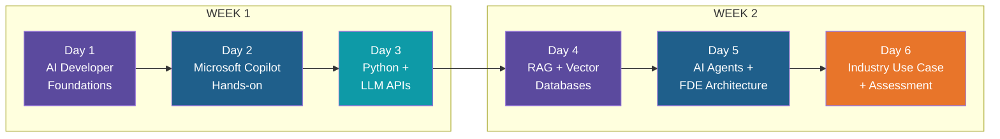
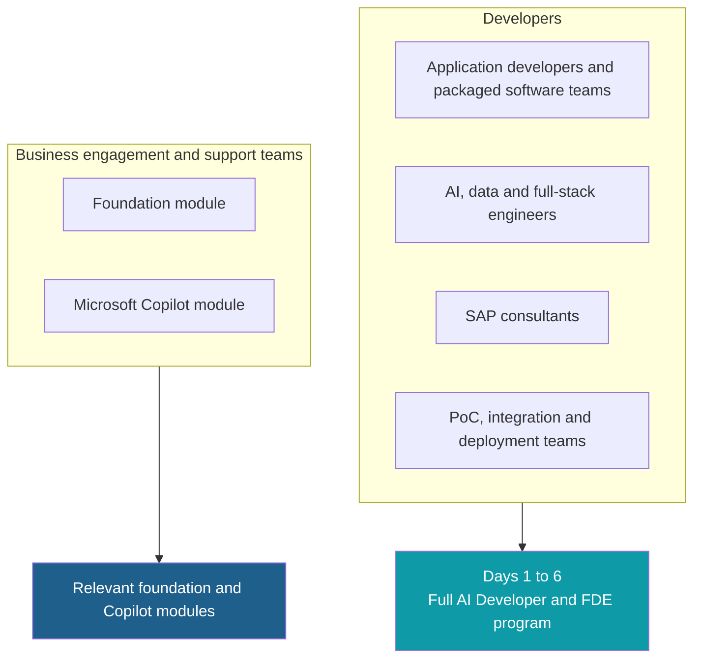
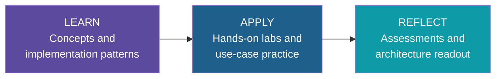
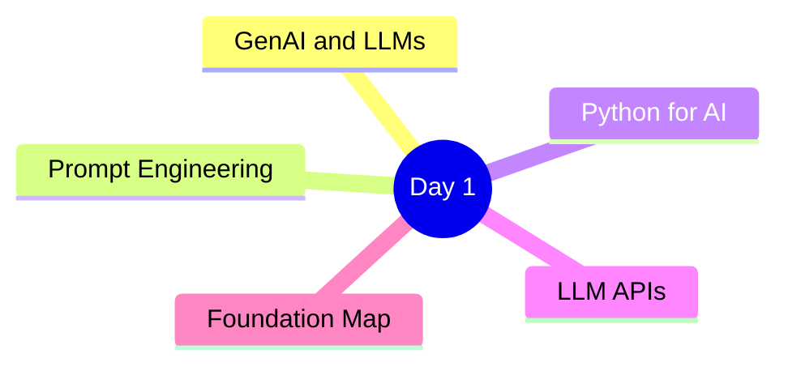
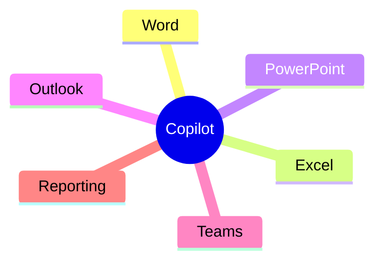
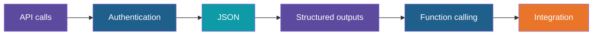
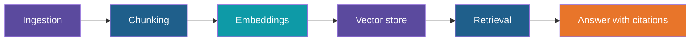
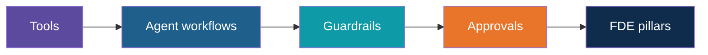
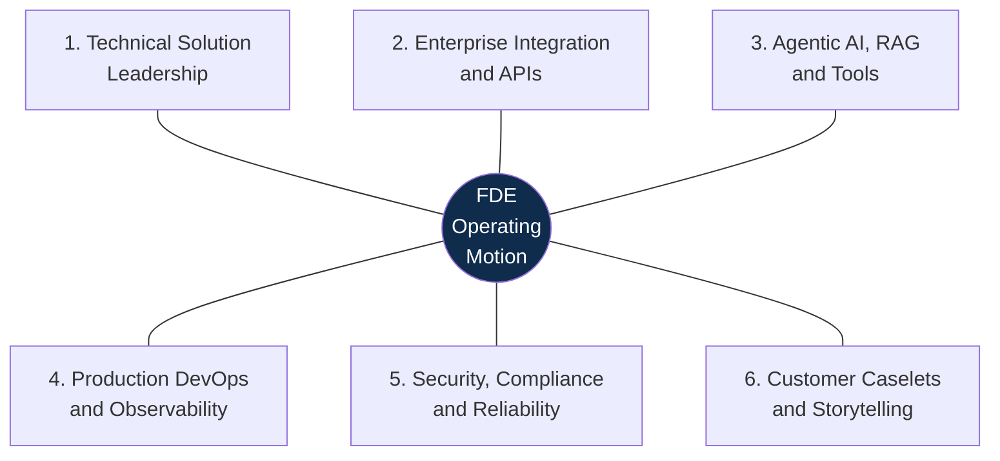
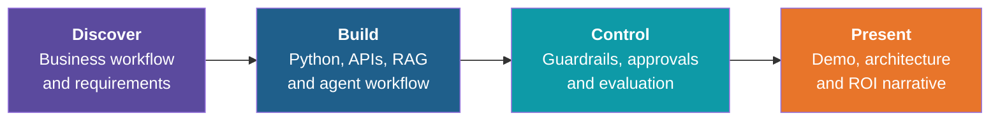

# AI Developer & FDE Training

**Kalpataru Projects | Onsite, Ahmedabad**
Delivered by ADaSci, An AIM Initiative

6 days | 4 hours per day | 3 days per week for 2 weeks | Two batches daily (forenoon and afternoon)

---

## Course at a Glance

| Day | Module | Hands-on output |
|:---:|---|---|
| 1 | Foundations | Prompt patterns + API/environment setup |
| 2 | Microsoft Copilot | Business workflow exercises |
| 3 | Python + LLM APIs | LLM-powered utility app |
| 4 | RAG + Vector DBs | Document knowledge assistant |
| 5 | AI Agents + FDE | Agentic workflow blueprint |
| 6 | Industry Use Case | Caselet demo |

---

## Who Attends What

- Developers: Python basics, APIs, JSON, SQL and Git recommended
- Business teams: comfortable with Word, Excel, PowerPoint, Outlook and Teams; no coding needed
- The Copilot module is de-coupled from FDE in terms of learning outcomes

---

## How We Learn: LAR

## What You Will Gain

- Developers: AI, RAG and agentic solution capability
- Business teams: practical Copilot skills for daily workflows
- Everyone: hands-on, immersive coverage with an exit caselet

---

# Week 1

---

## Day 1: AI Developer Foundations

**Output: Prompt patterns + API/environment setup**

1. GenAI and LLM fundamentals: tokens, context window, temperature, hallucination, closed and open-weight models
2. Prompt engineering: prompt anatomy, few-shot, step-by-step reasoning, structured output, prompt risks
3. Python for AI: Python 3.10+, virtual environments, JSON, API keys and `.env`, error handling
4. LLM APIs overview: anatomy of a call, responses, token usage, rate limits, providers
5. Foundation map: preview of RAG, vector databases and agents

Labs: Prompt Patterns, Environment Setup, First API Calls

---

## Day 2: Microsoft Copilot Hands-on

**Output: Business workflow exercises**

| Tool | Focus |
|---|---|
| Word | Draft and refine documents |
| Excel | Analyse tables and explain trends |
| PowerPoint | Create executive summaries |
| Outlook | Draft replies and follow-ups |
| Teams | Meeting summaries and action items |
| Reporting | Management briefs and weekly reports |

- Practical AI skills for daily business operations
- Responsible use with business documents, email and meetings
- Faster, clearer reporting without writing code
- Requires an eligible Microsoft 365 licence and assigned Copilot licence per participant

---

## Day 3: Python + LLM APIs

**Output: LLM-powered utility app**

1. Python for AI in practice
2. API calls and authentication
3. Working with JSON
4. Structured outputs
5. Function calling
6. Integrating LLM calls into an application

---

# Week 2

---

## Day 4: RAG + Vector Databases

**Output: Document knowledge assistant**

1. Why RAG: grounding models in your own documents
2. Ingestion and chunking
3. Embeddings
4. Vector stores: FAISS, Chroma, pgvector or a free equivalent
5. Retrieval
6. Citations

---

## Day 5: AI Agents + FDE Architecture

**Output: Agentic workflow blueprint**

1. Agent fundamentals and workflows
2. Tools
3. Guardrails and approvals
4. Agent frameworks (LangGraph, CrewAI, AutoGen), introduced after agent fundamentals
5. The FDE six-pillar view

### FDE Six-Pillar Capability Model

---

## Day 6: Industry Use Case + Assessment

**Output: Caselet demo**

Indicative use-case scenarios:

- Project status and management reporting assistant
- Procurement / vendor comparison and exception workflow
- Contract, tender or policy document knowledge assistant
- Site issue / service ticket classification and escalation

Assessment components:

- Hands-on practice checks during labs
- Capstone solution readout with architecture, risks and next steps
- Completion certificate from ADaSci

---

## What Moves Out of Foundation

- Docker, containers and deployment remain in the production / DevOps section
- LangGraph, CrewAI and AutoGen are introduced after agent fundamentals

---

## Tools and Readiness

| Developer toolchain | Classroom readiness |
|---|---|
| Python 3.10+, VS Code / Jupyter, Git | Laptop for each participant |
| LLM APIs: Gemini, OpenAI, Claude or approved enterprise endpoint (free tier only) | Stable internet and projector/display |
| Open-weight models: Llama, Mistral via hosted or local runtime | Package repositories and API endpoints whitelisted |
| Agent framework: LangGraph, CrewAI or AutoGen as selected | API keys issued or training sandbox provisioned |
| Vector DB: FAISS, Chroma, pgvector or free equivalent | Synthetic or sanitized datasets only, or ADaSci-provided dataset |

The final toolchain is validated before kickoff based on customer approvals, endpoint availability and IT whitelisting.

---

## About ADaSci

AIM Media House is one of India's trusted voices in AI, data science, analytics and emerging technologies. ADaSci brings enterprise learning, community engagement, hackathons, events and thought leadership to activate AI adoption at scale.

**Enterprise AI capability building through Learn, Apply, Reflect**

---

*Prepared for Kalpataru Projects | AIM ADaSci | Confidential*
