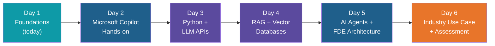
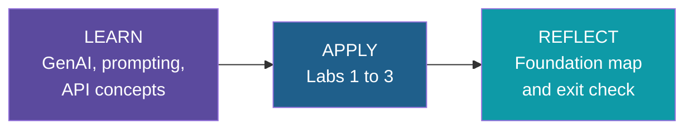

# Day 1: AI Developer Foundations — Introduction

**AI Developer & FDE Training | Kalpataru Projects, Ahmedabad**
Week 1, Day 1 of 6 | 4 hours | Batch 1 (forenoon) and Batch 2 (afternoon)

---

## Welcome

Day 1 is the foundation for everything that follows in this program. Whether you spend the
next five days building a Copilot-based reporting workflow or a full agentic FDE solution,
you'll be doing it with the vocabulary, prompting habits, Python setup and API instincts you
build today.

You don't need prior AI or ML experience. You do need working Python 3.10+, an editor, and a
willingness to write and re-write prompts until they behave the way you expect.

## Why This Day Exists

Every later day assumes Day 1 is already in place:

- Day 2's Copilot workflows assume you can already tell a good prompt from a vague one.
- Day 3's LLM client and structured outputs assume a working Python environment and a first
  successful API call.
- Day 4's RAG pipeline and Day 5's agents both sit on top of the "prompt → API call" loop you
  build today, just with more steps inserted.

Nothing here is throwaway warm-up material — the Prompt Pattern Card, the Python environment
and the API wrapper you build today are reused directly in later labs.

## How Today Fits Into the Program

## Learn, Apply, Reflect — Today

- **Learn:** GenAI and LLM fundamentals, then prompt engineering, Python for AI and LLM API
  concepts, one block at a time.
- **Apply:** three labs, each producing something you keep — a Prompt Pattern Card, a working
  Python/Git environment, and a reusable API wrapper with error handling.
- **Reflect:** the Foundation Map block places RAG, vector databases and agents on the map, so
  you leave knowing not just what you did today but where it leads.

## Today's Journey

| Block | Focus | You'll produce |
|---|---|---|
| 1. GenAI and LLM Fundamentals | Mental model: tokens, context window, temperature, hallucination, closed vs. open-weight models | A working vocabulary for the rest of the program |
| 2. Prompt Engineering | Prompt anatomy, few-shot, step-by-step reasoning, structured output, prompt risks | Prompt Pattern Card (Lab 1) |
| 3. Python for AI | Environments, JSON, `.env` and secrets, error handling | Working Python + Git environment (Lab 2) |
| 4. LLM APIs Overview | Anatomy of a call, reading responses, token usage, rate limits | Reusable API wrapper with logging (Lab 3) |
| 5. Foundation Map | Where RAG, vector databases and agents fit for Days 4 to 6 | A map of the rest of the program |

Full timing and topic-by-topic detail live in [schedule.md](schedule.md).

## Before You Start

- Laptop with Python 3.10+ installed, plus VS Code or Jupyter
- Git installed and configured
- Stable internet access to the whitelisted API endpoints
- A training/sandbox API key (issued separately) — never a personal or production key
- No confidential Kalpataru documents, datasets, or credentials on the machine you're using

## How These Notes Are Organized

- [schedule.md](schedule.md) — the agenda: timing, topic lists, labs and ground rules.
- `intro.md` — this page: why the day matters and how it connects to the rest of the program.
- `notes/` — one file per block, with the concept explained in depth, a diagram, worked Python
  examples where the block has hands-on content, and the walkthrough for that block's lab.

## Ground Rules

- Use only the provided synthetic or sanitized datasets
- No confidential Kalpataru documents in any AI tool
- Keep API keys out of code and Git

---

*Prepared for Kalpataru Projects | AIM ADaSci | Confidential*
