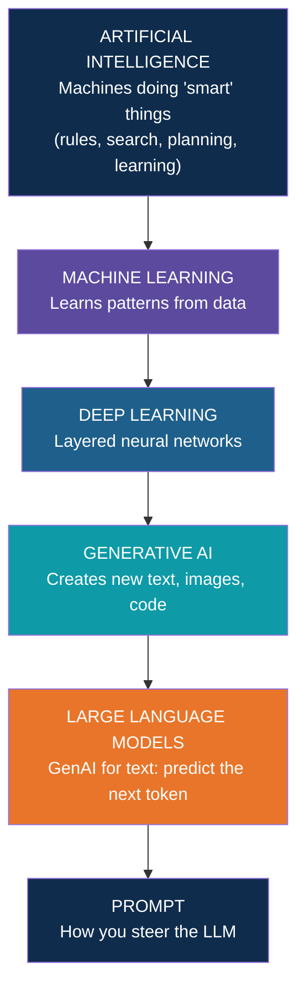
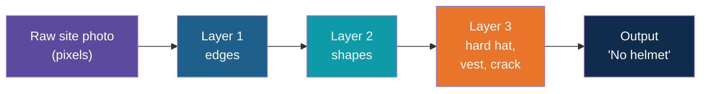
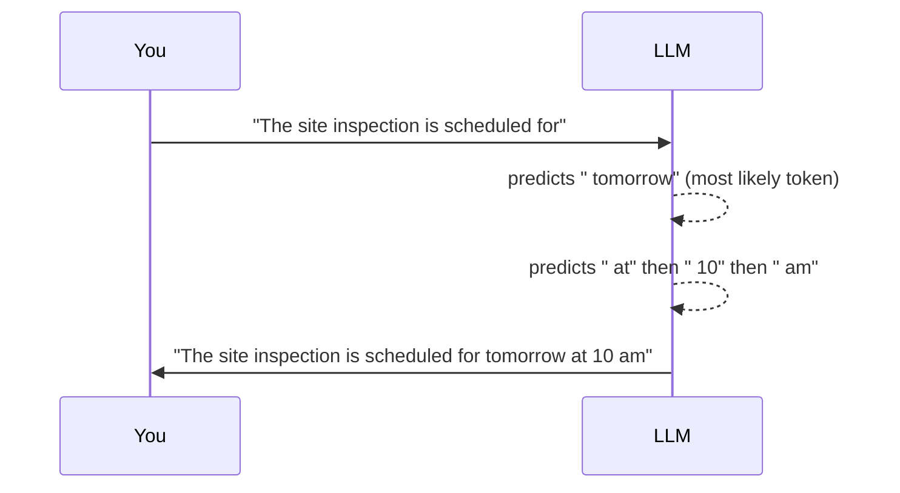

# How AI, ML, DL, GenAI, LLMs and Prompts Are Connected

**Day 1 | Block 1: GenAI and LLM Fundamentals**

> One story, six buzzwords. By the end you'll know which one sits inside which, and why
> "just write a better prompt" is a real engineering skill.

---

## The Story: Ravi and His Inbox

Ravi is a site engineer. His inbox is full of spam. Here is how each buzzword helps him.

1. **AI: a rule.** IT adds a rule: "if an email says *free prize*, move it to spam."
   A machine is doing something smart, but a human wrote the rule. This is **AI**.
2. **ML: learning.** Spammers change the words and the rule fails. So IT shows the computer
   1,000 emails marked "spam" or "not spam". It finds the pattern itself. This is
   **Machine Learning**: learn from examples, don't wait for rules.
3. **DL: learning from photos.** Ravi now wants photos checked for "worker without helmet".
   Rules are impossible here, so a many-layered network learns from thousands of photos.
   This is **Deep Learning**: ML with big, layered brains.
4. **GenAI: creating.** Ravi needs a weekly report. Nobody is sorting anything; something must
   be written. A tool drafts it. This is **Generative AI**: it makes new text, images or code.
5. **LLM: the text engine.** The tool that drafts the report is a **Large Language Model**.
   It was trained on huge amounts of text and writes by predicting the next word, again
   and again.
6. **Prompt: the instruction.** Ravi types: "Summarise this for my manager in 3 lines."
   That sentence is the **prompt**. Change the prompt and you change the answer.

---

## The Big Picture: Dolls Inside Dolls

Think of Russian nesting dolls. Each idea sits inside a bigger one.

A precise reading of the nesting, because it is easy to get slightly wrong:

- Not all AI is ML. Ravi's first "free prize" rule is AI with no learning at all.
- Not all ML is DL. Simple models (like predicting house prices from area and location)
  are ML without deep networks.
- Most modern GenAI is DL. Image generators and LLMs are deep networks.
- LLMs are one kind of GenAI, the text kind. Image generators are another.
- A prompt isn't a "model type". It is the input you give a model, and it is the part
  you control.

| Term | One-line meaning | Everyday analogy | Example |
|---|---|---|---|
| AI | Machines doing tasks that seem intelligent | A satnav | Rule-based spam filter |
| ML | Learns rules from examples | A child learning fruits by being shown many | Spam filter trained on labelled emails |
| DL | ML with many-layered neural networks | A team of specialists, each spotting finer details | Helmet detection in site photos |
| GenAI | Creates new content | A chef who cooks, not just rates dishes | Drafting a progress report |
| LLM | GenAI for language, predicts the next token | Autocomplete on a very large scale | Chat assistants |
| Prompt | Your instruction to the model | A brief given to a contractor | "Summarise for the CFO in 3 lines" |

---

## Meet Each Layer With Examples

### 1. AI without learning: a human writes the rules

Rule: *"If the email has the words free and prize, it is spam."*

- "Claim your FREE prize now" gets caught.
- "You have won a lottery, send OTP" slips through, because the rule never mentioned lottery.

Every new trick means a person edits the rules.

### 2. Machine Learning: the computer finds the pattern

Show the computer a few spam messages ("win free prize now", "free recharge offer now") and a
few normal ones ("site meeting at 10 am", "share the safety report").

- It notices "free" and "prize" show up mostly in spam.
- A new message, "free prize inside", is flagged, and nobody wrote that rule.
- Add more examples and it gets better without changing the code.

That is the heart of ML: **data in, rules out.**

### 3. Deep Learning: many layers, no hand-picked features

In the spam example a human decided "count the words". A deep network takes the raw input,
such as the pixels of a site photo, and learns by itself what to look for, layer by layer.

### 4. GenAI and LLMs: predict the next word, again and again

An LLM does not think of a full sentence and then type it. It picks a likely next word (really
a "token"), adds it, and repeats. It is like the autocomplete on your phone, on a huge scale.

Try it on your own phone: type "Good" and keep tapping the middle suggestion. You get a
sentence nobody planned. That is next-word prediction.

Run the same start twice and you can get different sentences. That variety is controlled by a
setting called **temperature**: low means play it safe, high means take more risks.

A real LLM is the same idea with two upgrades: it reads the whole conversation so far, and it
learned from a huge amount of books, websites and code.

### 5. The prompt: same model, different steering

An LLM answers what it is asked, in the shape it is asked. Compare:

| Prompt | What you tend to get |
|---|---|
| `Tell me about concrete curing.` | A textbook-style essay, long and generic |
| `You are a site QA engineer. In 3 bullets, explain concrete curing to a new supervisor. Mention the 7-day rule.` | Three focused, role-appropriate bullets |
| `Explain concrete curing like I'm 10, using a cooking analogy.` | A friendly analogy, no jargon |

Nothing about the model changed. Only the prompt did. That is why Block 2 of today is
Prompt Engineering: it is the cheapest, fastest lever you have.

---

## Putting the Story Together

```mermaid
flowchart LR
    R["Rules<br/>You write them"] -->|"can't keep up"| ML["Machine Learning<br/>Learns from examples"]
    ML -->|"images, voice,<br/>text at scale"| DL["Deep Learning<br/>Layered networks"]
    DL -->|"learn to create,<br/>not only classify"| G["Generative AI"]
    G -->|"for language"| L["LLM"]
    L -->|"you steer it with"| P["Prompt"]

    style R fill:#0F2C4C,color:#ffffff
    style ML fill:#5B4A9E,color:#ffffff
    style DL fill:#1F5F8B,color:#ffffff
    style G fill:#0E9AA7,color:#ffffff
    style L fill:#E8752A,color:#ffffff
    style P fill:#0F2C4C,color:#ffffff
```

Each step exists because the previous one hit a wall: rules didn't scale, so we learned from
data; classic ML struggled with messy inputs like photos, so we went deep; classifying wasn't
enough, so we generated; text generation became so useful it got its own name, the LLM;
and to use it well, we learned to prompt it.

---

## Where This Shows Up at Work

Think about a tender review team at a construction company.

| Task | Which layer is doing the work |
|---|---|
| Flagging invoices that look like duplicates | ML (pattern learned from past invoices) |
| Spotting missing safety gear in site CCTV | DL (vision model) |
| Drafting a summary of a 200-page tender | LLM (GenAI for text), steered by a prompt |
| Getting the summary in the format your director wants | Prompt engineering |

Most of this program lives in the last two rows: using LLMs well through prompts (Day 1),
Python and APIs (Day 3), grounding them in your documents (Day 4, RAG), and letting them
take actions (Day 5, agents).

---

## Common Mix-ups

| Myth | Reality |
|---|---|
| "AI and ML are the same" | ML is one way of building AI. Rule-based systems are AI too. |
| "LLMs understand like humans" | They predict likely text. Often useful, sometimes confidently wrong (hallucination, covered next). |
| "GenAI = ChatGPT" | ChatGPT is one LLM product. GenAI also covers images, audio, video and code. |
| "A better model fixes everything" | Often a better prompt or better context (your documents) matters more. |
| "The model learns from my chat" | In a normal API call it doesn't retrain. It only sees what you send in that request. |

---

## Quick Check

1. Is a rule-based spam filter AI? Is it ML? (AI yes, ML no.)
2. What's the difference between an ML model that flags fraud and an LLM that drafts an email?
   (Classify vs. generate.)
3. In one sentence, what does an LLM actually do? (Predicts the next token, repeatedly.)
4. Why does the same LLM give different answers to differently worded prompts?
5. What would make an autocomplete more repetitive? More surprising?

**Try it:** on your phone keyboard, type a starting word and keep tapping the middle suggestion.
What sentence do you get? Now imagine that trained on the whole internet.

---

## What's Next

Next in this block: what tokens, the context window, temperature and hallucination actually
mean, now that you know an LLM is a next-token predictor.

---

*Prepared for Kalpataru Projects | AIM ADaSci | Confidential*
