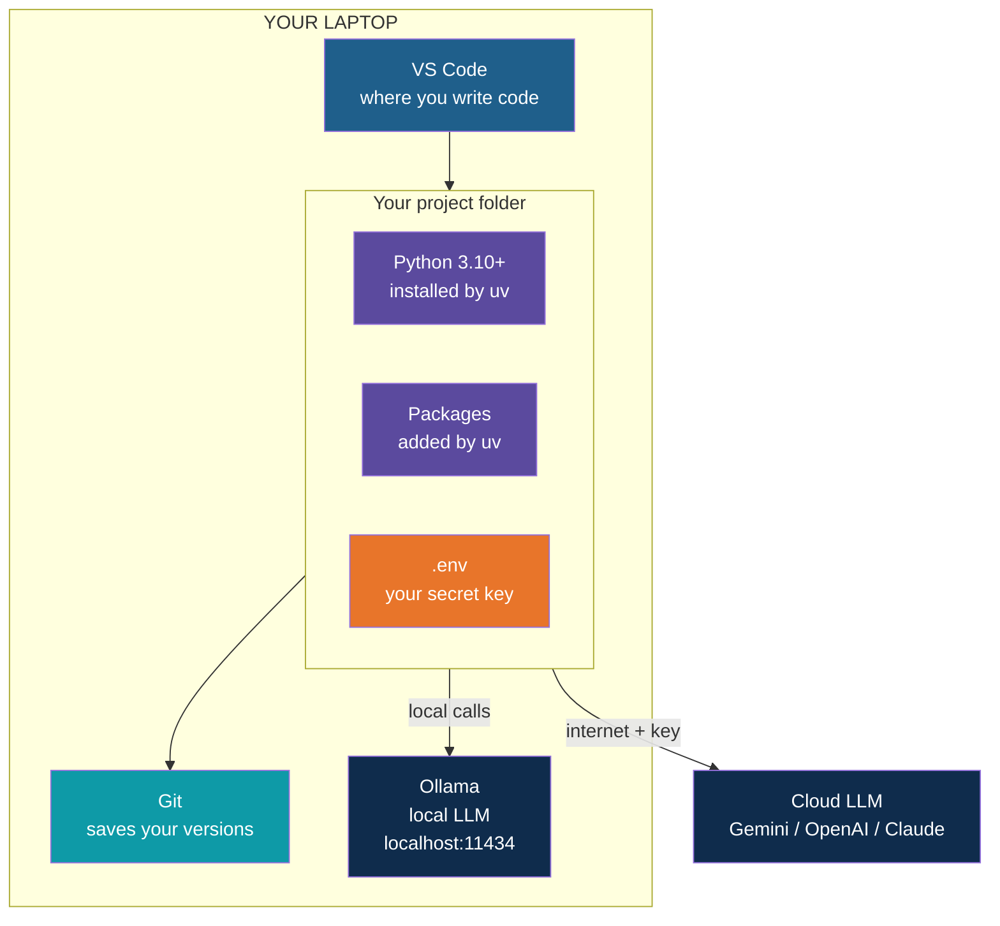
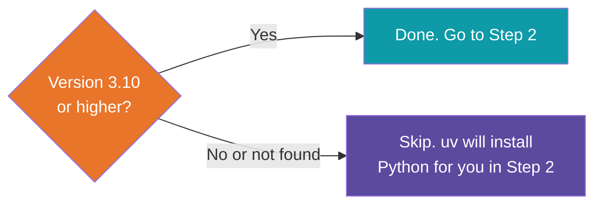
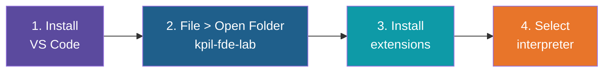
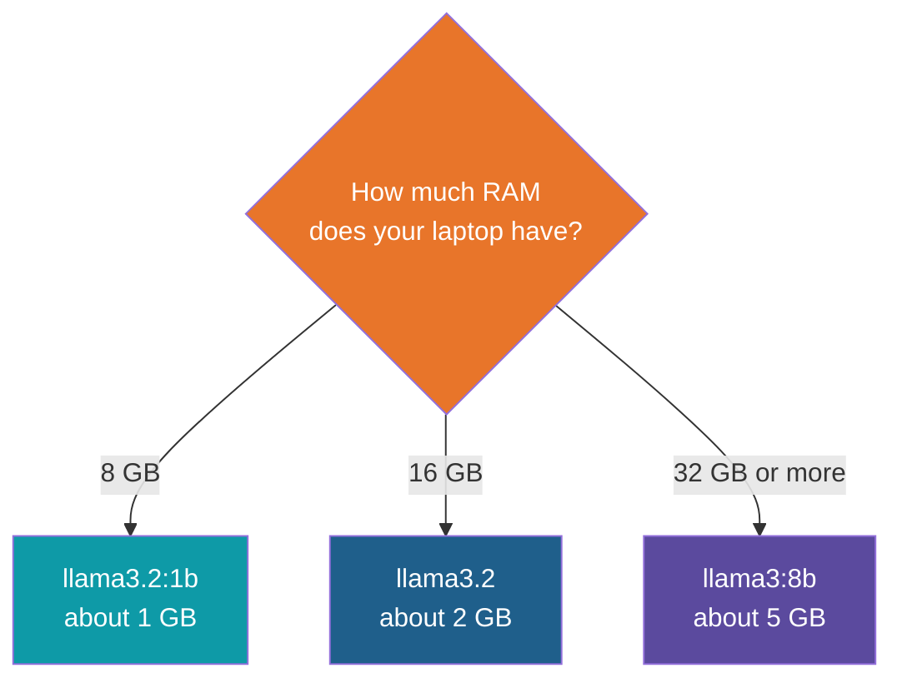
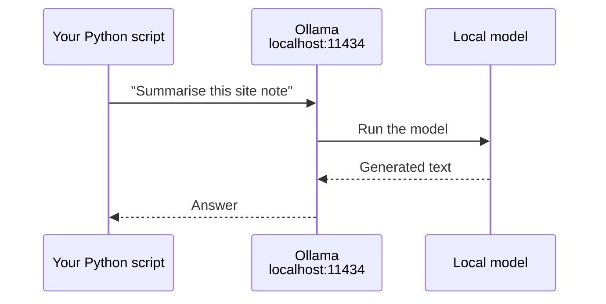
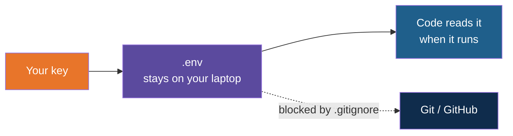

# Setting Up Our Environment

**Day 1 | Block 3: Python for AI | Lab 2: Environment Setup**

> Goal: a laptop ready to build AI apps. About 30 minutes, seven small steps, one check at
> the end.

---

## The Big Picture

Here is what your laptop will look like when we are done.



## Your Checklist and Time Plan

| # | Step | Time | You are done when |
|:---:|---|:---:|---|
| 1 | Check Python | 2 min | You see a version number |
| 2 | Install uv | 3 min | `uv --version` prints a version |
| 3 | Install VS Code + extensions | 7 min | Project opens, interpreter picked |
| 4 | Set up Git | 3 min | `git --version` works |
| 5 | Install Ollama + a model | 10 min | The model answers you |
| 6 | Add your API key safely | 3 min | `.env` exists, ignored by Git |
| 7 | Check everything works | 2 min | Every line in the check table passes |

Downloads can be slow, so start Step 5 early and let it run while you do the others.

---

## Step 1: Python 3.10 or Newer

| Do this | You should see |
|---|---|
| Open a terminal (Terminal on Mac, PowerShell on Windows) and type `python3 --version` | `Python 3.10` or higher |



---

## Step 2: uv, Your Package Manager

**In one line:** uv installs Python, keeps each project's packages separate, and is very
fast. Think of it as a tidy toolbox per project.

| | Mac / Linux | Windows (PowerShell) |
|---|---|---|
| Install | `curl -LsSf https://astral.sh/uv/install.sh \| sh` | `powershell -ExecutionPolicy ByPass -c "irm https://astral.sh/uv/install.ps1 \| iex"` |
| Then | Close and reopen the terminal | Close and reopen the terminal |
| Check | `uv --version` | `uv --version` |

**Create your project (do this once):**

```bash
uv init kpil-fde-lab
cd kpil-fde-lab
uv add python-dotenv requests
```

**Your everyday uv commands:**

| Want to... | Type |
|---|---|
| Get a Python version | `uv python install 3.12` |
| Add a package | `uv add <package>` |
| Run a script | `uv run script.py` |
| Rebuild after `git clone` | `uv sync` |

> Tip: always run scripts with `uv run`. It uses the right Python and packages for you, and
> there is nothing to "activate".

---

## Step 3: Visual Studio Code

**Do these four things:**



**Extensions** (click the Extensions icon, or press Ctrl/Cmd + Shift + X, then search):

| Extension | What you get | Priority |
|---|---|---|
| Python (Microsoft) | Run and debug Python | Must |
| Pylance | Hints and error underlines as you type | Must |
| Jupyter | Run code in small cells | Must |
| Ruff | Auto-tidy and mistake spotting | Nice |
| Markdown Preview Mermaid Support | See the diagrams in these notes | Nice |

**Pick the interpreter:** press Ctrl/Cmd + Shift + P, type `Python: Select Interpreter`,
and choose the one inside `.venv`.

> Tip: turn on Auto Save (File menu). It avoids "I fixed it but forgot to save".

---

## Step 4: Git

| Do this | You should see |
|---|---|
| `git --version` | A version number. If not, install from git-scm.com |
| Set your name and email once (below) | No message means it worked |
| `git init` inside your project | "Initialized empty Git repository" |

```bash
git config --global user.name "Your Name"
git config --global user.email "you@example.com"
```

**Why Git?** It is your undo button for the whole project.

---

## Step 5: Ollama, Your Own Local LLM

**In one line:** an app that runs an AI model on your laptop. Free, private, and works
offline after the download.

**5a. Install** the app from the official Ollama site and let it start. It sits quietly in
the background.

**5b. Pick a model that fits your laptop:**



Sizes are approximate. Start small, you can try bigger ones later.

**5c. Download and talk to it:**

```bash
ollama pull llama3.2
ollama run llama3.2
```

Ask it something, then type `/bye` to leave.

| Command | What it does |
|---|---|
| `ollama list` | Models you have |
| `ollama pull <model>` | Download a model |
| `ollama ps` | Model currently loaded |
| `ollama rm <model>` | Delete a model, frees space |

**How Python talks to it:** Ollama runs a small service on your laptop. Your script sends a
request and gets an answer, just like calling a cloud API.



> Note: the first answer is slow while the model loads into memory. Later ones are faster.

---

## Step 6: Keep Your API Key Safe

A key is like a password. Follow the four-file pattern:

| File | What goes in it | Shared with others? |
|---|---|:---:|
| `.env` | Your real key, for example `GEMINI_API_KEY=...` | No |
| `.gitignore` | A line saying `.env`, so Git ignores it | Yes |
| `.env.example` | The same variable names, with empty values | Yes |
| Your code | Reads the key at run time, never contains it | Yes |



| Do | Don't |
|---|---|
| Use the training key issued in class | Use a personal or production key |
| Keep the key only in `.env` | Paste it in code, chat or email |
| Tell the trainer if it leaks, it gets replaced | Hide the mistake |

---

## Step 7: Check Everything Works

Open a terminal in your project folder and try each line:

| Check | Type | You should see |
|---|---|---|
| Python | `uv run python --version` | 3.10 or higher |
| uv | `uv --version` | A version number |
| Git | `git --version` | A version number |
| Ollama installed | `ollama --version` | A version number |
| Ollama has a model | `ollama list` | Your model in the list |
| Ollama answers | `ollama run <model>` and ask a question | A reply |
| VS Code command (optional) | `code --version` | A version number |
| API key safe | Look for `.env` in your folder and `.env` inside `.gitignore` | Both present |

---|---|
| Python 3.10+ | OK |
| uv | OK |
| Git | OK |
| VS Code (code command) | OK, or `--` if you skipped the optional shell command |
| Ollama installed | OK |
| Ollama server | OK, and lists your model |
| API key in environment | `--` until your key is issued, then OK |

---

## Your Finished Project Folder

```text
kpil-fde-lab/
  .venv/            created by uv, never edit
  .env              your secret key, never share
  .env.example      names of keys, safe to share
  .gitignore        tells Git what to skip
  pyproject.toml    list of your packages
```

---

## Stuck? Find Your Symptom

| You see | Try this |
|---|---|
| `uv: command not found` | Close and reopen the terminal |
| Wrong Python version runs | Use `uv run` instead of `python` |
| VS Code can't find packages | Select the interpreter inside `.venv` |
| `ollama: command not found` | Restart the terminal, reinstall if needed |
| `ollama list` says it can't connect | Open the Ollama app, then try again |
| Model download fails or crawls | Tell the trainer, a copy may be shared locally |
| Laptop freezes on a model | Switch to `llama3.2:1b` |
| Package install blocked | Company firewall, ask the trainer |

---

## Ready Checklist

- [ ] `uv --version` works
- [ ] VS Code opens your project with the `.venv` interpreter
- [ ] `git --version` works, name and email set
- [ ] Ollama answers a question in the terminal
- [ ] `.env` and `.gitignore` are in place
- [ ] Every line in the Step 7 check table passes

---

## What's Next

Your workshop is ready. Next: first LLM API calls to both a cloud model and your local
Ollama model.

---

*Prepared for Kalpataru Projects | AIM ADaSci | Confidential*
