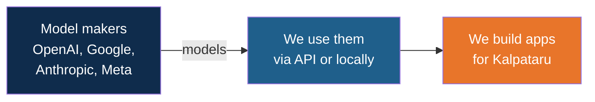
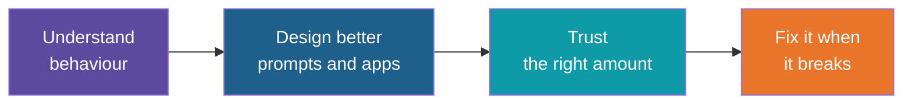
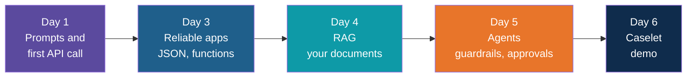
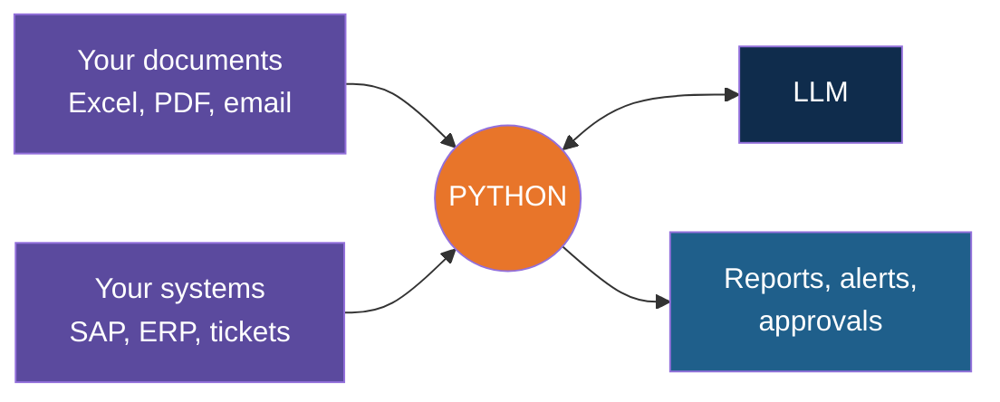
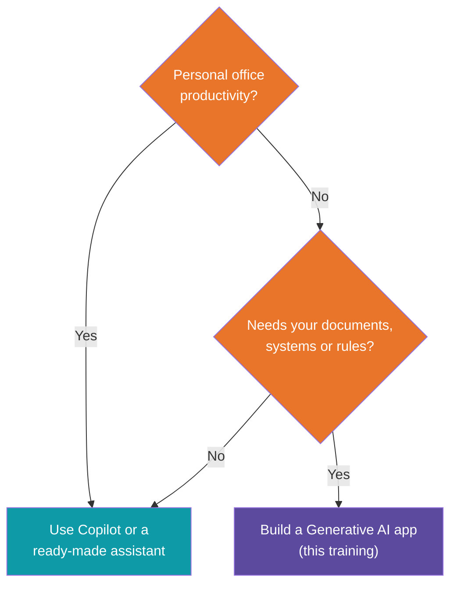
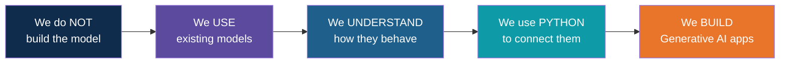

# The Scope of This Training

<!-- Slide deck in markdown. Each block between the --- lines is one slide.
     Trainer notes are in HTML comments and do not show in the preview. -->

---

# What Are We Here to Do?

## AI Developer & FDE Training

**Kalpataru Projects | Ahmedabad**
Day 1 | Kickoff and Objectives

<!-- Trainer: set the tone. This is the "why" before the "how". About 10 minutes. -->

---

## Five Questions Everyone Asks

| | Question |
|:---:|---|
| 1 | Are we building our own GPT or Claude? |
| 2 | Do we need to understand how LLMs work? |
| 3 | So what are we actually building? |
| 4 | Why do we need Python? |
| 5 | Claude and Copilot already exist. Why build our own? |

---

# Question 1

## Are we building our own GPT or Claude?

# NO

---

## Why Not?

| What it takes | Scale |
|---|---|
| Money | Tens to hundreds of millions of dollars |
| Computers | Thousands of special chips, for months |
| Data | A big slice of the internet |
| People | Teams of research scientists |

> Nobody needs this to solve a business problem.

---

## The Cement Factory Idea

A builder doesn't build a cement factory before building a house.

> We buy the cement. We build the house.

---

# Question 2

## Do we need to understand how LLMs work?

# YES

### Not to build one. To drive one well.

---

## You Don't Need to Build the Car

...but you do need to read the dashboard.

| In a car | In an LLM |
|---|---|
| Fuel and its cost | **Tokens** and API cost |
| Size of the boot | **Context window** |
| Steering wheel | **Prompt** |
| Cruise vs sport mode | **Temperature** |
| Warning light | **Hallucination** |
| Petrol or electric | **Closed vs open** models |

---

## What Goes Wrong Without It

| If you don't know... | Then... |
|---|---|
| Models can sound sure and be wrong | A made-up clause enters a contract summary |
| Context has a limit | A long tender is quietly cut off |
| You pay per token | A surprise bill |
| Data leaves your laptop | Private data goes to the wrong place |

---

## The Payoff

> Enough to predict the model. Not enough to rebuild it.

---

# Question 3

## What are we actually building?

# Generative AI Apps

---

## What Is a Generative AI App?

> Software where an **LLM does the language work**, and **your code adds your data, tools
> and rules** around it.

Language work means: read, write, summarise, extract, answer.

---

## A Chat Window Is Not an App

| Chat window | Generative AI app |
|---|---|
| You type, it answers | Runs by itself |
| Knows what you paste | Reads your documents and systems |
| Different each time | Same format, checked |
| One person | A whole team |
| No record | Logged and approved |

---

## What This Looks Like at Kalpataru

| The problem | The app |
|---|---|
| Weekly report takes hours | Drafts the management brief from site updates |
| "What does clause 14 say?" | Answers from your own tender documents, with sources |
| Tickets arrive in every format | Classifies, routes and escalates them |
| Comparing vendor quotes | Extracts figures, flags exceptions, asks a human to approve |

---

## The Staircase We Climb

Day 2 (Microsoft Copilot) runs alongside: daily office AI, no code needed.

---

# Question 4

## Why do we need Python?

### Because the model is only one piece.

---

## Python Is the Glue

---

## What Python Does for You

| Job | Example |
|---|---|
| Talk to the model | Send a request, read the answer |
| Handle files | Open 500 PDFs automatically |
| Check the output | Reject a reply with no invoice number |
| Connect systems | Pull from a database |
| Repeat | Run every Monday at 8 am |
| Keep control | Log, track cost, add approvals |

---

## Why Python, Specifically

- Every AI provider ships a Python library first
- RAG and agent tools are Python-first
- Reads almost like English
- We use a **small, focused slice**, not all of Python

---

# Question 5

## Claude, Codex and Copilot exist. Why build our own?

### Honest answer: often, you shouldn't.

---

## Use Ready-Made Tools When...

- It is personal productivity: emails, slides, notes
- Nothing about it depends on your private data or systems

That is exactly why **Day 2 teaches Microsoft Copilot**.

---

## Build Your Own When...

| You need | A general tool can't |
|---|---|
| Your private documents | It hasn't read your tenders |
| Your systems | It can't log into SAP by itself |
| Your rules | "Escalate if above the limit and vendor is new" |
| No one typing | Runs on its own, on schedule |
| Approvals and audit | Records who approved what |

---

## The Decision in One Picture

---

## Coding Agents Help, You Steer

Tools like Claude Code and Codex can write code faster.

But you must be able to:

1. Say clearly what to build
2. Check what they produced
3. Catch their mistakes

> Understanding the basics is what makes you the pilot, not the passenger.

---

## This Is the "FDE" in the Name

**Forward Deployed Engineer**

Goes to the business problem, builds something that works with the customer, and makes it
safe enough to trust.

Python + APIs + RAG + agents + good judgement.

---

## In Scope

| We will |
|---|
| Write good prompts |
| Set up Python securely |
| Call cloud and local LLMs |
| Get structured output and use function calling |
| Build RAG with vector databases |
| Design agents with guardrails and approvals |
| Demo a final caselet with an ROI story |

---

## Out of Scope

| We will not |
|---|
| Train or fine-tune a model from scratch |
| Teach the maths of neural networks |
| Build servers or data centres |
| Cover Docker and deployment (production section) |
| Start with agent frameworks (they come after the basics) |
| Use real confidential Kalpataru data |
| Turn you into a Python expert in four days |

---

## By the End, You Can

1. Explain GenAI in plain language
2. Write prompts that give useful, steady results
3. Call an LLM from Python and handle errors
4. Build an assistant that answers from your documents, with sources
5. Design an agent workflow with guardrails and approval
6. Demo it and explain its value

---

## The Deal

| We bring | You bring |
|---|---|
| Structured sessions and labs | Curiosity |
| Datasets and working code | Hands-on effort in every lab |
| Free-tier tools, synthetic data | Questions, especially "why" |
| Learn, Apply, Reflect | A laptop that is ready |

---

## Everything in One Picture

---

## Quick Check

1. Why don't we train our own model?
2. Name two things that break if you skip tokens and hallucination.
3. Chat window vs app: what is the difference?
4. When should you just use Copilot?

---

## Next Up

How LLMs really work, in plain language: tokens, context window, temperature,
hallucination.

---

*Prepared for Kalpataru Projects | AIM ADaSci | Confidential*
