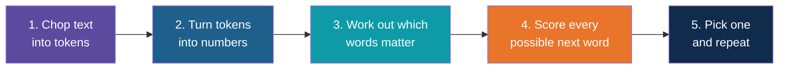
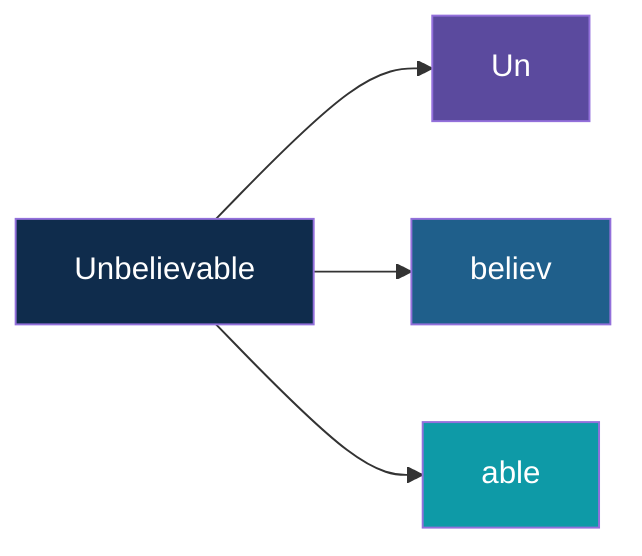
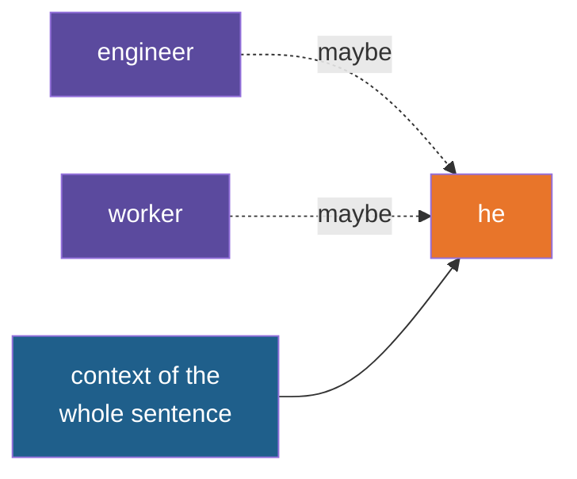
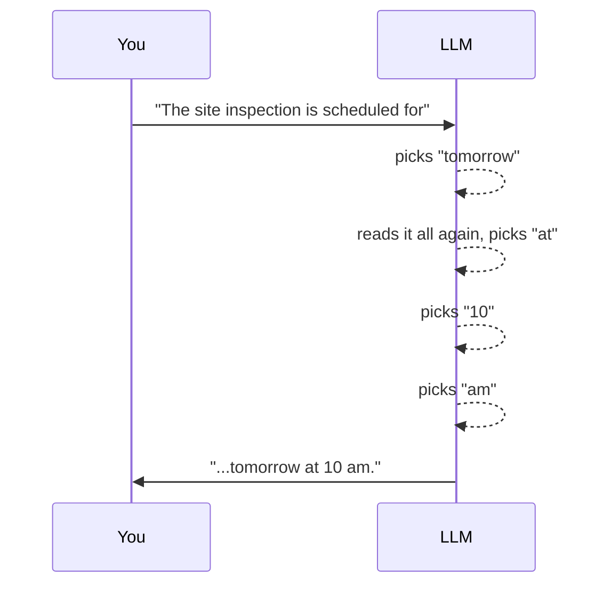
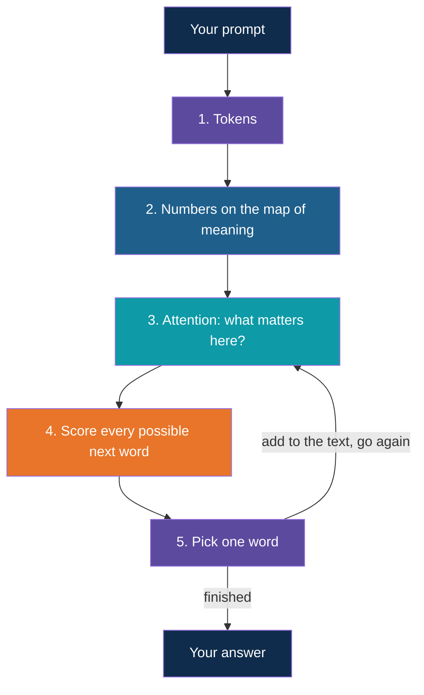
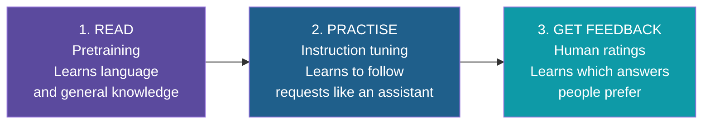
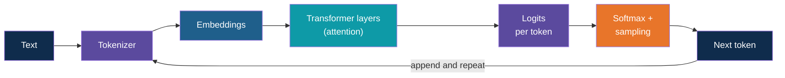

# How Do LLMs Work?

<!-- Slide deck in markdown. Each block between the --- lines is one slide.
     Trainer notes are in HTML comments and do not show in the preview.
     Slides marked "Technical corner" are optional for non-technical audiences. -->

---

# How Do LLMs Work?

## The idea, without the maths

**Day 1 | Block 1: GenAI and LLM Fundamentals**

<!-- Trainer: about 20 minutes. Keep asking "what would you guess comes next?" -->

---

## The Whole Idea in One Line

# An LLM predicts the next word.

Then it does that again. And again. Until you have an answer.

---

## You Already Use One

Type "Good" on your phone and keep tapping the middle suggestion.

> Good morning, I will be there in a few minutes.

Nobody planned that sentence. It was built one guess at a time.

| Phone autocomplete | Large Language Model |
|---|---|
| Looks at the last word or two | Reads the **whole conversation** |
| Learned from your own typing | Learned from books, websites and code |
| Suggests a word | Writes whole reports, emails, answers |

---

## Play the Game: Finish the Sentence

| Sentence | Your guess |
|---|---|
| Roti, dal, ___ | sabzi, rice |
| Please find the invoice ___ | attached |
| Concrete must be cured for 7 ___ | days |
| Good morning, sir. Please ___ | find, share, confirm... |

You guessed using everything you have read and heard. **An LLM does exactly this,** with far
more reading than any human could do.

---

## The Five Steps Inside

We will take these one at a time.

---

# Step 1

## Chop text into tokens

---

## A Token Is a Piece of a Word

The model doesn't read whole words. It reads small pieces called **tokens**.

Think of Lego. Common words are one big brick. Rare words are built from several small ones.

---

## Tokens Are Not Words

Measured on a local model in our classroom setup:

| Text | Words | Tokens |
|---|:---:|:---:|
| Hello | 1 | 1 |
| The site inspection is scheduled for tomorrow at 10 am. | 10 | 12 |
| Unbelievably uncharacteristic infrastructure | 3 | 7 |
| Invoice 2024-11-0048 for Rs 12,45,000 | 5 | 17 |
| साइट का निरीक्षण कल सुबह दस बजे है | 8 | 16 |

Rule of thumb for English: **about 3 words for every 4 tokens**. Numbers, codes and
non-English text use **more tokens**.

**Why it matters:** you pay per token, and there is a limit to how many fit at once.

**Try it:** paste these into a tokenizer website (see the Explore It Yourself slide).

---

# Step 2

## Turn tokens into numbers

---

## Computers Only Understand Numbers

Each token gets a number, and that number is placed on a giant "map of meaning".

- Words with **similar meaning sit close together**
- Words with **different meaning sit far apart**

| Close together | Far apart |
|---|---|
| cement, concrete, mortar | cement, banana |
| invoice, bill, payment | invoice, monsoon |
| engineer, supervisor | engineer, sandwich |

Think of a city map. Restaurants cluster in one area, hospitals in another. Meaning has a
"neighbourhood" too.

---

# Step 3

## Work out which words matter

---

## Attention: What Should I Focus On?

When you read a sentence, you automatically link words together. The model does too. This
is called **attention**.

> "The engineer told the worker that **he** was late."

Who is "he"? You look back and decide. The model does the same, at scale.

---

## Same Word, Different Meaning

| Sentence | "bank" means |
|---|---|
| "I deposited cash at the **bank**." | A place with money |
| "We walked along the river **bank**." | The side of a river |
| "The **bank** approved our loan." | A lender |

Attention lets the model use the **surrounding words** to get the meaning right.

---

# Step 4

## Score every possible next word

---

## The Model Gives Every Word a Chance

Prompt: *"The site inspection is scheduled for ___"*

Illustrative chances:

| Next word | Chance |
|---|:---:|
| tomorrow | 45% |
| Monday | 20% |
| next | 12% |
| Friday | 6% |
| banana | 0.0001% |
| ...thousands more | tiny |

It doesn't "know" the answer. It knows **what is likely**.

---

## Steady or Adventurous?

You can control how it picks. This dial is called **temperature**.

| Setting | Behaviour | Good for |
|---|---|---|
| Low (near 0) | Always picks the top choice | Reports, extraction, facts |
| High | Sometimes picks less likely words | Brainstorming, creative writing |

**Real test on our classroom model**, same prompt, three runs each:

| Temperature | Run 1 | Run 2 | Run 3 |
|:---:|---|---|---|
| 0 | Tomorrow | Tomorrow | Tomorrow |
| 1.5 | Tuesday | Friday | Tuesday |

**Try it:** ask your local Ollama model the same question a few times at different temperatures.

---

# Step 5

## Pick one, add it, repeat

---

## One Word at a Time

After each word, the model reads **everything so far** and picks the next. That is why
answers appear word by word on screen.

---

## Putting the Five Steps Together

---

# But How Did It Learn?

---

## Learning by Playing Fill-in-the-Blank, Billions of Times

1. Hide a word in a real sentence
2. Let the model guess
3. Check the real answer
4. Nudge the model slightly to guess better next time
5. Repeat, across a huge amount of text

Like a child who reads thousands of books and slowly gets a feel for language.

---

## Three Stages of Schooling

| Stage | Like... |
|---|---|
| Read | Going through a huge library |
| Practise | Training to be a helpful assistant |
| Feedback | A manager marking your work |

---

## Why "Large"?

Inside the model are billions of tiny adjustable dials, called **parameters**.
Learning means finding good settings for all of them.

Think of a giant sound mixing desk with billions of knobs. Training is the long process of
tuning every knob until the music sounds right.

That is what costs so much, and why we use models others have already trained.

---

# What This Explains

---

## Why LLMs Behave the Way They Do

| Because it... | You see... |
|---|---|
| Predicts likely words, not looked-up facts | Confident answers that can be wrong (**hallucination**) |
| Picks words with some randomness | Slightly different answers each time |
| Learned from text up to a certain date | It may not know recent events |
| Reads only what is in front of it | It forgets a chat once the conversation ends |
| Works from patterns in the prompt | A clearer prompt gives a better answer |

We give each of these its own slide next.

---

## What an LLM Is Not

| Myth | Reality |
|---|---|
| It searches the internet for answers | Not by default. It writes from what it learned. |
| It understands like a human | It is very good at patterns in language |
| It learns from your chat | Not in a normal API call. It only sees what you send. |
| It always knows when it is wrong | No. It sounds equally sure either way. |

---

## Technical Corner

*For developers. Non-technical folks can skip this slide.*

| Term | What it means |
|---|---|
| Transformer | The neural network design behind LLMs |
| Token | A chunk of text from a fixed vocabulary, mapped to an ID |
| Embedding | A vector (list of numbers) representing a token's meaning |
| Attention | Layers that weigh how much each token relates to the others |
| Parameters | The learned weights, often billions |
| Logits and softmax | Raw scores for each vocabulary token, turned into probabilities |
| Sampling | Choosing the next token from those probabilities (temperature, top-p) |
| Context window | The maximum number of tokens the model can attend to at once |
| Autoregressive | Each new token is fed back in to produce the next |

---

## Explore It Yourself

No code needed. Open a site or your local model and play.

| To see... | Try | What to do |
|---|---|---|
| Tokens | A tokenizer site, for example the OpenAI Tokenizer (platform.openai.com/tokenizer) or Tiktokenizer (tiktokenizer.vercel.app) | Paste an English line, a Hindi line and an invoice number. Watch the coloured chunks. |
| The map of meaning | Embedding Projector (projector.tensorflow.org) | Search a word and look at its neighbours |
| Attention, probabilities and temperature | Transformer Explainer (poloclub.github.io/transformer-explainer) | Type a sentence, slide the temperature, watch the next-word bars change |
| The whole model, animated | LLM Visualization (bbycroft.net/llm) | Scroll through a small model step by step |
| Steady vs varied answers | Your local Ollama model | Ask the same question 3 times. Then type `/set parameter temperature 0` in the chat and ask 3 times again. |

<!-- Trainer: links are from memory of well-known public tools. Open each before class. -->

---

## Remember These Four Things

1. An LLM **predicts the next word**, one at a time
2. It works on **tokens**, small pieces of words
3. **Attention** lets it use the whole context
4. **Temperature** decides steady or adventurous

---

## Quick Check

1. In one sentence, what does an LLM do?
2. Is a token the same as a word?
3. Why does the same prompt sometimes give different answers?
4. Why can an LLM sound sure and still be wrong?
5. What does "attention" help the model do?

---

## Next Up

Tokens, the context window, temperature and hallucination, one slide deck each, with
hands-on examples.

---

*Prepared for Kalpataru Projects | AIM ADaSci | Confidential*
