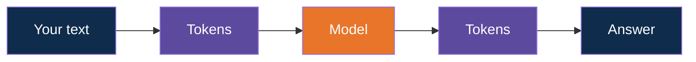
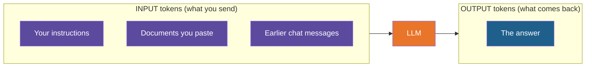
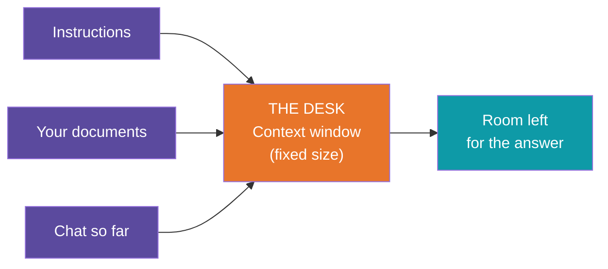
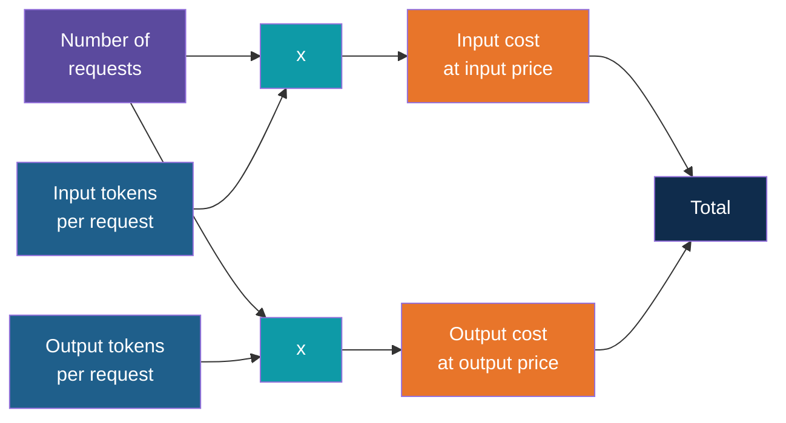
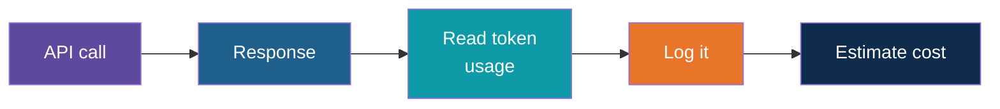

# Tokens and Cost

<!-- Slide deck in markdown. Each block between the --- lines is one slide.
     Trainer notes are in HTML comments and do not show in the preview.
     All prices in this deck are illustrative. Check the provider's price list for real budgets. -->

---

# Tokens and Cost

## The small unit that decides your speed, limits and bill

**Day 1 | Block 1: GenAI and LLM Fundamentals**

<!-- Trainer: about 15 minutes. Demo a tokenizer website live. -->

---

## Quick Recap

The model reads text in small pieces called **tokens**.

Tokens go **in**, tokens come **out**. Everything is measured in them.

---

## Why Should a Business Person Care?

Tokens are like **minutes on a phone plan** or **units on an electricity bill**.

| Tokens decide... | Plain meaning |
|---|---|
| **Cost** | Providers charge per token |
| **Speed** | More tokens, slower answer |
| **Limits** | Only so many tokens fit at once |

---

## Words vs Tokens

| Text | Words | Tokens |
|---|:---:|:---:|
| Hello | 1 | 1 |
| The site inspection is scheduled for tomorrow at 10 am. | 10 | 12 |
| Invoice 2024-11-0048 for Rs 12,45,000 | 5 | 17 |
| साइट का निरीक्षण कल सुबह दस बजे है | 8 | 16 |

> English: roughly **3 words for every 4 tokens**.
> Numbers, codes and Indian languages: **many more tokens per word**.

*(Measured on our classroom model.)*

---

## What Costs More Tokens?

| Cheaper | More expensive |
|---|---|
| Plain English words | Long, rare words |
| Short sentences | Numbers, IDs, codes |
| Common phrases | Hindi, Gujarati and other Indian languages |
| Plain text | Tables and formatting clutter |

---

# Two Directions

## Tokens in, tokens out

---

## You Pay for Both

| | Input | Output |
|---|---|---|
| Counted? | Yes | Yes |
| Usually priced | Lower | **Higher** |
| You control it by | Sending less | Asking for shorter answers |

---

## Chats Get Heavier Over Time

The model has no memory. To "remember", the app **re-sends the whole chat** each time.

| Message | Tokens sent to the model |
|:---:|:---:|
| 1 | 100 |
| 2 | 100 + 150 + 100 = 350 |
| 3 | 350 + 200 + 100 = 650 |
| 4 | 650 + 250 + 100 = 1,000 |

> Long conversations quietly cost more and more.

---

# The Limit

## The context window

---

## The Model's Desk

The **context window** is the total number of tokens the model can hold in view at once:
your input **plus** its answer.

Think of a **desk**. Only what fits on the desk can be read. Everything else is off the table.

---

## Will My Tender Fit?

Our classroom model has a window of **8,192 tokens**. A small document page in our test
(about 240 words) uses about **240 tokens**.

| Document size | Tokens | Share of window |
|---|---:|---:|
| 1 page | 243 | 3% |
| 10 pages | 2,430 | 30% |
| 50 pages | 12,150 | **148%, doesn't fit** |
| 100 pages | 24,300 | **297%, doesn't fit** |

Real pages often hold more words, so they use more.

---

## Windows Differ by Model

| Model type | Typical window |
|---|---|
| Small local models | A few thousand up to tens of thousands of tokens |
| Large cloud models | Hundreds of thousands, some up to a million |

Check the model's documentation. Bigger window means more room, but also more cost and
sometimes slower answers.

---

## What Happens When It Doesn't Fit?

| Outcome | What you see |
|---|---|
| Request is rejected | An error about too many tokens |
| Old text is dropped | The model "forgets" the start of the chat |
| Text is cut off | Missing parts of your document, silently |

> The dangerous one is the silent one. Always check your document size.

**This is exactly why Day 4 teaches RAG:** send only the relevant pieces, not the whole
document.

---

# The Bill

## Estimating cost

---

## The Formula

Prices are quoted **per million tokens**.

---

## Worked Example (Illustrative Prices)

Assume: **$1 per million input tokens** and **$4 per million output tokens**.

| Scenario | Requests / month | In | Out | Cost / month |
|---|---:|---:|---:|---:|
| Ticket triage, short reply | 10,000 | 500 | 50 | $7.00 |
| Weekly report drafts | 200 | 3,000 | 800 | $1.24 |
| Tender Q&A with retrieved text | 2,000 | 4,000 | 300 | $10.40 |
| Same Q&A, whole document pasted | 2,000 | 60,000 | 300 | **$122.40** |

*(These prices are made up for teaching. Check your provider's price page for real ones.)*

---

## The Lesson in That Table

Same task, same answers. Only difference: **what we sent.**

- Send just the relevant pieces: **$10.40**
- Paste the whole document every time: **$122.40**

> Sending less is the biggest saving. That is more than **11 times** cheaper.

---

## Local vs Cloud Cost

| | Cloud LLM | Local (Ollama) |
|---|---|---|
| Per-token price | Yes | None |
| Free tier | Yes, with limits | Not needed |
| Hidden cost | Grows with usage | Your laptop's time and memory |
| Best for | Strongest quality | Practice, private data |

---

## Free Tiers Have Limits

In class we use free tiers. They usually limit:

- Requests per minute
- Tokens per minute or per day

If you hit a limit you get a "rate limit" error. We handle that with retries on Day 1
(Block 4) and Day 3.

---

# Saving Tokens

## Simple habits that cut cost and speed things up

---

## Seven Habits

| Habit | Why it helps |
|---|---|
| Be concise in prompts | Fewer input tokens |
| Send only what's relevant | Biggest saving of all |
| Ask for short outputs ("3 bullets") | Output tokens cost more |
| Start a new chat for a new topic | Old history isn't re-sent |
| Set a maximum output length | Stops runaway answers |
| Log token usage on every call | You can't manage what you don't measure |
| Use a smaller model for easy tasks | Cheaper and faster |

---

## Where You Will See Tokens Next

Every API response tells you how many tokens were used. In Lab 3 you will:

1. Make an API call
2. Read the token usage in the response
3. Log it
4. Estimate cost

---

## Explore It Yourself

No code needed.

| To see... | Try | What to do |
|---|---|---|
| How many tokens your text uses | A tokenizer site, for example the OpenAI Tokenizer (platform.openai.com/tokenizer) or Tiktokenizer (tiktokenizer.vercel.app) | Paste a paragraph from a synthetic tender, note the token count, then paste a Hindi version |
| Tokens and speed on your own laptop | Ollama in verbose mode: `ollama run <model> --verbose` | Ask a short question, then a long one. Compare the token counts and speed printed after each answer. |
| Real prices | Your provider's pricing page | Find the input and output price per million tokens, redo the worked example with real numbers |
| The context window of a model | Your local model's details: `ollama show <model>` | Find the context length, then estimate how many pages that is |

<!-- Trainer: links are from memory of well-known public tools. Open each before class. -->

---

## Remember These Four Things

1. Tokens are the unit of **cost, speed and limits**
2. You pay for **input and output**
3. The **context window** is the model's desk, and it has a fixed size
4. **Sending less** is the best way to save money

---

## Quick Check

1. Is a token the same as a word?
2. Why does a long chat cost more with each message?
3. What is the context window, in one sentence?
4. A 100-page document doesn't fit. What can you do? (Hint: Day 4.)
5. Name two ways to reduce your token bill.

---

## Next Up

**Temperature and randomness:** how to make answers steady or creative, with a live demo.

---

*Prepared for Kalpataru Projects | AIM ADaSci | Confidential*
