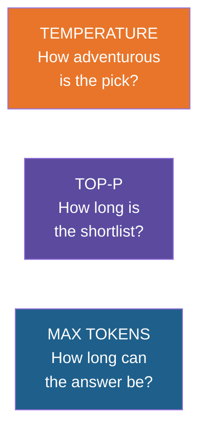
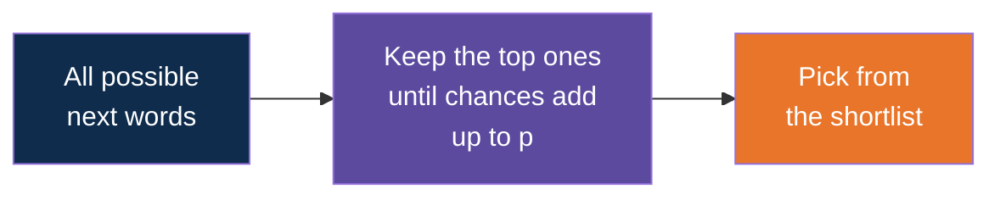
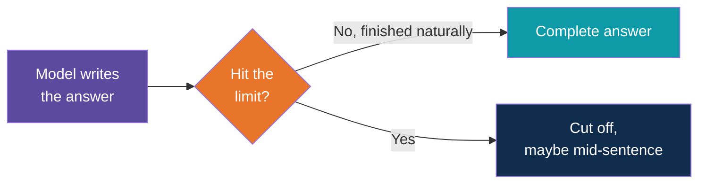
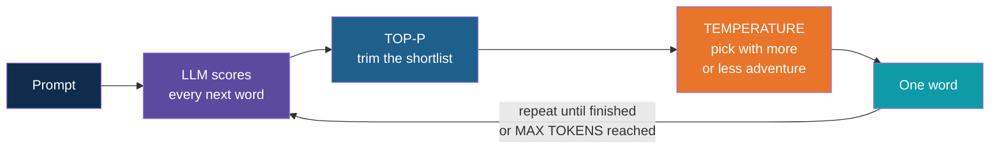

# Temperature, Top-p and Max Tokens

<!-- Slide deck in markdown. Each block between the --- lines is one slide.
     Trainer notes are in HTML comments and do not show in the preview.
     Percentages in the tables are illustrative, made up to show the idea. -->

---

# Temperature, Top-p and Max Tokens

## The three dials that control how a model answers

**Day 1 | Block 1: GenAI and LLM Fundamentals**

<!-- Trainer: about 15 minutes. Best taught live: run the same prompt at different settings. -->

---

## Quick Recap

At every step the model gives **every possible next word a chance**.

Prompt: *"The site inspection is scheduled for ___"*

| Next word | Chance |
|---|:---:|
| tomorrow | 45% |
| Monday | 20% |
| next | 12% |
| Friday | 6% |
| everything else | 17% |

Now the question: **how does it choose from this list?**

---

## Three Dials, Three Jobs

| Dial | Controls | Everyday picture |
|---|---|---|
| Temperature | Steady or varied | Ordering your usual chai vs trying something new |
| Top-p | Which words are even considered | A shortlist on the menu |
| Max tokens | Length of the answer | A word limit on the answer sheet |

---

# Dial 1

## Temperature

---

## The Chai Stall Idea

You visit the same stall every day.

- **Low temperature:** you order your usual cutting chai. Every single day.
- **High temperature:** some days you try the masala chai, the ginger one, or something
  you can't pronounce.

Same stall, same menu. The only thing that changed is **how adventurous you feel.**

---

## What Temperature Does to the Chances

Illustrative, for *"The site inspection is scheduled for ___"*:

| Word | Low temperature | Medium | High temperature |
|---|---|---|---|
| tomorrow | 96% `████████████████████` | 45% `█████████` | 28% `██████` |
| Monday | 3% `▌` | 20% `████` | 22% `████▌` |
| next | 1% `▏` | 12% `██▌` | 17% `███▌` |
| Friday | 0% | 6% `█▎` | 12% `██▌` |
| everything else | 0% | 17% `███▌` | 21% `████▎` |

- **Low:** the favourite wins almost every time. Steady and predictable.
- **High:** the chances flatten out. Unusual words get picked more often.

---

## The Numbers in Practice

| Setting | Behaviour | Feels like |
|---|---|---|
| **0** | Always the top choice | A strict clerk following a form |
| **About 0.2 to 0.4** | Mostly the top choice | A careful professional |
| **About 0.7** | A healthy mix | A friendly colleague |
| **1.0 and above** | Adventurous | A brainstorming session |

> The exact range depends on the provider. Some go from 0 to 1, others from 0 to 2.
> Always check the documentation.

---

## Real Test on Our Classroom Model

Same prompt, three runs each, on the local model we set up:

| Temperature | Run 1 | Run 2 | Run 3 |
|:---:|---|---|---|
| 0 | Tomorrow | Tomorrow | Tomorrow |
| 1.5 | Tuesday | Friday | Tuesday |

Low: identical every time. High: different every time.

---

## Which Setting for Which Job?

| Job at Kalpataru | Temperature | Why |
|---|---|---|
| Pull invoice numbers and amounts out of a PDF | **0** | You want the same answer every time |
| Classify a service ticket | **0 to 0.2** | Consistency matters |
| Summarise a weekly site report | **0.2 to 0.4** | Accurate, with natural wording |
| Draft a client email | **0.5 to 0.7** | Natural, a little variety |
| Brainstorm safety campaign slogans | **0.9 and above** | You want fresh ideas |

> Rule of thumb: **facts and data, go low. Ideas and creativity, go higher.**

---

## Does Temperature 0 Guarantee the Same Answer?

Almost always, but **not always guaranteed**.

- Some providers can still vary slightly due to how their systems run
- A tiny change in the prompt can change the answer

So for critical work, **check the output**, don't just trust it.

---

# Dial 2

## Top-p

---

## The Shortlist Idea

Imagine a restaurant menu with 100 dishes. Most people order from a few popular ones.

**Top-p says: only consider the most popular dishes that together cover p% of all orders.**
Ignore the rest.

---

## Top-p With Our Example

Set **top-p = 0.8** (80%). The model adds the most likely words until it reaches 80%:

| Step | Word | Chance | Running total |
|:---:|---|:---:|:---:|
| 1 | tomorrow | 45% | 45% |
| 2 | Monday | 20% | 65% |
| 3 | next | 12% | 77% |
| 4 | Friday | 6% | **83%, stop** |

**Shortlist: tomorrow, Monday, next, Friday.**
Every other word is dropped, so "banana" can never appear.

---

## Temperature and Top-p Together

| | Temperature | Top-p |
|---|---|---|
| What it changes | How the chances are spread | Which words are allowed |
| Low value | Very predictable | Very short shortlist |
| High value | More variety | Longer shortlist, more variety |

> **Tip:** change **one at a time**. If you change both, you won't know which one made the
> difference. Most people adjust temperature and leave top-p alone.

---

# Dial 3

## Max Tokens

---

## The Word Limit

**Max tokens** sets the longest answer the model is allowed to write.

Think of an exam answer sheet with a fixed number of lines. When the lines run out, the
writing stops, **even mid-sentence**.

---

## Why Set a Limit?

| Reason | Benefit |
|---|---|
| Control cost | Output tokens are billed, often at a higher price |
| Control speed | Shorter answers arrive faster |
| Stop rambling | Prevents endless replies |
| Fit a screen or form | A 3-line summary box needs 3 lines |

**Watch out:** set it too low and answers get chopped off.
Apps can see *why* a reply ended (finished vs hit the limit), and we will use that on Day 3.

Remember from the tokens deck: **about 3 words for every 4 tokens** in English.
100 tokens is roughly 75 words.

---

## All Three Dials Together

---

## Cheat Sheet

| Task type | Temperature | Top-p | Max tokens |
|---|---|---|---|
| Extraction, classification | 0 | Default | Small, just enough |
| Summaries and reports | 0.2 to 0.4 | Default | Medium |
| Emails and drafts | 0.5 to 0.7 | Default | Medium to large |
| Brainstorming | 0.9 and above | Default | As needed |

<!-- Trainer: "default" means leave it alone. -->

---

# Try It

## Explore It Yourself

No code needed.

| To see... | Try | What to do |
|---|---|---|
| Temperature and top-p visually | Transformer Explainer (poloclub.github.io/transformer-explainer) | Type a sentence, move the temperature slider, watch the next-word bars flatten or sharpen |
| Steady vs varied answers | Your local Ollama model | Run `ollama run <model>`. Type `/set parameter temperature 0`, ask the same question 3 times. Then `/set parameter temperature 1.5` and ask 3 times again. |
| Top-p | Same Ollama chat | Type `/set parameter top_p 0.3`, then `/set parameter top_p 0.95`, and compare |
| Max tokens | Same Ollama chat | Type `/set parameter num_predict 20` and ask for a long explanation. See it stop. |
| Real-world tools | A cloud chat playground from your provider | Find the temperature slider in its settings panel |

<!-- Trainer: links are from memory of well-known public tools. Open each before class. -->

---

## Three Quick Exercises

1. Ask for **"five names for a new site safety campaign"** at temperature 0, then at 1.5.
   Which list is more interesting? Which is more repeatable?
2. Ask it to **"extract the amount from: Invoice total is Rs 12,45,000 payable in 30 days"**
   at temperature 0, then 1.5. Did the answer change?
3. Ask for **"explain concrete curing"** with a small max tokens, then a large one.
   Where did the small one stop?

---

## Common Myths

| Myth | Reality |
|---|---|
| "Higher temperature makes it smarter" | No. It only makes it more varied, and more likely to go wrong. |
| "Temperature 0 means always correct" | No. Steady is not the same as right. |
| "Higher temperature adds more facts" | No. It only changes how it picks words. |
| "Max tokens makes answers shorter and better" | It only cuts them. To get a good short answer, **ask** for one. |

---

## Remember These Four Things

1. **Temperature:** low is steady, high is adventurous
2. **Top-p:** a shortlist of the most likely words
3. **Max tokens:** the longest answer allowed
4. **Facts go low, ideas go higher.** Change one dial at a time.

---

## Quick Check

1. What does temperature 0 do?
2. Which temperature would you use to pull invoice numbers from a document? Why?
3. What is top-p, in your own words?
4. What happens when the model hits max tokens?
5. Does a higher temperature make the model more accurate?

---

## Next Up

**Hallucination:** why a model can sound sure and still be wrong, and what to do about it.

---

*Prepared for Kalpataru Projects | AIM ADaSci | Confidential*
