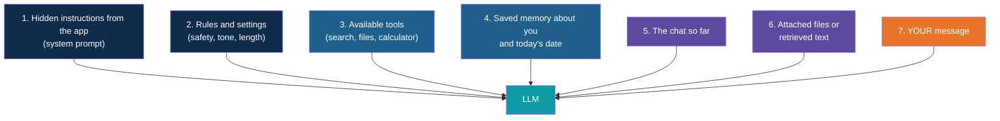
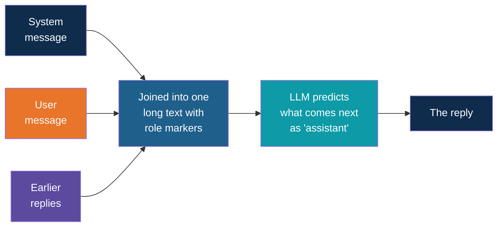
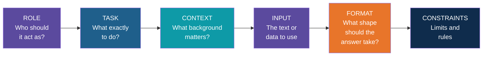
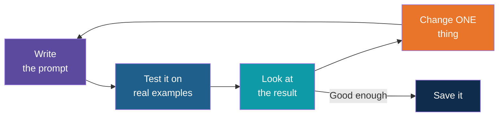

# Prompts: What the LLM Really Receives, and How to Write Better Ones

<!-- Slide deck in markdown. Each block between the --- lines is one slide.
     Trainer notes are in HTML comments and do not show in the preview.
     Example outputs are illustrative of typical model behaviour. Real outputs vary. -->

---

# Prompts

## What the LLM really receives, and how to write better ones

**Day 1 | Block 2: Prompt Engineering**

<!-- Trainer: about 25 minutes. Two halves: (1) what is really sent, (2) how to improve a prompt. -->

---

## The Big Question

You type: *"Summarise this for my manager."*

# Is that all the model sees?

**No.** Chat apps add a lot before your message reaches the model.

---

## The Waiter Analogy

You tell the waiter: **"One chai."**

The waiter doesn't shout only that to the kitchen. The ticket also says:

- Table number 7
- The restaurant's rules ("no spice for this customer, allergy noted")
- What you ordered earlier
- Today's specials

The kitchen gets the **full ticket**, not just your words.

Chat apps like ChatGPT, Gemini, Claude and Copilot work the same way.

---

## What Actually Gets Sent

> Your message is the **last and smallest** part of what the model reads.
> Which of these extras are present depends on the app.

---

# The Roles

## System, user and assistant

---

## Every Message Has a Role

| Role | Who writes it | Purpose | Example |
|---|---|---|---|
| **System** | The app or developer | Sets behaviour, tone, rules | "You are a polite assistant for a construction company. Keep answers short." |
| **User** | You | Asks the question or gives the task | "Summarise this for my manager." |
| **Assistant** | The model | The model's earlier replies | "Sure. Here are three points..." |
| **Tool** (sometimes) | A connected tool | Results from search, files or systems | "Search result: ..." |

Think of a **film set**: the **director** (system) gives the actor the role and rules,
the **other actor** (user) speaks a line, and the **actor** (assistant) replies in character.

---

## What Your Message Looks Like Inside (Illustrative)

You typed one line. The model may receive something like this:

| # | Role | Content |
|:---:|---|---|
| 1 | System | "You are a helpful assistant. Today's date is 22 September. Be clear and concise. Do not give harmful advice." |
| 2 | User | "Here is our site diary for this week..." |
| 3 | Assistant | "Thanks, I have read it. What would you like?" |
| 4 | User | "Summarise this for my manager." |

The app builds this list every time. You only wrote row 4.

---

## Same Engine, Different Dashboard

Why do ChatGPT, Gemini, Claude and Copilot each **feel different**, even when the engine is
similar?

| Different in each app | Effect |
|---|---|
| Hidden system prompt | Different tone, rules, personality |
| Tools connected | Web search, file reading, image tools |
| Settings | Temperature, length limits |
| Memory features | What it remembers about you |
| Safety rules | What it refuses |

The exact hidden instructions are usually **not shown to you**. They differ from app to app
and change over time.

---

## Under the Hood: One Long Text

Roles are for us. Inside, everything is joined into **one long piece of text** with markers.
The model then does what it always does: **predict the next words**, but now as the
assistant's turn.

It is still **next-word prediction**. The roles just organise the text the model continues.

---

## No Memory, Remember?

The model doesn't remember your last chat. To "remember", the app **sends the earlier
messages again** each time (this is why long chats cost more tokens).

| Feature you see | What really happens |
|---|---|
| "It remembers my name" | The app stores a note and inserts it into the prompt |
| "Continue from yesterday" | The app re-sends the old messages |
| "Custom instructions" | The app adds your text to the system prompt |

---

## In Your Own App, You Are the Waiter

In ChatGPT or Gemini, the app writes the hidden part. When **you** build an app (Days 3 to 5),
**you write the system prompt.**

| | Using a chat app | Building your own app |
|---|---|---|
| System prompt | Written by the app company | **Written by you** |
| Tools | Chosen by the app company | **Chosen by you** |
| Settings | Mostly hidden | **You set them** |
| Data it can see | What the app allows | **Your documents and systems** |

That is the power of building: you decide the whole ticket.

---

## Why This Matters for Safety

- Hidden prompts are **not a vault**. Don't put secrets in them.
- Text inside documents or web pages can **look like instructions** to the model.
  This is called **prompt injection**, and we return to it later.
- Never paste confidential data into a tool your company hasn't approved.

---

# Writing Better Prompts

## Step by step

---

## The Six Ingredients of a Good Prompt

You don't always need all six. But every one you add **removes guessing** from the model.

---

## Our Practice Task

Ravi's manager wants a short update. Here is the **input** we will use every time
(synthetic data):

> **Site diary, 14 Oct:** Slab casting for Block B completed. Two days lost earlier this
> week due to rain. Steel delivery delayed by three days, new date is 18 Oct. 42 workers on
> site. One minor injury, first aid given.

Let's improve the prompt one step at a time.

---

## Step 0: The Vague Prompt

> **Summarise this.**

Typical result: a long, generic paragraph that repeats every detail, in no particular order,
with no idea who it's for.

**Problem:** the model has to guess your audience, length and priorities.

---

## Step 1: Add the Task and Audience

> **Summarise this site diary update for my project manager.**

**Better:** now it knows who reads it. The tone becomes more businesslike.
**Still missing:** what the manager cares about.

---

## Step 2: Add a Role

> **You are a project coordinator.** Summarise this site diary update for my project
> manager.

**Better:** the role sets a professional viewpoint and vocabulary.

---

## Step 3: Add Context

> You are a project coordinator. Summarise this site diary update for my project manager.
> **The manager has a review meeting tomorrow and mainly cares about delays and risks.**

**Better:** the model now knows what to **emphasise**.

---

## Step 4: Add the Format

> You are a project coordinator. Summarise this site diary update for my project manager,
> who has a review meeting tomorrow and cares about delays and risks.
> **Use three bullet points, then one line starting with "Action needed:".**

**Better:** the shape is predictable and easy to scan.

---

## Step 5: Add Constraints

> You are a project coordinator. Summarise this site diary update for my project manager,
> who has a review meeting tomorrow and cares about delays and risks. Use three bullet
> points, then one line starting with "Action needed:".
> **Keep it under 60 words. No jargon. Use only facts from the diary and don't invent
> numbers. If something is not stated, write "not stated".**

**Better:** shorter, honest, and safer against made-up details.

---

## Step 6: Iterate and Fix

Look at the result and adjust **one thing** at a time.

Typical result for the Step 5 prompt (illustrative):

> - Block B slab casting completed.
> - Delays: two days lost to rain; steel delivery now 18 Oct (three days late).
> - Safety: one minor injury, first aid given.
>
> Action needed: confirm the new steel delivery date with the vendor.

Not right? Tweak. For example: *"Put safety first."* or *"Mention the 42 workers."*

---

## Before and After, Side by Side

| | Step 0 | Step 5 |
|---|---|---|
| Prompt | "Summarise this." | Role + task + context + format + constraints |
| Length | Long paragraph | About 50 words |
| Structure | None | 3 bullets and an action line |
| Focus | Everything equally | Delays and risks |
| Safe from invention | Not guaranteed | Facts only, "not stated" if unknown |
| Reusable | Not really | Yes, swap the input each week |

---

## What Each Step Added

| Step | Removes this guess |
|---|---|
| Audience | "Who is this for?" |
| Role | "What viewpoint and tone?" |
| Context | "What matters most?" |
| Format | "What shape should it take?" |
| Constraints | "How long? What must I avoid?" |

---

# More Before and After

## Same idea, other tasks

---

## Example: Drafting an Email

| | Prompt |
|---|---|
| **Before** | "Write an email about the delay." |
| **After** | "You are a project manager at a construction company. Write a polite email to a steel vendor asking for a firm delivery date after a 3-day delay. Mention that the slab work is waiting. Keep it under 100 words and end with a clear request for reply by Friday." |

**Why it's better:** the reader, tone, length, key facts and the ask are all clear.

---

## Example: Pulling Out Data

| | Prompt |
|---|---|
| **Before** | "What are the details in this invoice?" |
| **After** | "From the invoice text below, extract vendor name, invoice number, date and total amount. Reply as four lines in the form `Label: value`. If a field is missing, write `Not found`. Do not guess." |

**Why it's better:** predictable output that a person or program can use.

---

## Example: Classifying Tickets

| | Prompt |
|---|---|
| **Before** | "Is this ticket urgent?" |
| **After** | "Classify the service ticket below as Urgent, Normal or Low. Urgent means safety risk or work stopped. Reply with only one word, then a one-line reason. Ticket: ..." |

**Why it's better:** the meaning of each label is defined, so answers are consistent.

---

## Show, Don't Just Tell

Sometimes a **worked example** teaches better than a rule. This is called **few-shot
prompting**.

> Classify each ticket as Urgent, Normal or Low.
> Ticket: "Crane cable frayed, work continues." Answer: Urgent
> Ticket: "Canteen tap is dripping." Answer: Low
> Ticket: "Delivery gate sensor not working." Answer:

The model copies the pattern. We practise this in Lab 1.

---

## Habits of Good Prompt Writers

| Habit | Example |
|---|---|
| Be specific | "3 bullets" beats "short" |
| Give context | "for a review meeting tomorrow" |
| Show the format | "Label: value, one per line" |
| Say what not to do | "Don't invent numbers" |
| Allow "I don't know" | "If not stated, write not stated" |
| Separate instructions from data | Put the diary text after a clear label |
| Iterate | Change one thing, then test again |
| Save what works | Your Prompt Pattern Card (Lab 1) |

---

## The Fill-in-the-Blanks Template

A handy starting point. Copy it and fill it in:

| Part | Fill in |
|---|---|
| **Role** | You are a ___ |
| **Task** | Your job is to ___ |
| **Context** | Background: ___ |
| **Input** | Here is the text: ___ |
| **Format** | Reply as ___ |
| **Constraints** | Keep it ___. Don't ___. If unsure, ___ |

---

## The Improvement Loop

Test on **more than one input**. A prompt that works once may fail on the next diary.

---

## Common Mistakes

| Mistake | Fix |
|---|---|
| Too vague ("make it better") | Say what "better" means |
| Too much at once | Split into steps |
| No format | Ask for bullets, a table, or labelled lines |
| Assuming it knows your company | Give the background |
| Trusting the first answer | Check facts, especially numbers |
| Pasting confidential data | Use approved tools and synthetic data |
| Changing many things at once | Change one, then test |

---

# Try It

## Explore It Yourself

No code needed.

| To see... | Try | What to do |
|---|---|---|
| The effect of a system prompt | Your local Ollama model | Run `ollama run <model>`, ask "Explain concrete curing." Then type `/set system "You are a site safety officer. Answer in two short sentences."` and ask again. |
| A system prompt box in the real world | A cloud playground from your provider (many have a "system instructions" field) | Write a system prompt, then chat and see how it changes tone |
| Custom instructions | Your chat app's settings | Add a line like "Always answer in bullet points" and see it applied to every chat |
| Step-by-step improvement | Any chat tool | Take the diary example and try Steps 0 to 5. Note what changes at each step. |

<!-- Trainer: check that each tool is available in your training environment. -->

---

## Exercise: Improve Your Own Prompt

1. Pick a real task from your work (use made-up data, not confidential data)
2. Write the vague version and run it
3. Add one ingredient at a time: role, context, format, constraints
4. Run after each change and note what improved
5. Save the final version as a template

---

## Remember These Five Things

1. The model receives **much more** than what you type: system prompt, history, tools, memory
2. **Roles** (system, user, assistant) organise the text
3. In your own app, **you write the system prompt**
4. A good prompt has **role, task, context, input, format, constraints**
5. Improve prompts **one step at a time**, and save the good ones

---

## Quick Check

1. Is the text you type the only thing the model sees? Name two other things it may get.
2. What is the difference between the system and user roles?
3. Why can two chat apps behave differently on the same underlying model?
4. Name the six ingredients of a good prompt.
5. Why change only one thing at a time when improving a prompt?

---

## Next Up

**Prompt patterns:** few-shot, step-by-step reasoning, structured output and self-check.

---

*Prepared for Kalpataru Projects | AIM ADaSci | Confidential*
