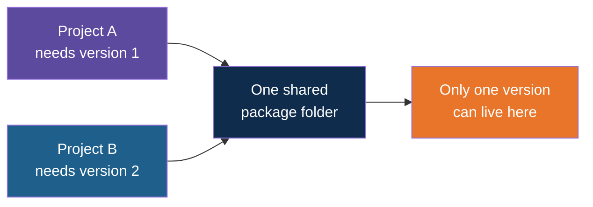
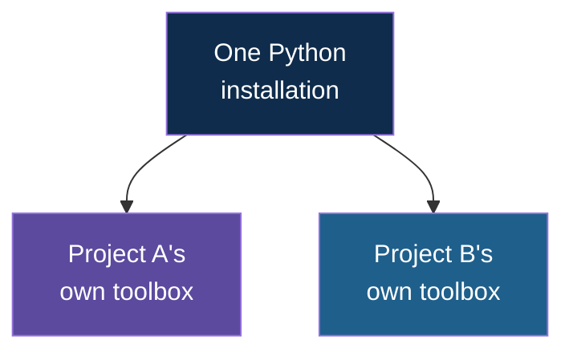
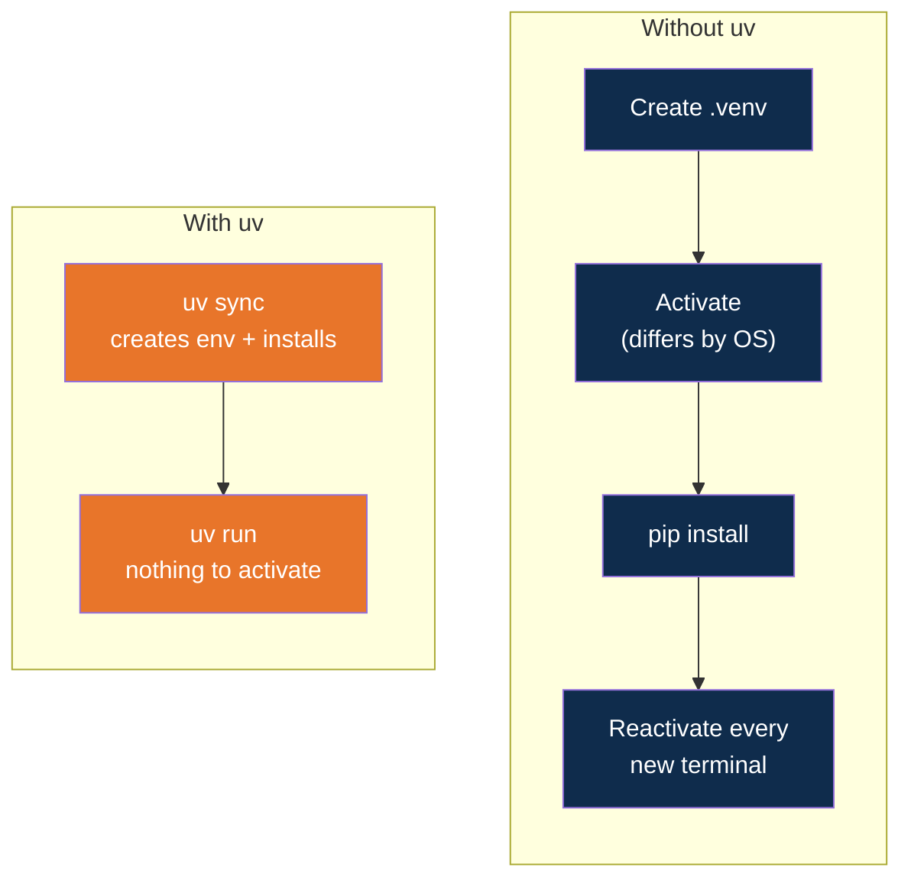

# Virtual Environments and uv

<!-- Slide deck in markdown. Each block between the --- lines is one slide. -->

---

# Virtual Environments and uv

## Why every Python project needs its own toolbox

**Day 1 | Block 3: Python for AI**

---

## The Problem

Two people share one toolbox. One needs a metric wrench, the other needs imperial. There
is only one set, so restocking it for one person can leave the other stuck.

Python has the same problem: if every project shares **one** global set of installed
packages, two projects needing different versions of the same package cannot both get
what they need.

---

## The Fix: a Private Toolbox Per Project

A **virtual environment** is a private, isolated set of packages for one project. One
Python installation, many separate toolboxes — installing something for one project can
never affect another.

---

## Without uv: `venv` + `pip`

The traditional way needs four separate manual habits, and skipping any one of them
causes a confusing error:

| Step | Easy to get wrong |
|---|---|
| Create the environment | Wrong folder |
| Activate it | A different command per OS — easy to forget |
| Install packages | Installs into the wrong place if step 2 was skipped |
| Every new terminal | Forgetting to activate again |

There's also no guarantee two people who "installed the same requirements" end up with
identical package versions.

---

## With uv

**uv** replaces that whole workflow with one fast tool — and can install Python itself. It
also writes down the exact versions it installed, so the same setup can be reproduced
exactly, by anyone.

---

## What Problem Does uv Actually Solve?

| Pain without uv | What uv does instead |
|---|---|
| Several manual setup steps | One command, `uv sync` |
| Forgetting to activate | `uv run` always uses the right environment |
| No guarantee of identical installs | `uv.lock` pins exact versions automatically |
| Slower installs | uv is built for speed |
| Managing Python versions separately | uv installs and switches them for you |

---

## Explore It Yourself

| To see... | Try |
|---|---|
| uv is installed | Run `uv --version` (from Lab 2 — see the environment setup note) |
| The old way, hands-on | without-uv walkthrough — Day 3 |
| The uv way, hands-on | with-uv walkthrough — same app, same code |
| A lock file in the wild | After `uv sync`, open the generated `uv.lock` |

---

## Remember

1. A virtual environment gives each project its own packages — no collisions.
2. `venv` + `pip` works, but in several manual, easy-to-skip steps.
3. uv does the same job in fewer steps, plus a lock file for reproducibility.
4. Application code never knows which tool set up its environment — that's why the same
   `main.py` works unchanged in both walkthroughs.

---

## Lab Tie-In

The hands-on build is on Day 3 (Block 1: Python for AI in Practice, Lab 1: Project
Skeleton): build the Site Status API once with `venv` + `pip` (the without-uv walkthrough),
then again with uv (the with-uv walkthrough).

---

*Prepared for Kalpataru Projects | AIM ADaSci | Confidential*
