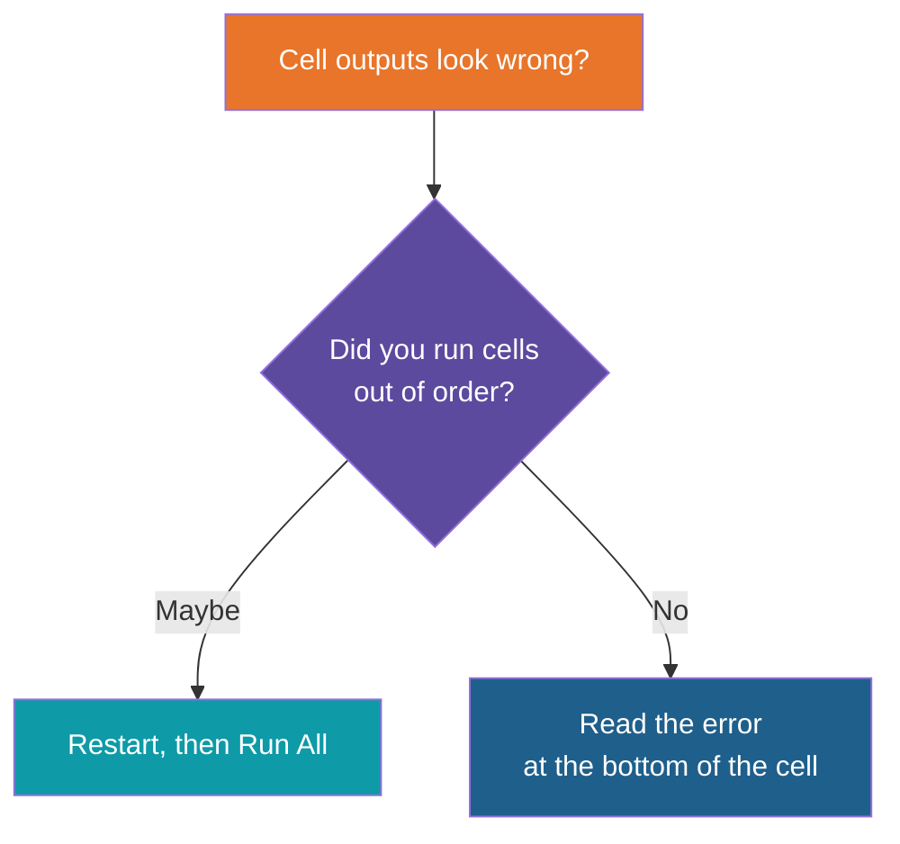

# Jupyter Notebooks

**Day 1 | Block 3: Python for AI | Working in small cells**

> Goal: know what a notebook is, run one in VS Code, and avoid the usual surprises.

---

## What Is a Notebook?

A notebook (`.ipynb` file) is one page that mixes **text**, **code** and **results**. You run code a small piece at a time and see the answer right under it.

Think of a lab notebook: your notes, your experiment and the outcome, all on the same page.

| | Script (`.py`) | Notebook (`.ipynb`) |
|---|---|---|
| Runs | Top to bottom, all at once | One cell at a time, in any order |
| Output | Terminal | Right under each cell |
| Best for | Finished programs, apps | Learning, trying ideas, explaining |
| Shares well as | Code | A readable story with results |

---

## The Two Cell Types

| Cell | Holds | You run it to |
|---|---|---|
| Code | Python | Execute it and see the output |
| Markdown | Headings, text, lists | Turn the text into a formatted note |

---

## The Kernel: The Memory Behind the Notebook

The **kernel** is the running Python that executes your cells. It remembers every variable you have created until it is restarted.

| Kernel action | Use it when |
|---|---|
| Run | Normal work |
| Interrupt | A cell is stuck or looping |
| Restart | Things behave strangely, or you want a clean start |
| Restart and Run All | Final check that the whole notebook works in order |

---

## Using Notebooks in VS Code

You already installed the **Jupyter** extension in the setup lab.

| Step | Do this |
|---|---|
| 1. Open | Click any `.ipynb` file in the project |
| 2. Pick the kernel | Top right, "Select Kernel", choose the interpreter inside `.venv` |
| 3. Run a cell | Click the play icon on the left of the cell |
| 4. Run and move on | Shift + Enter |
| 5. Run all | "Run All" in the toolbar at the top |

If VS Code asks to install `ipykernel`, say yes. Adding the package once with uv also avoids the prompt.

**New notebook:** Cmd/Ctrl + Shift + P, then `Create: New Jupyter Notebook`.

---

## Keyboard Shortcuts

Press **Esc** to leave a cell (command mode), **Enter** to edit it again.

| Keys | Action |
|---|---|
| Shift + Enter | Run cell, go to the next |
| Ctrl + Enter | Run cell, stay put |
| A / B (command mode) | Insert a cell Above / Below |
| M / Y (command mode) | Make it Markdown / Code |
| D, D (command mode) | Delete the cell |
| Z (command mode) | Undo a cell delete |

---

## Habits That Save You Pain

| Gotcha | Why it happens | Fix |
|---|---|---|
| A variable has an old value | Cells can run in any order, the kernel keeps the last value | Restart and Run All |
| "NameError: not defined" | The cell that creates it has not run yet | Run the cell above first |
| Package not found | The kernel uses a different Python than your project | Select the `.venv` kernel |
| Secrets in the output | Outputs are saved inside the file | Never print keys; clear outputs before sharing |
| Cell never finishes | An endless loop or a slow model call | Interrupt |

---

## Notebook or Script?

| Use a notebook to... | Use a script to... |
|---|---|
| Learn and try things step by step | Build the real app |
| Explore data and see results at once | Run on a schedule or a server |
| Explain your work to someone | Be imported by other files |

A common path: try the idea in a notebook, then move the working parts into a `.py` file.

**Notebook quirk:** the `if __name__ == "__main__"` pattern from the main method lesson is not needed here. Each cell is already its own starting point.

---

## Running Notebooks Outside VS Code

| Way | What it is |
|---|---|
| Jupyter Lab | Runs in your browser, started from the terminal |
| Google Colab | Free notebooks in the cloud, nothing to install |

VS Code is enough for this course.

---

## Try It Now

Open the Python essentials notebooks and, for each one:

- [ ] Select the `.venv` kernel
- [ ] Run the cells one by one with Shift + Enter
- [ ] Change a value in a cell, run it again, and watch the output change
- [ ] Finish with Restart and Run All

---

*Prepared for Kalpataru Projects | AIM ADaSci | Confidential*
