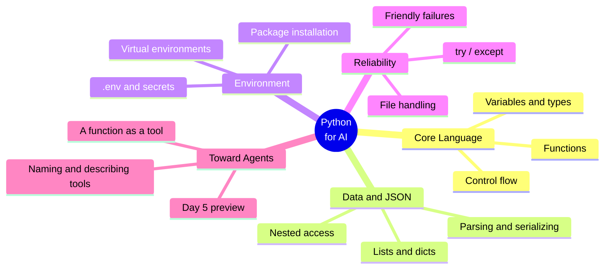
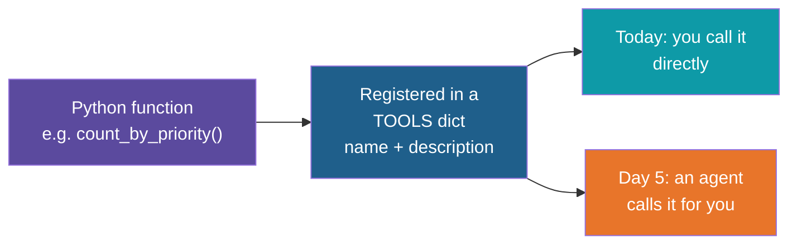
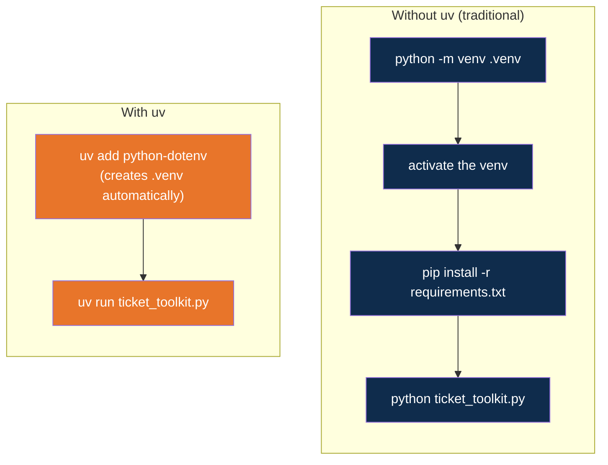

# Python Essentials for AI

**Day 1 | Block 3: Python for AI | Lab 2: Environment Setup**

This folder is the hands-on companion to Block 3. It covers the Python you will lean on
for the rest of the program -- and points ahead to how the same small pieces (functions,
data structures, a bit of config) become the building blocks of an AI agent on Day 5.

---

## Why Python, Specifically

Most of the AI tooling you will touch in this program -- LLM SDKs (Gemini, OpenAI,
Claude), RAG libraries, agent frameworks like LangGraph and CrewAI -- ship their primary
interface in Python first. That is not a coincidence: Python's data structures map
cleanly onto how LLMs communicate (JSON in, JSON out), and its syntax stays readable even
when a script is mostly plumbing around an API call.

You do not need to become a Python expert. You need to be fluent in a small slice of the
language: how to shape data, how to wrap steps in a function, how to keep a program
running when something upstream goes wrong. That slice is what this block covers.

---

## Python Essentials, At a Glance

Everything in this block is in service of one idea: **an AI agent is, underneath, a loop
that calls plain Python functions.** The better you can write, structure and describe a
function today, the easier agent-building will feel on Day 5.

---

## From a Function to a Tool

A "tool" in agent frameworks is nothing exotic -- it is a function with a name and a
one-line description, collected in a lookup table. An agent's job is to read a request,
decide which entry in that table fits, and call it.

You will see this exact pattern -- a `TOOLS` dict mapping a name to a function -- in the
exercise below.

---

## Without uv vs. With uv

Every Python project needs an isolated place to install packages (a virtual
environment) so one project's dependencies do not collide with another's. There are two
ways to get there, and you will practise both:

Same outcome, fewer steps and nothing to "activate" with uv. `session-01/notes/02-setting-up-our-env.md`
already introduced uv for your main lab environment; this exercise is where you feel the
difference on a second, throwaway project.

---

## The Exercise: Ticket Triage Toolkit

A synthetic set of site/service tickets (`tickets.json`) -- electrical faults, safety
re-inspections, procurement follow-ups -- and a script (`ticket_toolkit.py`) with a few
functions left as `TODO`s for you to complete:

| Function | Python concept it practises |
|---|---|
| `load_tickets` | File handling, `try` / `except`, JSON parsing |
| `filter_by_status` | List comprehension, dict access |
| `count_by_priority` | Loops, dict as a counter |
| `format_ticket_summary` | f-strings, string formatting |
| `top_priority_report` | Composing functions, sorting with a key |
| `TOOLS` registry | Naming and describing functions -- the agent-tool shape |

The identical exercise exists in two folders:

- [`exercise/without-uv/`](exercise/without-uv/) -- set up with `venv` + `pip`
- [`exercise/with-uv/`](exercise/with-uv/) -- set up with `uv`

Full steps, one TODO at a time, are in [`walkthrough.md`](walkthrough.md).

---

## Use Case: Why This Matters at Kalpataru

A site engineer today skims a ticket list by eye to decide what to escalate. The same
`count_by_priority` / `top_priority_report` functions you write here are exactly what
would sit behind a future "morning triage" assistant -- and on Day 5, an agent could call
them itself, in response to a plain-language request like "what should I look at first on
Site A." Block 3's job is to make sure the functions underneath are solid before anything
gets AI-powered.

---

## Lab 2 Tie-In

By the end of this block, alongside the Lab 2 environment checklist in
`notes/02-setting-up-our-env.md`, you should be able to:

- Explain the difference between the `venv` + `pip` workflow and the `uv` workflow
- Read and write nested Python data structures (lists of dicts) and JSON
- Write a function with a docstring, sensible name, and a single clear purpose
- Handle a missing file or malformed JSON without crashing the program
- Read a configuration value from `.env` instead of hardcoding it

---

*Prepared for Kalpataru Projects | AIM ADaSci | Confidential*
