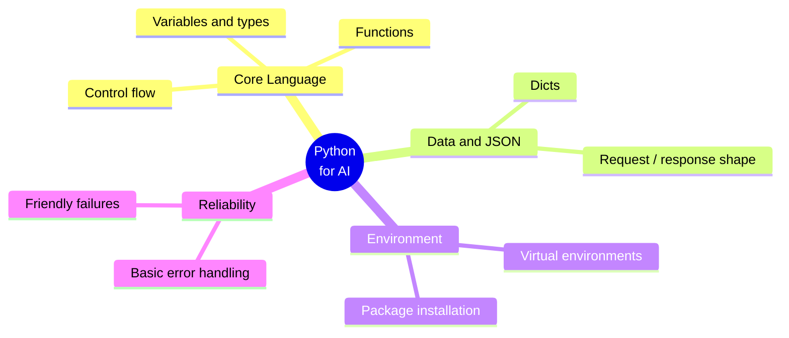
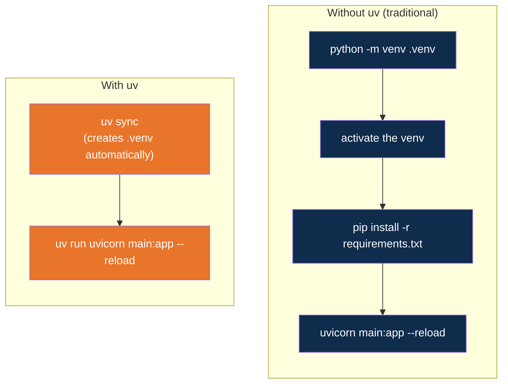

# Python Essentials for AI

**Day 1 | Block 3: Python for AI | Lab 2: Environment Setup**

This folder is the hands-on companion to Block 3. It covers the Python you will lean on
for the rest of the program, using the smallest app that can carry the idea: a two-route
FastAPI service.

---

## Why Python, Specifically

Most of the AI tooling you will touch in this program -- LLM SDKs (Gemini, OpenAI,
Claude), RAG libraries, agent frameworks like LangGraph and CrewAI -- ship their primary
interface in Python first. That is not a coincidence: Python's data structures map
cleanly onto how LLMs communicate (JSON in, JSON out), and its syntax stays readable even
when a script is mostly plumbing around an API call.

You do not need to become a Python expert. You need to be fluent in a small slice of the
language: how to shape data, how to wrap a step in a function, how to keep a program
running when something goes wrong. That slice is what this block covers -- and it is also
exactly what sits behind an AI agent's "tools" later in the program (Day 5): a function
with a clear name and a predictable response.

---

## Python Essentials, At a Glance

---

## Without uv vs. With uv

Every Python project needs an isolated place to install packages (a virtual
environment) so one project's dependencies do not collide with another's. There are two
ways to get there, and you will practise both on the same small app:

Same outcome, fewer steps and nothing to "activate" with uv. `session-01/notes/02-setting-up-our-env.md`
already introduced uv for your main lab environment; this exercise is where you feel the
difference on a second, throwaway project.

---

## The Exercise: Site Status API

A minimal FastAPI app, `main.py`, with two routes and a couple of `TODO`s to fill in:

| Route | What it returns | Python concept it practises |
|---|---|---|
| `GET /` | A welcome message | Functions |
| `GET /sites/{site_id}/status` | Status of a synthetic site, or a 404 if unknown | Dict lookup, basic error handling |

The identical exercise exists in two folders:

- [`exercise/without-uv/`](exercise/without-uv/) -- set up with `venv` + `pip`
- [`exercise/with-uv/`](exercise/with-uv/) -- set up with `uv`

Full steps are in [`walkthrough.md`](walkthrough.md).

---

## Use Case: Why This Matters at Kalpataru

A tiny API like this is the shape almost every internal tool eventually takes: something
that reads a request, looks up or computes a small piece of information, and returns it
as JSON -- a site's status, a ticket count, a procurement summary. FastAPI also gives you
a free, browsable test page (`/docs`) with zero extra code, which is useful for showing
non-technical stakeholders that "yes, this works" without asking them to run anything.

---

## Lab 2 Tie-In

By the end of this block, alongside the Lab 2 environment checklist in
`notes/02-setting-up-our-env.md`, you should be able to:

- Explain the difference between the `venv` + `pip` workflow and the `uv` workflow
- Write a small FastAPI route and run it locally
- Return a clear error (a 404 with a message) instead of letting the app crash

---

*Prepared for Kalpataru Projects | AIM ADaSci | Confidential*
