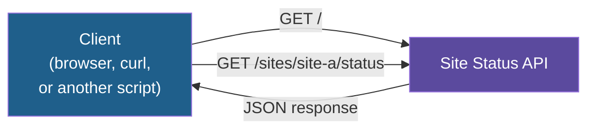

# Step 0 — Concepts Overview

> [Back to index](README.md) · Next: [Step 1 — Environment Setup](01-environment-setup.md)

## Goal

Before touching code, know what you're building and the four or five words you'll need
to talk about it.

## Why this matters

Every AI tool you build from Day 3 onward is, underneath, a small program that receives
a request and returns structured data — a chatbot backend, a RAG lookup, an agent's
tool. FastAPI is the simplest way in Python to build exactly that shape: a function that
runs when a request comes in, and a return value that becomes JSON automatically. Once
you can build a two-route app like this one, you can build the API layer behind almost
anything you make in this program.

## What You're Building

A **Site Status API**: a tiny web server with two routes.



- `GET /` responds with a welcome message.
- `GET /sites/{site_id}/status` looks up a site in an in-memory list and responds with
  its status, or a clear error if the site does not exist.

## Vocabulary You'll Need

| Term | In one line |
|---|---|
| Route | A URL path plus an HTTP method (`GET`, `POST`, ...) mapped to a Python function |
| Path parameter | A piece of the URL itself, e.g. `site_id` in `/sites/{site_id}/status` |
| ASGI server | The program that actually listens on a port and hands requests to FastAPI — here, `uvicorn` |
| `HTTPException` | FastAPI's way of returning a structured error (a status code plus a message) instead of crashing |

## Why FastAPI Specifically

You write a plain Python function; FastAPI turns it into a web endpoint and turns your
return value into JSON, with no manual serialization code. It also generates a free,
browsable test page (`/docs`) from your routes — useful for demoing to someone who does
not want to run a terminal command.

## Try it

Nothing to run yet. Confirm your tools are ready before Step 1:

```bash
python3 --version   # 3.10 or higher
uv --version         # any recent version
```

If either command fails, complete
[../../notes/02-setting-up-our-env.md](../../notes/02-setting-up-our-env.md) first.

Next: **[Step 1 — Environment Setup](01-environment-setup.md)**.
