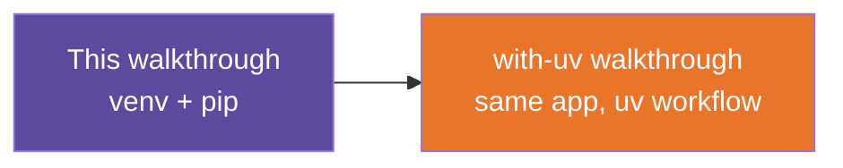

# Site Status API — Without uv — Build Walkthrough

A step-by-step guide to hand-building the reference app in
[`../solutions/without-uv/`](../solutions/without-uv/README.md): a minimal FastAPI service, set up the
traditional way with `venv` and `pip`.

## What You'll Build

A two-route FastAPI app, `main.py`:

- `GET /` — a welcome message
- `GET /sites/{site_id}/status` — the status of a synthetic construction site looked up
  by id, or a clear 404 if the id doesn't exist

Same shape every internal lookup tool ends up taking: read a request, look something up,
return JSON or a clear error.

## Who This Is For / Prerequisites

Day 1, Block 3 (Python for AI), Lab 2 (Environment Setup). Assumes basic Python (variables,
functions, dicts) and that Python 3.10+ is already installed and confirmed working — see
[Step 1 of the environment setup note](../../notes/02-setting-up-our-env.md). No prior
FastAPI experience required. Budget 30-40 minutes.

## Steps

| Step | File | What You'll Add | Est. Time |
|---|---|---|---|
| 1 | [01-concepts-overview.md](01-concepts-overview.md) | Vocabulary: API, route, JSON, virtual environment | 5 min |
| 2 | [02-environment-setup.md](02-environment-setup.md) | `.venv` + installed packages | 5 min |
| 3 | [03-first-route.md](03-first-route.md) | `app = FastAPI()` and `GET /` | 5 min |
| 4 | [04-in-memory-data.md](04-in-memory-data.md) | The `SITE_STATUS` dict | 5 min |
| 5 | [05-site-status-route.md](05-site-status-route.md) | `GET /sites/{site_id}/status`, happy path | 5 min |
| 6 | [06-error-handling.md](06-error-handling.md) | A clean 404 for unknown ids | 5 min |
| 7 | [07-recap-and-exercises.md](07-recap-and-exercises.md) | Review + practice | 10 min |

## Relationship to the Reference Implementation

By the end of Step 6, your `main.py` should match
[`../solutions/without-uv/main.py`](../solutions/without-uv/main.py) exactly, and your `requirements.txt`
should match [`../solutions/without-uv/requirements.txt`](../solutions/without-uv/requirements.txt). This
walkthrough was generated from, and statically checked against, that reference — every
checkpoint has been diffed against the real source file.

## Suggested Demo Flow

1. Before writing any code, run the finished reference app yourself and open
   `http://127.0.0.1:8000/docs` so trainees see the destination first, then build toward it.
2. At the end of Step 5, deliberately request an unknown site id and let the app crash with
   a raw 500 — that failure is the hook for Step 6's "why this matters."
3. Keep a second terminal running `curl` next to the `/docs` browser tab, so trainees see the
   raw JSON an API consumer would get, not just the interactive UI.
4. After Step 4, have trainees add a fourth synthetic site to `SITE_STATUS` before you reveal
   Step 5 — a cheap check that they understand the dict literal.
5. If someone doesn't see their code changes take effect, the first question is always
   "did you start uvicorn with `--reload`?"

## Series

Start with [Step 1 — Concepts Overview](01-concepts-overview.md).
