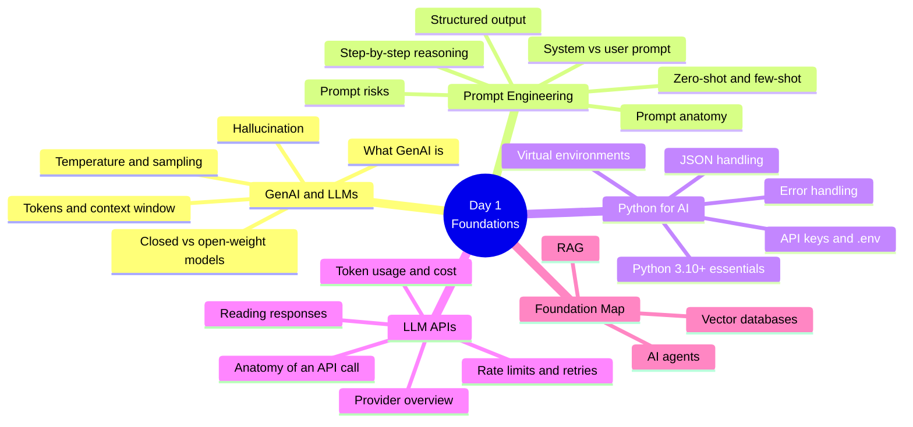
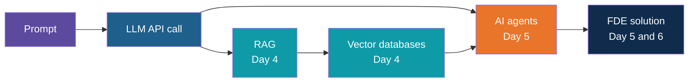
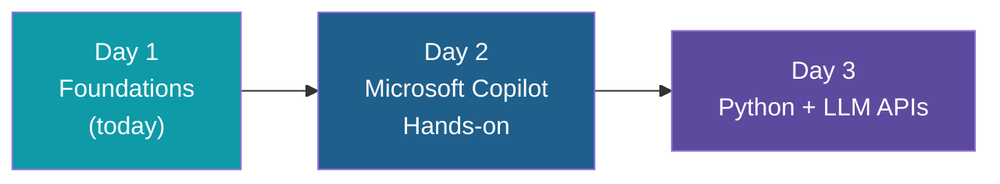

# Day 1: AI Developer Foundations

**AI Developer & FDE Training | Kalpataru Projects, Ahmedabad**
Week 1, Day 1 of 6 | 4 hours | Batch 1 (forenoon) and Batch 2 (afternoon)

---

## Today at a Glance

Five topic areas, three hands-on labs, one shared foundation for the rest of the program.

---

## Agenda

```mermaid
gantt
    title Day 1 Agenda (240 minutes)
    dateFormat HH:mm
    axisFormat %H:%M
    section Opening
    Kickoff                         :a1, 09:30, 15m
    section Concepts
    GenAI and LLM fundamentals      :a2, after a1, 40m
    section Prompting
    Prompt engineering and Lab 1    :a3, after a2, 55m
    Break                           :crit, a4, after a3, 15m
    section Build
    Python for AI and Lab 2         :a5, after a4, 45m
    LLM APIs and Lab 3              :a6, after a5, 45m
    section Close
    Foundation map                  :a7, after a6, 15m
    Wrap-up and exit check          :a8, after a7, 10m
```

| Time | Duration | Topic Block | Type |
|---|---|---|---|
| 00:00 to 00:15 | 15 min | Kickoff and objectives | Intro |
| 00:15 to 00:55 | 40 min | 1. GenAI and LLM Fundamentals | Learn |
| 00:55 to 01:50 | 55 min | 2. Prompt Engineering + Lab 1 | Learn + Apply |
| 01:50 to 02:05 | 15 min | Break | |
| 02:05 to 02:50 | 45 min | 3. Python for AI + Lab 2 | Learn + Apply |
| 02:50 to 03:35 | 45 min | 4. LLM APIs + Lab 3 | Learn + Apply |
| 03:35 to 03:50 | 15 min | 5. Foundation Map | Learn |
| 03:50 to 04:00 | 10 min | Wrap-up and exit check | Reflect |

Clock times are indicative and can be shifted; Batch 2 follows the same durations.

---

## Topics Covered

### Block 1: GenAI and LLM Fundamentals (40 min)

1. What generative AI is, and how it differs from traditional ML and rule-based software
2. How an LLM works at an intuition level: tokens, next-token prediction, transformer idea
3. Context window and its limits
4. Key controls: temperature, top-p, max tokens
5. Why models hallucinate and what it means for enterprise use
6. Model landscape: closed API models (Gemini, OpenAI, Claude) and open-weight models (Llama, Mistral)
7. Hosted versus local runtime
8. Model selection criteria: cost, latency, context length, data policy, licence

### Block 2: Prompt Engineering (55 min)

1. Anatomy of a good prompt: role, task, context, input data, output format, constraints
2. System prompt versus user prompt
3. Zero-shot and few-shot prompting
4. Step-by-step reasoning
5. Delimiters and output templates
6. Asking for structured output
7. Self-check prompts
8. Iterative refinement
9. Prompt risks: ambiguity, prompt injection awareness, sensitive data

**Lab 1: Prompt Patterns.** Practise role + task + format, few-shot, structured output and self-check, then save your best prompts to a Prompt Pattern Card.

### Block 3: Python for AI (45 min)

1. Python 3.10+ features used across the program
2. Virtual environments and package installation
3. Core data structures, functions and string formatting
4. Working with JSON: parsing, serializing, nested access
5. Environment variables and `.env` files; keeping keys out of code and Git
6. File handling and basic exception handling

**Lab 2: Environment Setup.** Confirm Python and editor, create a virtual environment, install packages, configure the API key securely, initialise Git and pass the validation check.

### Block 4: LLM APIs Overview (45 min)

1. Anatomy of an LLM API call: endpoint, authentication, model name, messages with roles, parameters
2. Reading a response: content, finish reason, token usage
3. Cost and rate limits on free tiers
4. Retries and backoff
5. Provider differences at a glance: Gemini, OpenAI, Claude, approved enterprise endpoint
6. Why a thin wrapper function helps
7. Preview: structured outputs and function calling (Day 3)

**Lab 3: First API Calls.** Make your first calls, compare system messages and parameters, log token usage, build a reusable wrapper, add error handling, and reuse your Lab 1 prompt through the API.

### Block 5: Foundation Map (15 min)

1. RAG overview: why models need your documents
2. Vector databases overview: embeddings and similarity search
3. AI agents overview: tools, loops, guardrails
4. How today connects to Days 3 to 6

---

## What You Will Walk Away With

| Output | Lab |
|---|---|
| Prompt Pattern Card with tested prompts | Lab 1 |
| Working Python and Git environment with secure key handling | Lab 2 |
| Reusable API wrapper with error handling and token usage log | Lab 3 |

**Day 1 output: prompt patterns + API/environment setup**

### Learning Objectives

By the end of Day 1, you can:

1. Explain GenAI and LLM concepts in plain language
2. Write structured prompts using proven patterns
3. Run a working Python 3.10+ environment with secure API key handling
4. Make an LLM API call, read the response and token usage, and handle basic errors
5. Place RAG, vector databases and agents on a map for Days 4 and 5

---

## Not Covered Today

- Docker, containers and deployment (production and DevOps section)
- LangGraph, CrewAI and AutoGen (introduced after agent fundamentals)
- Full RAG and agent builds (Days 4 and 5)

## Ground Rules

- Use only the provided synthetic or sanitized datasets
- No confidential Kalpataru documents in any AI tool
- Keep API keys out of code and Git

## What Comes Next

---

*Prepared for Kalpataru Projects | AIM ADaSci | Confidential*