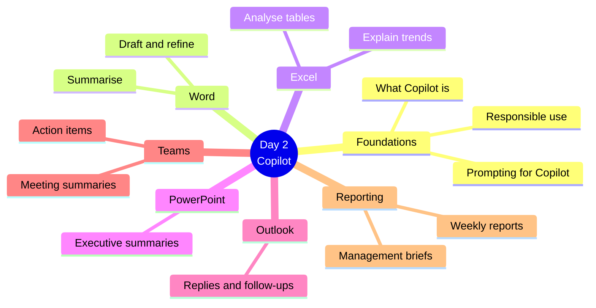
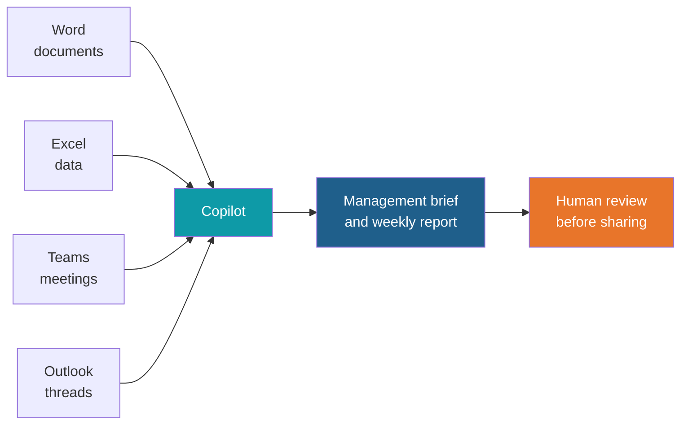
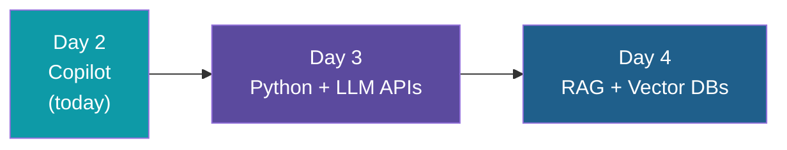

# Day 2: Microsoft Copilot Hands-on

**AI Developer & FDE Training | Kalpataru Projects, Ahmedabad**
Week 1, Day 2 of 6 | 4 hours | Batch 1 (forenoon) and Batch 2 (afternoon)

> Scope note: this document covers structure, timing, topics and outputs only. Exercises, sample files and demo content will be developed separately.

---

## Today at a Glance

One foundation block, five Microsoft 365 applications, and one reporting workflow. No coding required.

---

## Agenda

```mermaid
gantt
    title Day 2 Agenda (240 minutes)
    dateFormat HH:mm
    axisFormat %H:%M
    section Opening
    Kickoff and access check        :a1, 09:30, 10m
    section Foundations
    Copilot foundations and responsible use :a2, after a1, 25m
    section Documents and Data
    Word                            :a3, after a2, 30m
    Excel                           :a4, after a3, 35m
    Break                           :crit, a5, after a4, 15m
    section Communication
    PowerPoint                      :a6, after a5, 25m
    Outlook                         :a7, after a6, 25m
    Teams                           :a8, after a7, 30m
    section Reporting
    Reporting workflows             :a9, after a8, 30m
    section Close
    Wrap-up and exit check          :a10, after a9, 15m
```

| Time | Duration | Topic Block | Type |
|---|---|---|---|
| 00:00 to 00:10 | 10 min | Kickoff and access check | Intro |
| 00:10 to 00:35 | 25 min | 1. Copilot Foundations and Responsible Use | Learn |
| 00:35 to 01:05 | 30 min | 2. Word | Learn + Apply |
| 01:05 to 01:40 | 35 min | 3. Excel | Learn + Apply |
| 01:40 to 01:55 | 15 min | Break | |
| 01:55 to 02:20 | 25 min | 4. PowerPoint | Learn + Apply |
| 02:20 to 02:45 | 25 min | 5. Outlook | Learn + Apply |
| 02:45 to 03:15 | 30 min | 6. Teams | Learn + Apply |
| 03:15 to 03:45 | 30 min | 7. Reporting Workflows | Apply |
| 03:45 to 04:00 | 15 min | Wrap-up and exit check | Reflect |

Clock times are indicative and can be shifted; Batch 2 follows the same durations.

---

## Topics Covered

### Kickoff and Access Check (10 min)

1. Day 2 objectives and how it connects to Day 1
2. Confirm licences, service access and sample files are ready

### Block 1: Copilot Foundations and Responsible Use (25 min)

1. What Microsoft 365 Copilot is and where it appears across Word, Excel, PowerPoint, Outlook and Teams
2. How Copilot works with your organisation's content and permissions
3. Applying Day 1 prompt thinking to Copilot
4. Responsible use: sensitive data, human review, verifying outputs
5. Where Copilot helps and where it does not

### Block 2: Word (30 min)

1. Drafting documents from a prompt
2. Refining: tone, length and structure
3. Summarising long documents
4. Reviewing and improving existing text

**Exercise:** Copilot in Word

### Block 3: Excel (35 min)

1. Preparing data so Copilot can work with it
2. Analysing tables
3. Explaining trends and patterns
4. Asking questions of your data
5. Formula help, highlighting and charts

**Exercise:** Copilot in Excel

### Block 4: PowerPoint (25 min)

1. Creating a presentation from a prompt or a document
2. Executive summaries
3. Restructuring and refining slides
4. Speaker notes

**Exercise:** Copilot in PowerPoint

### Block 5: Outlook (25 min)

1. Summarising long email threads
2. Drafting replies
3. Adjusting tone and length
4. Follow-ups

**Exercise:** Copilot in Outlook

### Block 6: Teams (30 min)

1. Meeting summaries
2. Action items and follow-ups
3. Using transcription for recaps
4. Catching up on missed meetings and chats

**Exercise:** Copilot in Teams

### Block 7: Reporting Workflows (30 min)

1. Management briefs
2. Weekly reports
3. Combining inputs from documents, data, meetings and email
4. Review checklist before sharing
5. Building a repeatable reporting routine

**Exercise:** End-to-end reporting workflow

### Wrap-up and Exit Check (15 min)

1. Exit check on Copilot capabilities and responsible use
2. Each participant names one workflow they will adopt
3. Day 3 preview

---

## What You Will Walk Away With

| Output | Block |
|---|---|
| Hands-on practice in each Microsoft 365 application | Blocks 2 to 6 |
| A repeatable reporting workflow | Block 7 |
| A responsible-use checklist | Block 1 and Block 7 |

**Day 2 output: business workflow exercises**

### Learning Objectives

By the end of Day 2, you can:

1. Gain practical AI skills for daily business operations
2. Use Copilot responsibly with business documents, email and meetings
3. Improve reporting speed and clarity without writing code

---

## Requirements and Scope

- Each participant needs an eligible Microsoft 365 licence and an assigned Microsoft 365 Copilot licence
- Required services enabled: Microsoft Entra ID, Exchange Online, OneDrive/SharePoint, Word, Excel, PowerPoint, Outlook and Teams
- Teams transcription and meeting-summary features activated
- Non-confidential sample files available
- This module is de-coupled from FDE in terms of learning outcomes
- Batch participants are aligned by Kalpataru

## Ground Rules

- Use only non-confidential sample files
- Review every Copilot output before sharing it

## What Comes Next

---

*Prepared for Kalpataru Projects | AIM ADaSci | Confidential*
