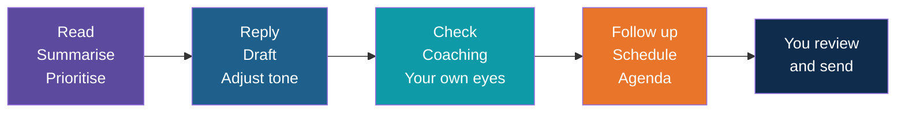
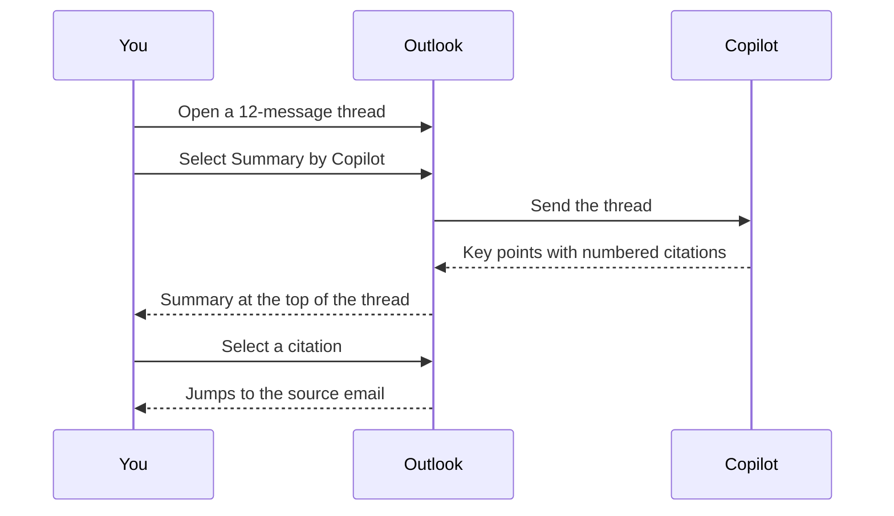

# Copilot in Outlook

<!-- Slide deck in markdown. Each block between the --- lines is one slide.
     Trainer notes are in HTML comments and do not show in the preview.
     Written for a trainer who cannot demo Outlook Copilot live. Button names and availability were checked against
     Microsoft Support pages in September 2026. Copilot changes often, so re-check before class and adjust. -->

---

# Copilot in Outlook

## Read less, reply faster, and still sound like you

**Day 2 | Block 5: Outlook**

<!-- Trainer: 25 minutes. There is no live demo. Walk through the screen guide slides, then trainees try the same
     prompts in Copilot Chat or in their own work mailbox. Ask a colleague for screenshots from a work account. -->

---

## Your Inbox Is a Busy Reception Desk

Every day the desk gets more letters than anyone can read properly.

| Without Copilot | With Copilot |
|---|---|
| Scroll a 40-message thread to find the decision | Ask for a short summary with links back to the source emails |
| Stare at a blank reply box | Describe the reply in one sentence and get a draft |
| Wonder if your tone sounds sharp | Ask for a check on tone and clarity before sending |
| Read every email to find the urgent ones | Let Copilot flag the ones that need you first |

You stay the person who decides and sends. Copilot does the first pass.

---

## Today's Four Skills

| Skill | The question it answers |
|---|---|
| **Summarise** a long thread | What was decided and what is still open? |
| **Draft** a reply | How do I say this quickly and clearly? |
| **Adjust** tone and length | Is this right for this reader? |
| **Follow up** | What happens next, and who does it? |

---

## The Life of One Email Thread

---

# Screen Guide

## What you would see if we opened Outlook together

---

## Where Copilot Appears

| Feature | What it does | Where to find it |
|---|---|---|
| **Summary by Copilot** | Summarises a long thread | A button at the top of the thread, sometimes labelled Summarize |
| **Draft with Copilot** | Writes an email from your description | Copilot icon in the toolbar of a new email, then Draft |
| **Coaching by Copilot** | Reviews your draft for tone, clarity and how the reader may feel | Copilot icon in the compose toolbar, then Coaching by Copilot |
| **Prioritize** | Marks incoming email as high, normal or low priority | Arrow next to the Copilot button at top right, then Prioritize |
| **Chat with Copilot** | Answers questions about your email, calendar and meetings | Copilot button at the top of Outlook |
| **Schedule with Copilot** | Turns an email thread into a meeting invitation | Toolbar in new Outlook for Windows |
| **Meeting agenda** | Drafts an agenda inside a meeting invitation | Copilot button in the meeting description, then Auto draft an agenda |
| **Draft instructions** | Saves your writing style so drafts sound like you | Copilot menu, then Settings, then Draft Instructions |

<!-- Trainer: the first three are today's exercise. The rest are "beyond today". Say which ones exist, do not spend
     time on them. Features vary by Outlook version. Legacy Outlook for Mac is not supported. -->

---

## Summarise a Long Thread

| Detail | Good to know |
|---|---|
| **Citations** | Numbered links take you to the email the point came from |
| **Attachments** | In new Outlook and Outlook on the web, a Summarize a file option can summarise Word, PowerPoint and PDF attachments |
| **Language** | On Mac and mobile the summary follows the language of the email |

**Your job:** click the citations for anything important. A summary that sounds right can still miss a disagreement.

---

## Draft a Reply

1. Open a reply or a new email
2. Select the **Copilot** icon, then **Draft**
3. Type what you want, in one or two sentences
4. Select **Generate**
5. **Keep**, **discard** or **regenerate**

| Adjust without retyping | Options |
|---|---|
| **Tone** | Pick from the list, for example Neutral |
| **Length** | Pick from the list, for example Short |
| **Edit prompt** | Change your instruction and generate again |

**Good prompt:** "Reply to Meera. Thank her for the update. Agree to send the complaint data by Friday. Do not commit to anything about pricing. Two short paragraphs, polite."

<!-- Trainer: Draft with Copilot does not work when the email is composed in plain text. Switch to HTML in
     Settings, Mail, Compose. This is a common reason for "the button is missing". -->

---

## Check Tone and Clarity

**Coaching by Copilot** reads your draft and suggests improvements on three things:

| It looks at | Example suggestion (illustrative wording) |
|---|---|
| **Tone** | "This may read as abrupt. Consider a softer opening." |
| **Clarity** | "The request is buried. Move it to the first line." |
| **Reader sentiment** | "The reader may feel blamed. Rephrase the second sentence." |

You can select **Apply all suggestions**, or take only the ones you agree with.

Use it when the email matters: a complaint reply, a difficult message to a supplier, a note to a senior leader.

---

## Follow-ups and Meetings

Two extras for the "what happens next" step. Both are beyond today's exercise.

| Feature | What happens |
|---|---|
| **Schedule with Copilot** | Reads the thread, then fills in a meeting invitation: title, attendees and a draft description |
| **Auto draft an agenda** | Inside a meeting invitation, drafts an agenda you can edit |

**Always check:** the attendees, the date and the agenda items before you send the invitation. Copilot only knows what is in the thread.

---

## Read the Important Ones First

**Prioritize my inbox** marks new emails as **high** (up arrow), **normal** or **low** (down arrow), with a short reason.

| Setting up | Good to know |
|---|---|
| You must give at least one high-priority instruction | For example: "It is from my manager" |
| Only new email counts | Emails received before you turn it on are not scored |
| Some items are skipped | Meeting invitations, out-of-office replies, receipts, encrypted mail and email in other folders |
| Low priority | Off by default, and can be switched on |

---

## Ask Your Mailbox

**Chat with Copilot in Outlook** answers questions about your mail and calendar in plain language.

| Try asking | What you get |
|---|---|
| "Summarise my emails from the last week about the supplier review." | A short digest across several emails |
| "When is my next meeting with Arjun?" | A calendar answer |
| "Which unread emails need a reply from me?" | A short list with reasons |

With an add-on licence it can also draw on chats and documents. Without it, it is limited to mail, calendar, meetings and organisation data. Check with your IT team which one you have.

---

## Make Drafts Sound Like You

Set it once, instead of repeating "shorter, with bullets" every time.

1. Copilot menu, then **Settings**, then **Draft Instructions**
2. Turn on **Use custom instructions when drafting email**
3. Write your style, for example: "Short and direct. Bullet points where they help. Sign off with just my first name."
4. Save

Change or switch it off any time in the same place.

---

## Where Copilot Helps, and Where It Does Not

| Good fit | Poor fit |
|---|---|
| Long threads you were not part of | Legal, HR or disciplinary messages |
| First drafts of routine replies | Anything with figures you have not checked |
| Tone check before sending | Decisions that need your judgement |
| Turning a thread into a meeting | Sensitive personal or confidential content |

---

## Before You Hit Send

| Check | Why |
|---|---|
| **Read the whole draft** | Copilot may agree to something nobody agreed to |
| **Check names, dates and numbers** | They come from the thread and can be wrong |
| **Check who it is going to** | Reply All and CC lists are your responsibility |
| **Check the tone once more** | Formal, warm and blunt are your choices, not the tool's |
| **Remove anything confidential** | Only include what the reader should see |

---

## "I Cannot See Copilot in My Outlook"

| Possible reason | What to try |
|---|---|
| No Copilot licence on your account | Ask IT |
| Signed in with a mailbox that is not a Microsoft account, such as a Gmail address | Use your work mailbox |
| Composing in plain text | Switch to HTML in Settings, Mail, Compose |
| Legacy Outlook for Mac | Use the latest Outlook |
| Older or unsupported app version | Update Outlook, or use Outlook on the web |
| Some features are New Outlook only | Check with your IT team which version you have |

If Copilot is missing, the exercise still works in Copilot Chat. Paste the thread into it.

---

## Explore It Yourself

No code needed.

| To see... | Try | What to do |
|---|---|---|
| Summary, drafting and tone changes | Copilot Chat, in the browser or app | Paste the FreshCart email thread from the exercise, then ask for a summary, a reply in three tones, and a shorter version |
| Real button names | Your work Outlook | Open a long thread and look for Summary by Copilot; open a new email and look for the Copilot icon |
| What Microsoft says right now | Microsoft Support, search "Copilot in Outlook" | Read the Welcome to Copilot in Outlook page and note which features apply to your version |
| Your own style | Draft Instructions | Write three sentences describing how you like your emails, then compare a draft with and without them |

<!-- Trainer: open each Microsoft Support page before class and update this deck to match what is live. -->

---

## Remember These Four Things

1. Summarise first, then **click the citations** for what matters
2. Describe the reply, then adjust **tone and length** instead of rewriting
3. Copilot does not know what was agreed, so **you read every draft**
4. If the button is missing, check licence, mailbox, compose format and app version

---

## Next Up

**Microsoft Teams:** meeting summaries, action items and catching up on what you missed.

---

*Prepared for Kalpataru Projects | AIM ADaSci | Confidential*
