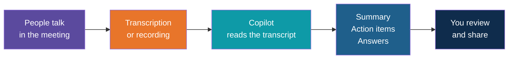
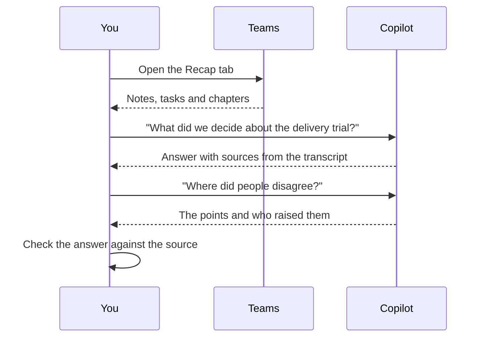

# Copilot in Teams

<!-- Slide deck in markdown. Each block between the --- lines is one slide.
     Trainer notes are in HTML comments and do not show in the preview.
     Written for a trainer who cannot demo Teams Copilot live. Button names and availability were checked against
     Microsoft Support pages in September 2026. Copilot changes often, so re-check before class and adjust. -->

---

# Copilot in Teams

## The colleague who took perfect notes

**Day 2 | Block 6: Teams**

<!-- Trainer: 30 minutes. There is no live Teams Copilot demo from a personal account. Use the screen guide slides,
     screenshots or a recording from a work account, then run the mock-meeting exercise with trainees' own accounts. -->

---

## The Meeting You Could Not Attend

Imagine three meetings a day, and one you missed. Someone forwards you a 60-minute recording.

| Without Copilot | With Copilot |
|---|---|
| Watch the recording, or ask a colleague what happened | Read a short recap in two minutes |
| Search your memory for who promised what | Ask "What action items were assigned to me?" |
| Scroll a long chat to catch up | Ask for a summary of what you missed |
| Write the minutes yourself after the meeting | Start from a draft and correct it |

Copilot turns **what was said** into **what matters**. Someone still has to check it.

---

## Today's Four Skills

| Skill | The question it answers |
|---|---|
| **Meeting summaries** | What was discussed and decided? |
| **Action items and follow-ups** | Who does what, by when? |
| **Recaps from the transcript** | What exactly was said about this topic? |
| **Catching up** on meetings and chats | What did I miss? |

---

## Transcription Is the Fuel

Copilot reads the **transcript**, the written record of who said what. No transcript, no recap.

| If... | Then... |
|---|---|
| Transcription or recording is on | Copilot works during the meeting and in the Recap afterwards |
| Neither is on | Copilot can still be used **during** the meeting if the organiser allows it, but there is no Copilot in the Recap afterwards |
| Very little was said | There may not be enough to summarise |
| The meeting is hosted outside your organisation | Copilot does not work |

Everyone is told when transcription or recording starts. Say so at the start of the meeting.

---

# Screen Guide

## What you would see if we opened Teams together

---

## Where Copilot Appears

| Where | What it does | Where to find it |
|---|---|---|
| **During a meeting** | Answers questions about the meeting so far | **Copilot** icon in the meeting controls |
| **Late joiner catch-up** | Offers a summary when you join late | A notification, then **Open Copilot** |
| **After a meeting** | Recap with AI notes and follow-up tasks | **Recap** tab of the meeting, or **View recap** in the chat |
| **Meeting chat** | Ask about what was discussed, with sources | **Open Copilot** at upper right of the meeting chat |
| **Chats and groups** | Summarise a conversation | **Copilot** at upper right of the chat, or a suggested prompt such as Summarize what I've missed |
| **Calls** | Ask about a finished call | **Calls** in the sidebar, then **Ask about this call** |
| **Copilot chat in Teams** | Ask across your work: meetings, chats, files | **Copilot** at the top of the **Chat** sidebar |
| **Facilitator agent** | AI notes, agenda tracking and timing | Turn on when scheduling, or **More actions**, then **Turn on Facilitator** |

<!-- Trainer: the first five rows are today's exercise. Calls, Copilot chat and Facilitator are "beyond today".
     Copilot chat in Teams has query limits per conversation and cannot read PDFs. Verify before class. -->

---

## The Recap Tab

After the meeting ends, open the meeting in your calendar or chat, then select **Recap**.

| You will find | What it is |
|---|---|
| **AI notes and summary** | Key points by topic |
| **Follow-up tasks** | Action items Copilot picked up |
| **Speaker timeline** | Who spoke and when |
| **Chapters** | Automatic sections, so you can jump to a topic |
| **Name mentions** | The moments your name was said |
| **Recording and transcript** | The full record, if they were on |
| **Ask Copilot** | The same chat as in the meeting, for questions afterwards |

People in your organisation who were invited can open the recap. External guests cannot open the intelligent recap.

---

## Summaries and Recaps in Practice

| Prompt to try | Why it is useful |
|---|---|
| "Summarise this meeting in five bullet points." | A quick recap for someone who missed it |
| "What decisions were made?" | Separates decisions from discussion |
| "Where do we disagree on this topic?" | Finds open issues |
| "What questions were left unanswered?" | Builds the follow-up list |
| "What did Priya say about the price?" | Targets one person or topic |

---

## Action Items and Follow-ups

| Step | What to do |
|---|---|
| **1. Ask** | "List the action items, with the owner and any due date mentioned." |
| **2. Check** | Compare each item with what was said. Owners and dates are the most common errors. |
| **3. Fix** | Correct anything wrong. Write "Not stated" where nothing was said. |
| **4. Share** | Post it in the meeting chat or send it as an email |

**Handy:** long answers can be exported to Word and tables to Excel, unless a sensitivity label prevents it.

**Warning:** Copilot may write "Meera to send the data by Friday" when nobody said Friday. If it was not said, it is not an action item.

---

## Catching Up on Meetings and Chats

| Situation | What Copilot offers |
|---|---|
| You join a meeting more than a few minutes late | A notification with an option to catch you up |
| You are in the meeting but distracted | Ask "What did I just miss?" in the Copilot pane |
| You missed the whole meeting | Open the **Recap** tab |
| A chat has many unread messages | A suggested prompt to summarise what you missed |
| You want the decisions from a long chat | Ask for the main points, action items and decisions |

In a chat, Copilot uses only that chat's messages. It does not read the meeting transcript.

---

## Beyond Today: Facilitator, Calls and Copilot Chat

| Feature | What it does | Good to know |
|---|---|---|
| **Facilitator agent** | Writes live AI notes everyone can edit together, tracks the agenda, keeps time and can answer questions in the meeting chat | Needs a Copilot licence to turn on; only for scheduled meetings, not instant meetings, channel meetings or calls |
| **Ask about this call** | Asks questions about a finished call | Needs transcription or recording; may not work if others join a one-to-one call |
| **Copilot chat in Teams** | Pulls together meetings, chats and files in one conversation | Has limits on the number of questions in one conversation |
| **Copilot without recording** | Lets Copilot answer during the meeting without keeping a recording | Copilot is then not available in the Recap afterwards, and organisation policies may still keep the questions and answers |

---

## Limits and Responsible Use

| Risk | What to do |
|---|---|
| **Mishearing** | Names, product codes and accents are easy to get wrong. Check the transcript for anything important. |
| **Wrong owners and dates** | Confirm with the people named before sharing |
| **Sensitive meetings** | Consider whether transcription should be on at all. HR, legal and confidential discussions need care. |
| **Not the official minutes** | Treat the recap as a draft, not a legal record |
| **Consent and notice** | People must know a meeting is being transcribed |
| **Sharing** | A recap may reveal things some people should not see. Check who receives it. |

---

## "I Cannot See Copilot in My Teams Meeting"

| Possible reason | What to try |
|---|---|
| No Copilot licence, or Teams Premium for the intelligent recap | Ask IT |
| Transcription or recording is off | Ask the organiser to enable it, or start it yourself if allowed |
| The meeting is hosted outside your organisation | Copilot will not work |
| The organiser changed the Copilot setting to Off | Ask the organiser |
| Personal or free Teams account | Copilot for meetings needs a work account with the right licence |

If Copilot is unavailable, the exercise still works with a **written transcript** pasted into Copilot Chat.

---

## Explore It Yourself

No code needed.

| To see... | Try | What to do |
|---|---|---|
| A meeting recap with your own account | A **Meet now** call with a colleague, with transcription switched on | Talk for three minutes about a made-up project. End the call, open the Recap and ask Copilot for the action items. |
| A recap from a written transcript | Copilot Chat or Copilot in Word | Paste the mock-meeting transcript from the exercise, then ask for a summary, decisions and action items with owners |
| Catching up on chats | A busy group chat | Select Copilot in the chat and ask for a summary of the last day |
| What Microsoft says right now | Microsoft Support, search "Copilot in Microsoft Teams" | Read the Welcome to Copilot in Microsoft Teams page and note which features apply to you |

<!-- Trainer: open each Microsoft Support page before class and update this deck to match what is live.
     In the mock meeting, script one wrong owner or date so trainees can catch it. -->

---

## Remember These Four Things

1. **Transcription is the fuel.** No transcript, no recap
2. Ask for **decisions, actions and open questions**, not just a summary
3. **Owners and dates** need checking against what was said
4. A recap is a **draft**, and you decide who sees it

---

## Next Up

**Reporting workflows:** combine documents, data, meetings and email into a management brief.

---

*Prepared for Kalpataru Projects | AIM ADaSci | Confidential*
