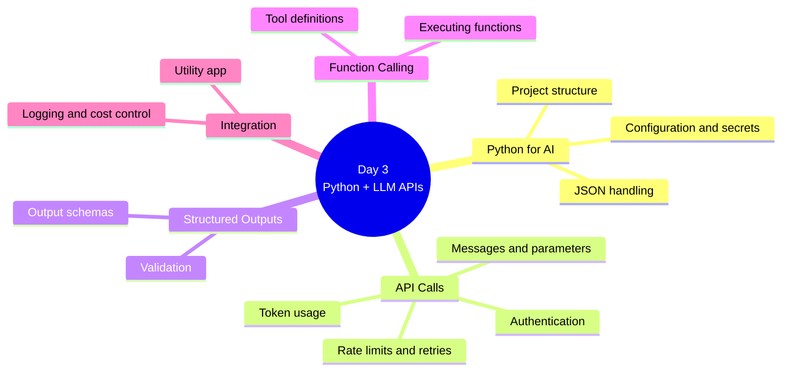
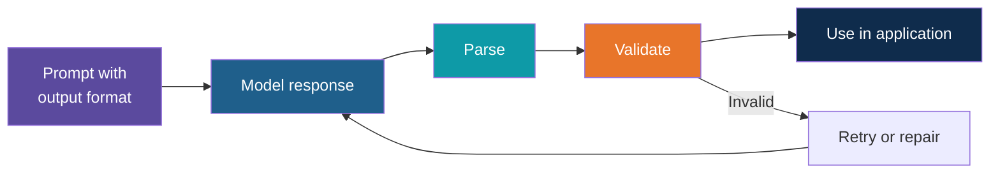
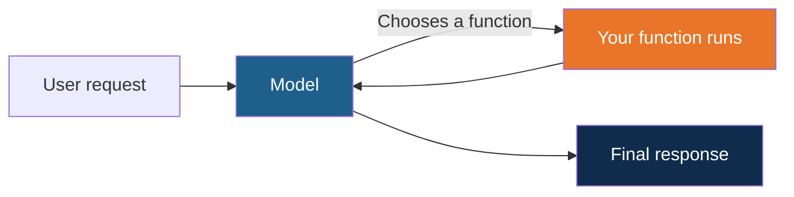
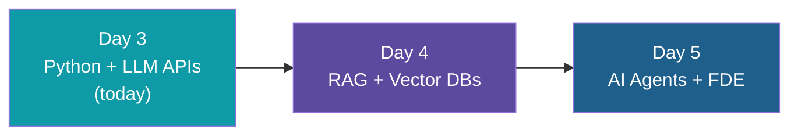

# Day 3: Python + LLM APIs

**AI Developer & FDE Training | Kalpataru Projects, Ahmedabad**
Week 1, Day 3 of 6 | 4 hours | Batch 1 (forenoon) and Batch 2 (afternoon)

> Scope note: this document covers structure, timing, topics and outputs only. Code, worked examples, datasets and demo content will be developed separately.

---

## Today at a Glance

From a first API call to a working LLM-powered utility app.

---

## Agenda

```mermaid
gantt
    title Day 3 Agenda (240 minutes)
    dateFormat HH:mm
    axisFormat %H:%M
    section Opening
    Kickoff and Day 1 recap         :a1, 09:30, 15m
    section Foundations
    Python for AI in practice       :a2, after a1, 35m
    API calls and authentication    :a3, after a2, 40m
    Break                           :crit, a4, after a3, 15m
    section Core Capabilities
    Structured outputs              :a5, after a4, 45m
    Function calling                :a6, after a5, 45m
    section Build
    Integration and utility app     :a7, after a6, 35m
    section Close
    Wrap-up and exit check          :a8, after a7, 10m
```

| Time | Duration | Topic Block | Type |
|---|---|---|---|
| 00:00 to 00:15 | 15 min | Kickoff and Day 1 recap | Intro |
| 00:15 to 00:50 | 35 min | 1. Python for AI in Practice | Learn + Apply |
| 00:50 to 01:30 | 40 min | 2. API Calls and Authentication | Learn + Apply |
| 01:30 to 01:45 | 15 min | Break | |
| 01:45 to 02:30 | 45 min | 3. Structured Outputs | Learn + Apply |
| 02:30 to 03:15 | 45 min | 4. Function Calling | Learn + Apply |
| 03:15 to 03:50 | 35 min | 5. Integration and Utility App | Apply |
| 03:50 to 04:00 | 10 min | Wrap-up and exit check | Reflect |

Clock times are indicative and can be shifted; Batch 2 follows the same durations.

---

## Topics Covered

### Kickoff and Day 1 Recap (15 min)

1. Day 3 objectives
2. Recap of Day 1: prompt patterns, environment and first API call
3. Environment check for anyone who needs it

### Block 1: Python for AI in Practice (35 min)

1. Project structure for an AI application
2. Packages and dependency management
3. Configuration and secrets handling
4. Working with JSON in depth
5. HTTP basics
6. Error handling and logging

**Lab 1:** Project skeleton

### Block 2: API Calls and Authentication (40 min)

1. Request and response anatomy
2. Authentication methods and key management
3. Messages, roles and model parameters
4. Token usage and cost awareness
5. Rate limits, retries and backoff
6. Building a reusable client across providers

**Lab 2:** Reusable LLM client

### Block 3: Structured Outputs (45 min)

1. Why applications need structured output
2. Requesting JSON and defining output schemas
3. Provider features for structured output
4. Validating responses
5. Handling malformed or incomplete output
6. Retry and repair strategies

**Lab 3:** Structured extraction

### Block 4: Function Calling (45 min)

1. What function calling is and why it matters
2. Defining functions for the model
3. How the model decides to call a function
4. Executing functions and returning results
5. Error paths and safe execution
6. Bridge to agents on Day 5

**Lab 4:** Function calling

### Block 5: Integration and Utility App (35 min)

1. Bringing client, structured output and function calling together
2. Application flow and configuration
3. Logging and cost control
4. Basic testing of LLM features

**Lab 5:** LLM-powered utility app

### Wrap-up and Exit Check (10 min)

1. Exit check on API calls, structured outputs and function calling
2. Show and tell of utility apps
3. Day 4 preview

---

## What You Will Walk Away With

| Output | Block |
|---|---|
| Project skeleton with secure configuration | Block 1 |
| Reusable LLM client with retries | Block 2 |
| Structured extraction with validation | Block 3 |
| Function calling workflow | Block 4 |
| LLM-powered utility app | Block 5 |

**Day 3 output: LLM-powered utility app**

### Learning Objectives

By the end of Day 3, you can:

1. Build a reliable, reusable client for LLM APIs
2. Get structured, validated output from a model
3. Use function calling to connect a model to your own code
4. Integrate these pieces into a working application

---

## Not Covered Today

- RAG and vector databases (Day 4)
- Agent workflows and frameworks (Day 5)
- Docker, containers and deployment (production and DevOps section)

## Ground Rules

- Use only the provided synthetic or sanitized datasets
- Keep API keys out of code and Git
- Stay within free-tier limits

## What Comes Next

---

*Prepared for Kalpataru Projects | AIM ADaSci | Confidential*
