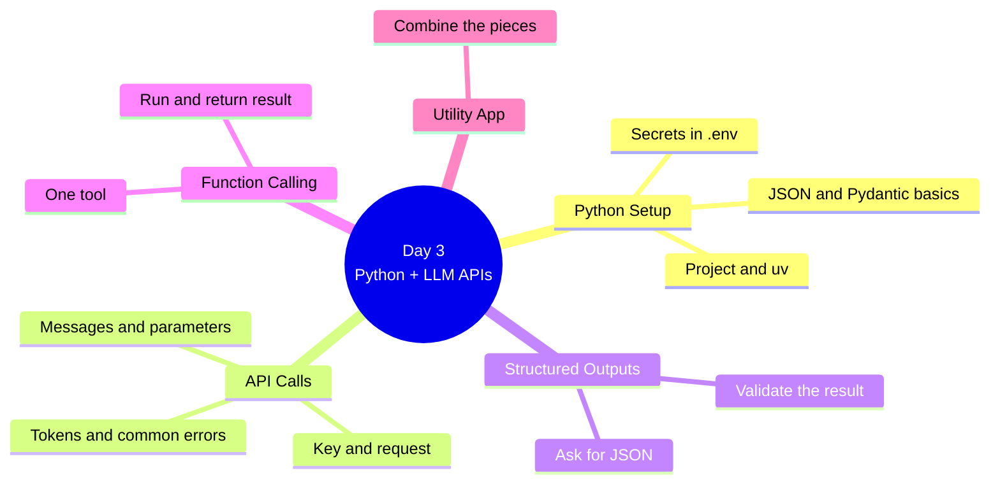
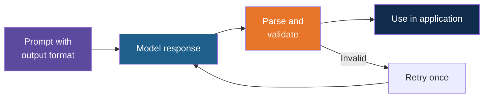
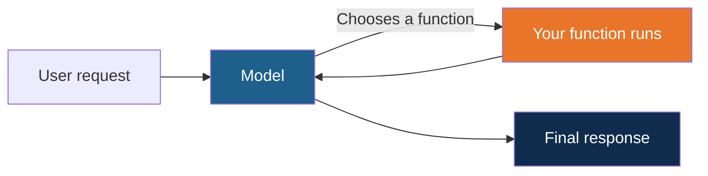
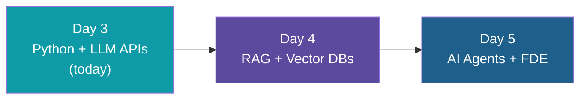

# Day 3: Python + LLM APIs

**AI Developer & FDE Training | Kalpataru Projects, Ahmedabad**
Week 1, Day 3 of 6 | 4 hours | Batch 1 (forenoon) and Batch 2 (afternoon)

> Scope note: this document covers structure, timing, topics and outputs only. Code, worked examples, datasets and demo content will be developed separately.

---

## Today at a Glance

From a first API call to a working LLM-powered utility app.

---

## Agenda

```mermaid
gantt
    title Day 3 Agenda (240 minutes)
    dateFormat HH:mm
    axisFormat %H:%M
    section Opening
    Kickoff and Day 1 recap         :a1, 09:30, 10m
    section Foundations
    Python for AI in practice       :a2, after a1, 40m
    API calls and authentication    :a3, after a2, 50m
    Break                           :crit, a4, after a3, 15m
    section Core Capabilities
    Structured outputs              :a5, after a4, 40m
    Function calling                :a6, after a5, 40m
    section Build
    Integration and utility app     :a7, after a6, 35m
    section Close
    Wrap-up and exit check          :a8, after a7, 10m
```

| Time | Duration | Topic Block | Type |
|---|---|---|---|
| 00:00 to 00:10 | 10 min | Kickoff and Day 1 recap | Intro |
| 00:10 to 00:50 | 40 min | 1. Python for AI in Practice | Learn + Apply |
| 00:50 to 01:40 | 50 min | 2. API Calls and Authentication | Learn + Apply |
| 01:40 to 01:55 | 15 min | Break | |
| 01:55 to 02:35 | 40 min | 3. Structured Outputs | Learn + Apply |
| 02:35 to 03:15 | 40 min | 4. Function Calling | Learn + Apply |
| 03:15 to 03:50 | 35 min | 5. Integration and Utility App | Apply |
| 03:50 to 04:00 | 10 min | Wrap-up and exit check | Reflect |

Clock times are indicative and can be shifted; Batch 2 follows the same durations.

**Pacing note:** most participants are new to AI and many are new to coding. Each block is one main idea. The trainer live-codes the first pass, and every lab starts from provided starter code, so trainees fill in the key lines instead of writing files from scratch. Anything that does not fit in a block is dropped, not rushed (see Deferred Topics below).

---

## Topics Covered

### Kickoff and Day 1 Recap (10 min)

1. Day 3 objectives
2. Recap of Day 1: prompt patterns and what an API is
3. Environment check for anyone who needs it (Python, VS Code, uv, model access)

### Block 1: Python for AI in Practice (40 min)

1. Project structure for a small AI application
2. Packages with uv
3. Configuration and secrets in a .env file
4. JSON: reading and writing it as Python dicts
5. Pydantic basics: describing the shape of data once
6. HTTP basics: request, response, status codes (concept only)

**Lab 1:** Project skeleton

### Block 2: API Calls and Authentication (50 min)

1. Request and response anatomy
2. API keys and keeping them safe
3. Messages, roles and the main model parameters (model, temperature, max tokens)
4. Token usage and cost awareness
5. When calls fail: wrong key, rate limit, timeout, and one simple retry

**Lab 2:** First LLM call and a small reusable helper function

### Block 3: Structured Outputs (40 min)

1. Why applications need structured output
2. Asking for JSON and describing the schema with Pydantic
3. Validating the response
4. What to do when the output is malformed: one retry

**Lab 3:** Structured extraction

### Block 4: Function Calling (40 min)

1. What function calling is and why it matters
2. Describing one function to the model
3. How the model decides to call it
4. Running the function and returning the result to the model
5. Bridge to agents on Day 5

**Lab 4:** Function calling with one tool

### Block 5: Integration and Utility App (35 min)

1. Putting the helper, structured output and function calling together
2. Application flow, following provided starter code
3. Printing token usage per call (simple cost awareness)

**Lab 5:** LLM-powered utility app

### Wrap-up and Exit Check (10 min)

1. Short exit check on API calls, structured outputs and function calling
2. Show and tell of utility apps
3. Day 4 preview

---

## Deferred Topics

These appeared in an earlier draft of this schedule. They are too much for a first day with a new audience and are moved to self-study or later days.

| Topic | Where It Goes |
|---|---|
| Reusable client across several providers | Not covered; one provider or one OpenAI-compatible endpoint is enough |
| Exponential backoff and advanced rate-limit handling | Self-study; Block 2 covers one simple retry |
| Provider-specific structured output features, repair strategies | Self-study; Block 3 covers validate and retry once |
| Multiple functions, error paths, safe execution | Day 5 (agents) |
| Logging setup and cost controls | Self-study; token printing only today |
| Testing of LLM features | Self-study |
| Packages and dependency management in depth | Covered only as far as uv basics |

---

## What You Will Walk Away With

| Output | Block |
|---|---|
| Project skeleton with secure configuration | Block 1 |
| First LLM call and reusable helper | Block 2 |
| Structured extraction with validation | Block 3 |
| Function calling with one tool | Block 4 |
| LLM-powered utility app | Block 5 |

**Day 3 output: LLM-powered utility app**

### Learning Objectives

By the end of Day 3, you can:

1. Make an LLM API call from Python and keep the API key out of code
2. Read the response and token usage, and handle the most common failures
3. Get structured, validated output from a model
4. Let a model call one of your own functions
5. Combine these pieces into a small working application

---

## Not Covered Today

- RAG and vector databases (Day 4)
- Agent workflows and frameworks (Day 5)
- Docker, containers and deployment (production and DevOps section)

## Ground Rules

- Use only the provided synthetic or sanitized datasets
- Keep API keys out of code and Git
- Stay within free-tier limits, or use a local open-weight model

## What Comes Next

---

*Prepared for Kalpataru Projects | AIM ADaSci | Confidential*
