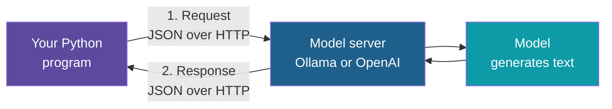
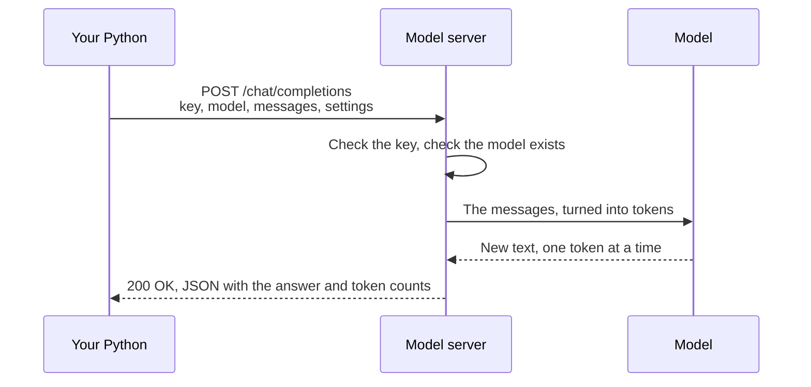
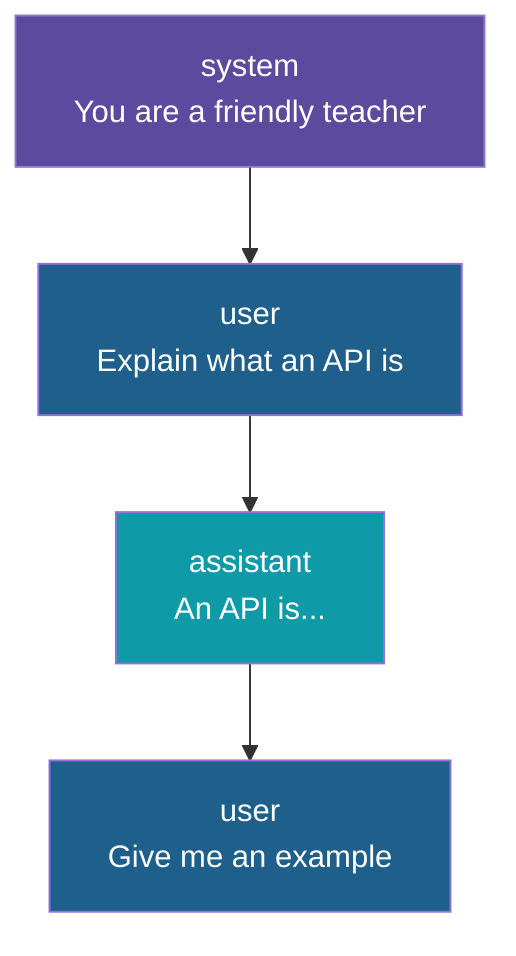
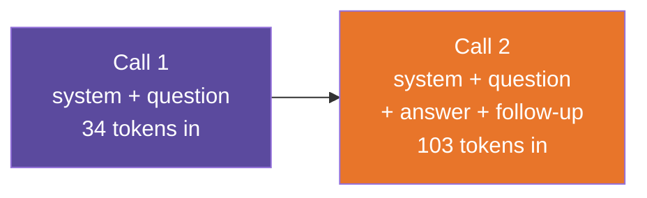

# How an LLM Call Works from Python

**Day 3 | Block 2: API Calls and Authentication**

Before writing any code, see the whole journey: your Python program sends a request, a model somewhere produces text, and the answer comes back. The runnable code is in `session-03/code/ai-and-python/`, and every step below maps to a file there.

---

## The Big Picture

Think of **writing a question on a form and handing it to a courier**. The form has a fixed layout: who you are, which expert you want, and your question. The courier delivers it, the expert writes an answer on the same kind of form, and the courier brings it back. You never meet the expert; you only exchange forms.

An LLM call works the same way. Your Python program fills in a **request**, sends it over HTTP, and reads the **response**. The "expert" is the model.

---

## The Call Step by Step

| Step | What happens |
|---|---|
| 1 | Python builds a dict: which model, the messages, and settings such as temperature |
| 2 | The dict is sent as JSON in an HTTP POST request, with the API key in a header |
| 3 | The server checks the key and the model name |
| 4 | The model reads the messages and generates the reply one token at a time |
| 5 | The server packs the reply and token counts into JSON and sends it back |
| 6 | Python reads the answer out of the response |

---

## Where the Model Lives

The model is not inside your program. It runs somewhere else, and you reach it by address.

| | Local with Ollama | Hosted such as OpenAI |
|---|---|---|
| Where it runs | Your own machine | The provider's data centre |
| Address | `http://localhost:11434/v1` | `https://api.openai.com/v1` |
| API key | Not needed, any text will do | Required, and it is a secret |
| Cost | Free, uses your own hardware | Pay per token, or a limited free tier |
| Data privacy | Nothing leaves your machine | Prompts are sent to the provider |
| Speed | Depends on your hardware | Usually fast |
| Model choice | Open-weight models such as Llama and Mistral | The provider's own models |

Ollama offers the **same API shape as OpenAI**. That is the trick this project uses: one piece of code, and only three settings change to switch between them.

---

## Anatomy of a Request

| Part | What it is | Example |
|---|---|---|
| Address | Base URL plus the chat path | `.../v1/chat/completions` |
| Method | Always POST, because we send data | POST |
| Authorization header | Carries the API key | `Bearer` followed by the key |
| Model | Which model should answer | `llama3:8b` |
| Messages | The conversation so far, as a list | See the next slide |
| Settings | Optional controls | Temperature, maximum tokens |

Two settings worth knowing now:

| Setting | Effect |
|---|---|
| Temperature | Low, near 0: steady and repeatable answers. Higher: more varied and creative |
| Maximum tokens | The upper limit on how long the answer can be |

---

## Messages and Roles

The conversation is a **list of messages**, and each one has a **role** saying who is speaking.

| Role | Who | Purpose |
|---|---|---|
| system | You, the developer | Sets behaviour and tone: the model's job description |
| user | The person asking | The question or task |
| assistant | The model | Its earlier answers, sent back when continuing a chat |

---

## Anatomy of a Response

| Part | What it tells you | Where to find it |
|---|---|---|
| The answer | The generated text | The first choice, then its message, then the content |
| Finish reason | Why generation stopped: "stop" means it finished naturally, "length" means it hit the token limit | The first choice |
| Model | Which model actually answered | Top level |
| Token usage | Prompt tokens, completion tokens and the total | The usage section |

Token counts matter because cloud providers **bill per token** and every model has a limit on how many it can handle at once.

---

## The Model Has No Memory

Each call is independent. The model does not remember the previous call, so a chat only feels continuous because your program **sends the whole conversation again every time**.

The longer the chat, the more tokens go in on every call, so cost and delay grow. This is why trimming old messages matters later.

---

## Three Ways to Make the Call

| Way | What you write | When it fits |
|---|---|---|
| Plain HTTP | The URL, headers and JSON yourself | Learning what really travels, or a tiny script |
| Provider SDK | A client object and a method call | Most real projects |
| Framework | Higher-level building blocks | Bigger workflows, covered on later days |

The project has one file for each of the first two, doing the identical request, so the SDK's convenience is easy to see.

---

## Configuration and Secrets

The three things that differ between setups are kept **outside the code**, in environment variables loaded from a `.env` file.

| Setting | Meaning |
|---|---|
| Base URL | Where the API lives |
| API key | The secret |
| Model | Which model to use |

| Rule | Why |
|---|---|
| Keep the key in `.env`, never in a `.py` file | Code gets shared and committed; secrets must not |
| Commit `.env.example`, not `.env` | Others see which settings exist without seeing your values |
| Ignore `.env` in Git | One slip is enough to leak a key |

---

## When a Call Fails

Calls cross a network to another program, so failures are normal, not exceptional.

| Symptom | Likely cause | Fix |
|---|---|---|
| Cannot connect | The server is not running, or the URL is wrong | Start Ollama, check the base URL |
| 401 Unauthorized | Wrong or missing API key | Check the key |
| 404 Not Found | The model name is wrong or not downloaded | Correct the name, or download it with Ollama |
| 429 Too Many Requests | You hit the rate limit | Wait, then retry with a delay |
| 5xx | The server had a problem | Retry later |
| Very slow first answer | A local model is loading into memory | Wait; later calls are faster |

Both code files turn these failures into short, readable messages instead of long stack traces.

---

## Explore It Yourself

1. Check that Ollama is running and see which models you have with `ollama list`.
2. Chat with a model directly with `ollama run llama3:8b` and ask it to explain an API. This is the same model the code will call.
3. Open `session-03/code/ai-and-python/` and run `uv sync`.
4. Run `01_raw_http_call.py`. Read the request body printed first, then the full JSON reply, and find the answer inside it.
5. Run `02_sdk_call.py` and compare its output with the first run.
6. Change the temperature to 1.5 and run again a few times to see the answers vary.

---

## What Comes Next

This is the start of Lab 2, the reusable LLM client. Next comes turning these scripts into one reusable function that adds retries and backoff, then structured outputs and function calling.

---

*Prepared for Kalpataru Projects | AIM ADaSci | Confidential*
