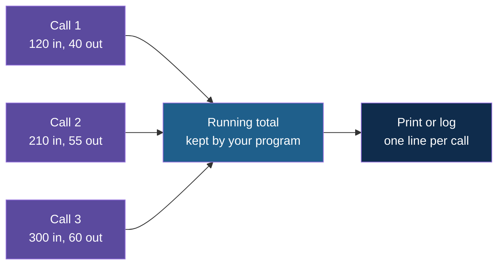
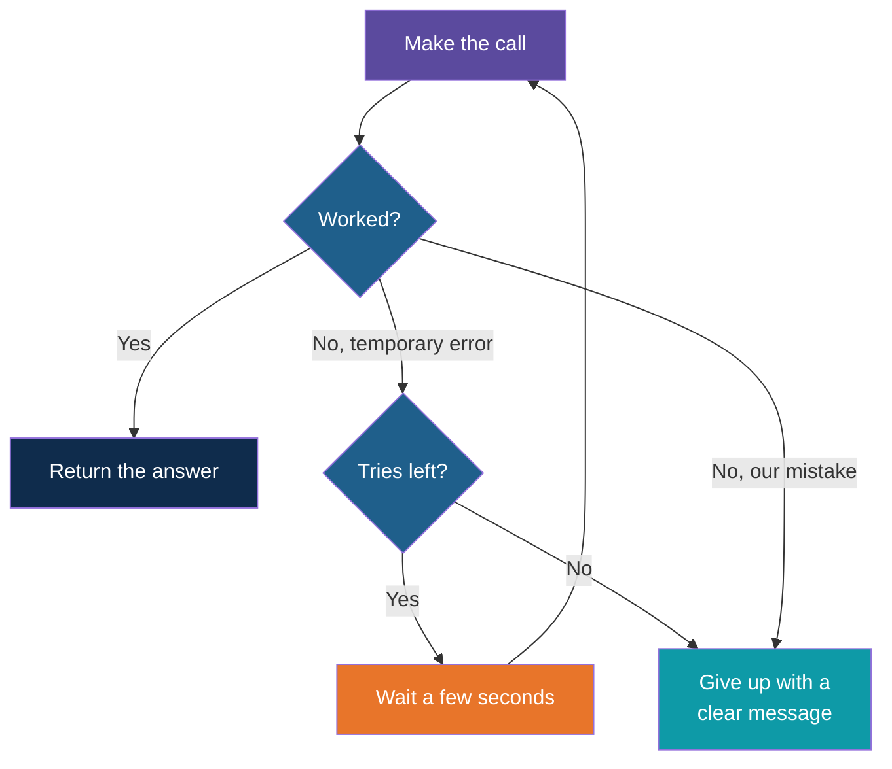

# Parameters, Tokens and Retries

**Day 3 | Block 2: API Calls and Authentication | Lab 2: First LLM Call and a Small Reusable Helper**

Three practical habits for any program that calls a model: set the few parameters that matter, read the token counts from every response, and retry sensibly when a call fails. Temperature, max tokens and token cost were explained on Day 1 (see the notes "Temperature, Top-p and Max Tokens" and "Tokens and Cost"), so this note only covers how they show up in application code.

---

## Three Settings That Matter

Think of **ordering at a counter**. You say which dish you want, how adventurous the cook may be, and how big a portion you will accept. Everything else is left to the kitchen.

| Setting | What it controls | A sensible starting point |
|---|---|---|
| Model | Which model answers | One fixed name in configuration, never typed in many places |
| Temperature | How much the answer varies from run to run | Near 0 for extraction and classification, around 0.7 for writing |
| Max tokens | The upper limit on the reply length | Large enough for the expected answer, small enough to stop a runaway reply |

Many other settings exist. Leave them at their defaults until you have a reason.

---

## When the Answer Is Cut Off

The response carries a **finish reason**. It is the first thing to check when an answer looks incomplete.

| Finish reason | Meaning | What to do |
|---|---|---|
| stop | The model finished naturally | Use the answer |
| length | It hit the max tokens limit mid-answer | Raise the limit, or ask for a shorter answer |

This matters more on Block 3, because a JSON reply cut in half is not valid JSON.

---

## Reading Token Usage

Every response reports three numbers in its usage section.

| Number | Meaning |
|---|---|
| Prompt tokens | Everything you sent: system message, history, your question |
| Completion tokens | The reply the model generated |
| Total tokens | The two added together, and what a cloud provider bills for |

Notice that the prompt tokens grow on every call, because the whole conversation is sent again. Printing one line of usage per call is the simplest form of cost awareness, and it is all Day 3 asks for. With a local model the cost is zero, but the counts still teach you how big your prompts are.

---

## Which Failures Deserve a Retry?

Not every failure is worth repeating. A wrong key will be wrong on the second try too.

| Failure | Temporary? | Action |
|---|---|---|
| Cannot connect, timeout | Often | Retry |
| 429 Too Many Requests | Yes, the limit resets | Wait, then retry |
| 500, 502, 503 | Often | Retry |
| 401 Unauthorized | No, the key is wrong | Stop and fix the key |
| 404 Not Found | No, the model name is wrong | Stop and fix the name |
| 400 Bad Request | No, the request itself is wrong | Stop and fix the request |

The rule: **retry what is temporary, stop on what is your mistake.**

---

## A Simple Retry

Think of **calling a phone that is busy**. You do not give up at once, and you do not redial every second. You wait a moment, try again, and after a few tries you decide it is not going to work.

Three numbers define the whole strategy: how many tries, how long to wait, and which errors count as temporary. Waiting a little longer after each failed try is a common refinement, and you will meet it in real projects, but a fixed short wait is enough for today.

---

## One Helper Instead of Many Calls

Once the call, the usage reading and the retry exist, they belong in **one small function** that the rest of the program uses.

| The helper takes | The helper returns |
|---|---|
| A list of messages | The reply text |
| Optional settings such as temperature | The token usage for that call |

Everything after this note, structured extraction and function calling, calls this helper instead of repeating the plumbing.

---

## Explore It Yourself

1. Run the SDK script from the previous note with max tokens set to 20 and check that the finish reason is "length".
2. Stop Ollama (or change the base URL to a wrong port) and run again. Read the message, decide whether it deserves a retry, and start Ollama again.
3. Change the model name to one you have not downloaded and confirm that this is a "fix it, do not retry" error.
4. Send the same question twice in one chat and compare the prompt token counts of the first and second call.

---

## Lab Tie-In

By the end of Lab 2 you can turn the two scripts into one helper function that takes messages, retries temporary failures, and returns both the reply and its token usage.

---

## What Comes Next

The helper returns text. Applications need data. Next: getting the model to reply in a shape your program can rely on.

---

*Prepared for Kalpataru Projects | AIM ADaSci | Confidential*
