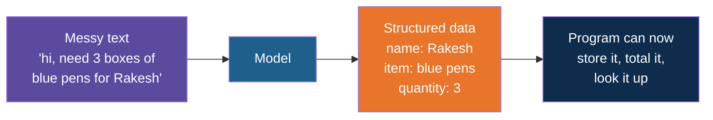
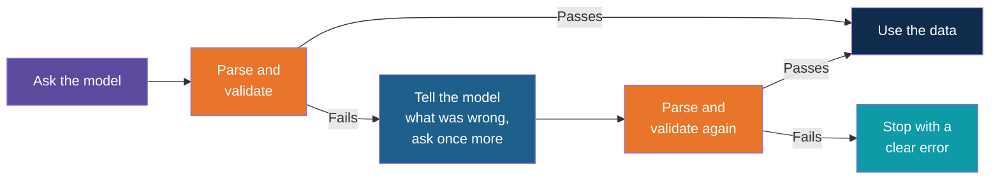

# Structured Outputs

**Day 3 | Block 3: Structured Outputs | Lab 3: Structured Extraction**

A chat reply is written for a human. A program needs fields it can read without guessing. This note shows how to get a model to return data in a fixed shape, and how to check it before trusting it. The tool that describes and checks the shape is Pydantic, from the Block 1 notes.

---

## Why Programs Need Structure

Think of a **shop counter that receives orders by WhatsApp**. Customers write freely: "hi, need 3 boxes of the blue pens, deliver to Rakesh, thanks!" A human reads it and fills in the order form. If the shop wanted to automate this, the program would need the form: a name, an item, a quantity.

| Reply style | Good for | Problem for a program |
|---|---|---|
| Free text | Reading by a person | Wording changes every run, so nothing can rely on it |
| Structured (JSON) | Reading by code | Needs care to keep it correct |

This is the most common real job for an LLM in an application: **turn messy text into clean fields**.

---

## Step 1: Describe the Shape

Before asking, decide what fields you want. Pydantic lets you write that description once as a model, and the same description is used to check the reply later.

| Field | Type | Rule |
|---|---|---|
| Customer name | Text | Required |
| Item | Text | Required |
| Quantity | Whole number | Required, at least 1 |
| Delivery note | Text | Optional |

Small, flat shapes work best, especially with small models. Every extra field is another chance for a mistake.

---

## Step 2: Ask for That Shape

The prompt states the format plainly, and the model is expected to obey it.

| Prompt ingredient | Example wording |
|---|---|
| The task | Extract the order from the message |
| The fields | List each field name and its type |
| The output rule | Reply with JSON only, no other text |
| An example | One sample message with its correct JSON, so the model sees the pattern |
| Low temperature | Set near 0 so the format stays steady |

Some providers also offer a "JSON mode" or a way to hand over the schema directly, which makes the reply more reliable. Those features differ between providers, so today we rely on a clear prompt plus our own check.

---

## Step 3: Parse and Validate

The reply arrives as text. Two separate checks turn it into something safe.

| Check | Question | Failure looks like |
|---|---|---|
| Parse | Is it valid JSON at all? | Extra chat around the JSON, a missing bracket, a reply cut off by the token limit |
| Validate | Does it match the model? | A missing field, "three" where a number was needed, a quantity of 0 |

Think of a **security gate**. First the guard checks you have a ticket at all (parse), then checks the ticket is for this event and this date (validate). Only then do you go in.

---

## When the Output Is Wrong

Models are not machines that always follow the format. Expect an occasional bad reply and plan for it.

| Common failure | Typical cause | Fix |
|---|---|---|
| Chat text around the JSON | Model being polite | Repeat "JSON only" in the prompt |
| Invalid JSON | Reply cut off | Check the finish reason, raise max tokens |
| Missing field | The message did not contain it | Make the field optional, or return "unknown" |
| Wrong type | "three" instead of 3 | The retry message quotes the validation error |
| Invented value | The model guessed | Say "use null if not stated" in the prompt |

The retry message is the clever part: the validation error already says exactly what is wrong, so it goes straight back to the model. **One retry is enough for today.** If it fails twice, stop and report instead of looping.

---

## Empty Is Better Than Invented

A model asked for a field that is not in the text will often make something up to be helpful. For data that feeds a system, a wrong value is worse than a missing one.

| Message | Bad reply | Good reply |
|---|---|---|
| "Need blue pens for Rakesh" | Quantity: 1 | Quantity: not stated |

Allow the fields to be empty, and tell the model that empty is an acceptable answer.

---

## Explore It Yourself

1. In Ollama chat, paste an order message and ask for the fields as JSON. Then ask again without saying "JSON only" and compare.
2. Send a message with the quantity missing and see whether the model invents one.
3. Use a message written in a different style, such as "two dozen", and see how the model handles it.
4. Ask for a field with a strict rule, like a quantity that must be a number, and check whether the reply obeys.

---

## Lab Tie-In

By the end of Lab 3 you can take a messy order message, get back a validated object with the right fields, and see what happens when the model gets it wrong and the single retry kicks in.

---

## What Comes Next

The model now returns data, but it still cannot do anything. Next: letting it ask your own code to act, such as checking the stock of an item.

---

*Prepared for Kalpataru Projects | AIM ADaSci | Confidential*
