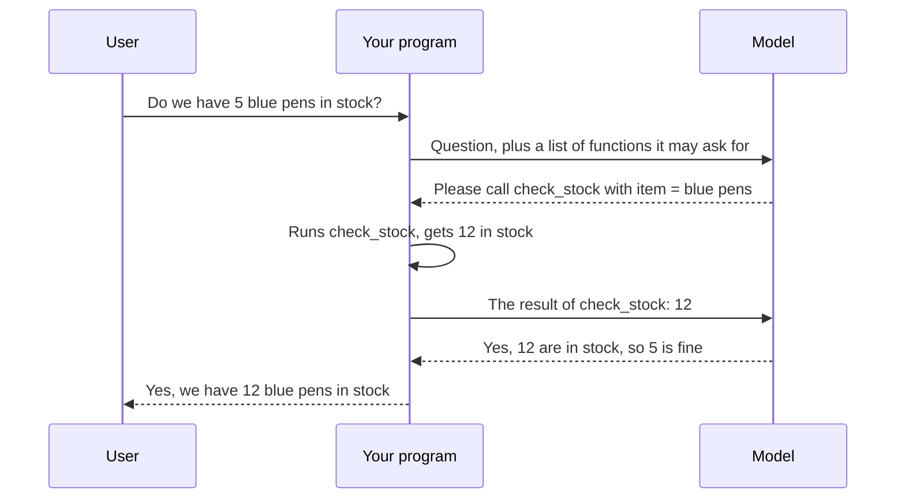
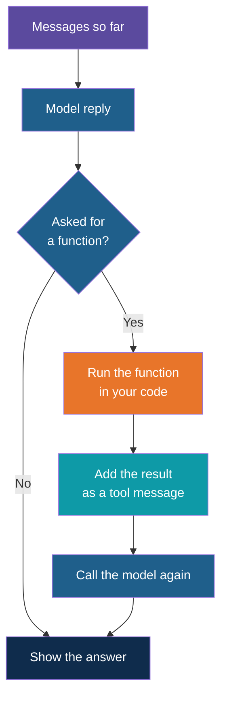
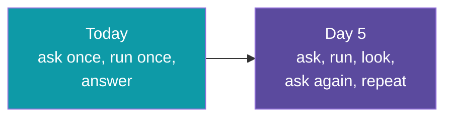

# Function Calling

**Day 3 | Block 4: Function Calling | Lab 4: Function Calling with One Tool**

A model only knows what it learned during training and what you put in the prompt. It cannot look up today's stock, read your file or send an email. Function calling is the way a model **asks your program to do those things for it**.

---

## The Problem

Think of a **very well-read manager sitting in a room with no phone and no computer**. Ask "do we have blue pens in stock?" and the manager can only guess. Now give the manager an assistant: "if you need something checked, tell me which check and with what details, and I will bring back the result." The manager can now answer properly.

The model is the manager. Your Python function is the assistant.

| Without function calling | With function calling |
|---|---|
| The model guesses or says it does not know | The model asks your code to look it up |
| Answers may be out of date | Answers come from real data |
| The model can only talk | The model can trigger actions |

---

## The Key Idea: The Model Never Runs Anything

This is the most misunderstood part. **The model does not execute your function.** It only writes a request saying "please call this function with these arguments." Your program decides whether to run it.

The model is called **twice**: once to decide what to ask, and once to turn the result into a sentence.

---

## Step 1: Describe the Function to the Model

The model cannot see your code. It only sees a short description you provide, like a menu entry.

| Part | Purpose | Example |
|---|---|---|
| Name | What to call it | check_stock |
| Description | When to use it, in plain words | Check how many units of an item are in stock |
| Parameters | What information it needs, with types | item, as text |

The description matters most. It is the only thing the model uses to decide **when** to ask for the function, so write it as if explaining the job to a new colleague.

---

## Step 2: The Model Decides

You send the question together with the list of functions. The model then makes one of two choices.

| Model's choice | When | What comes back |
|---|---|---|
| Answer directly | The question needs no function ("What is a pen?") | Ordinary text |
| Ask for a function | The question needs outside information | The function name and its arguments as JSON, and no text |

The arguments are structured data, so this is the same idea as Block 3: JSON in a fixed shape. That is why the two blocks sit side by side.

---

## Step 3: Run It and Report Back

Your program reads the request, runs the real function, and sends the result back as a new message with a special role, so the model knows it is a tool result and not something the user said.

The function result goes into the conversation like any other message. The model has no memory, so the second call carries the whole story: the question, its own request, and the result.

---

## Good Habits From the First Day

| Habit | Why |
|---|---|
| Start with one function | Each extra function makes the choice harder for the model |
| Keep functions read-only at first | A lookup cannot do harm if the model asks for the wrong thing |
| Check the arguments before running | The model can send a wrong or missing value, so validate them, as in Block 3 |
| Return a clear result even for "not found" | A missing item should produce "no such item", not a crash, so the model can explain it |
| Never let the model run arbitrary commands | Only the functions you list can be requested |

Anything that changes data, such as placing an order or sending a message, needs extra care and is left for later days.

---

## A Note on Models

Not every model supports function calling. Hosted models from the big providers do. For local models, pick one that is listed as supporting tools on its Ollama page; newer Llama versions do, while some older ones do not and will return an error. Check before the lab.

---

## The Bridge to Agents

Today's flow is a fixed pattern: the model asks for one function, you run it, the model answers. An **agent**, on Day 5, is the same idea in a loop: the model may ask for a function, see the result, decide it needs another, and keep going until the job is done. Function calling is the building block that agents are made of.

---

## Explore It Yourself

1. Ask a model in Ollama chat "How many blue pens are in stock?" and note that it cannot know. Any confident number is a guess.
2. Read the function description you will use in Lab 4 and change one word. Think about what kind of question would now trigger it, or not.
3. Ask a question that needs no function and check that the model answers directly.
4. Ask for an item that does not exist and see what the final answer says.

---

## Lab Tie-In

By the end of Lab 4 you can describe one function to a model, see it ask for that function with the right arguments, run it, send back the result, and get a final answer built on real data.

---

## What Comes Next

You now have all three pieces: a helper that calls the model, structured extraction, and function calling. The last step is putting them into one small app.

---

*Prepared for Kalpataru Projects | AIM ADaSci | Confidential*
