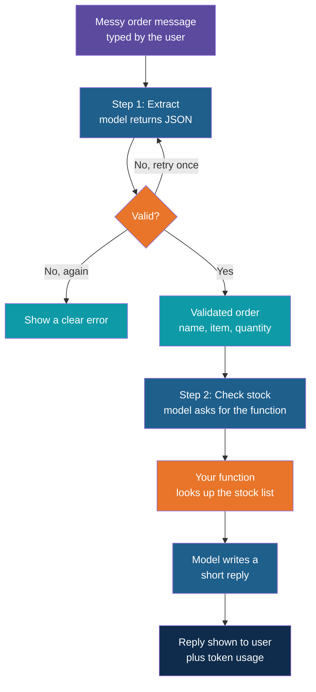
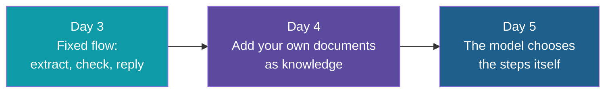

# Putting It Together: The Utility App

**Day 3 | Block 5: Integration and Utility App | Lab 5: LLM-Powered Utility App**

Three separate skills become one small application. The scenario is a simple **order helper**: a person pastes a messy order message, and the app turns it into a validated order and checks whether it can be fulfilled from a small stock list. The scenario is a stand-in; the same shape fits many everyday tasks.

---

## The Idea

Think of a **shop assistant** who reads a customer's message, writes it on the order form, and walks to the shelf to check the stock. Three jobs: understand, record, check. Each job is one of today's blocks.

| Job | Block | Tool from today |
|---|---|---|
| Talk to the model reliably | 2 | The reusable helper with retries and token usage |
| Turn the message into an order form | 3 | A Pydantic model and validation |
| Check the stock | 4 | One function the model may ask for |

---

## The Flow of the App

Every model call in this flow goes through the **same helper** from Lab 2, so retries and token counting come for free.

---

## What Each Piece Does

| Piece | Responsibility | Where it was taught |
|---|---|---|
| Configuration | Base URL, key and model from the environment file | Block 1 and the first Block 2 note |
| Helper | Call the model, retry on temporary errors, return text and usage | Lab 2 |
| Order model | Describe and validate the order fields | Lab 3 |
| Extract step | Prompt for JSON, parse, validate, retry once | Lab 3 |
| Stock function | Look up an item in a small in-memory list | Lab 4 |
| Answer step | Let the model call the function and phrase the reply | Lab 4 |
| Usage line | Print token counts after each call | Second Block 2 note |

---

## Provided Starter Code

The 35 minutes are not enough to write this from scratch, and they are not meant to be. The trainer provides a starter with the structure in place and a few clearly marked gaps.

| Already provided | You fill in |
|---|---|
| The folder layout and the environment file | Nothing to change |
| The stock list and the function that reads it | Nothing to change |
| The order model | One field or rule of your own |
| The extract prompt | The output rule and one example |
| The main loop that reads a message and prints the result | Connecting the extract step to the stock check |

Pieces from the earlier labs can be reused directly.

---

## Sample Runs to Try

| Message | What should happen |
|---|---|
| "Hi, need 3 boxes of blue pens for Rakesh" | Order extracted, stock found, reply says it can be fulfilled |
| "Send 500 blue pens to Meera" | Order extracted, stock is lower than 500, reply says how many are available |
| "Please send 2 staplers" | Item not in the stock list, reply says so plainly |
| "Order for Neha, something for the office" | Item unclear, so validation fails, and the app reports a clear error instead of guessing |

The last row matters most. **A good app fails clearly.**

---

## Cost Awareness

The app prints one usage line per model call. Use it to answer three questions.

| Question | What to notice |
|---|---|
| How many model calls did one order take? | At least three: extract, decide on the function, write the reply |
| Which call used the most tokens? | Usually the last one, because it carries the whole conversation |
| What would a hundred orders cost on a paid plan? | Multiply the totals; free-tier limits will run out sooner than you expect |

A local model costs nothing, but the counts show why a cloud provider's bill grows with every call.

---

## Where This Goes Next

The app today follows a route you wrote. On Day 4 the model gains a source of knowledge, and on Day 5 it starts choosing its own route.

---

## Explore It Yourself

1. Run the app with all four sample messages and note which one you expected to fail and did.
2. Write two messages of your own, one messy and one clear, and compare the token counts.
3. Change the temperature of the extract step from 0 to 1 and run the same message five times. Does the order stay the same?
4. Remove the example from the extract prompt and see whether the results get worse.

---

## Lab Tie-In

By the end of Lab 5 you have a working command-line app that takes a message, returns a validated order, checks it against a stock list using function calling, prints its token usage, and reports failures in plain words. Each pair of participants shows one run in the wrap-up.

---

*Prepared for Kalpataru Projects | AIM ADaSci | Confidential*
