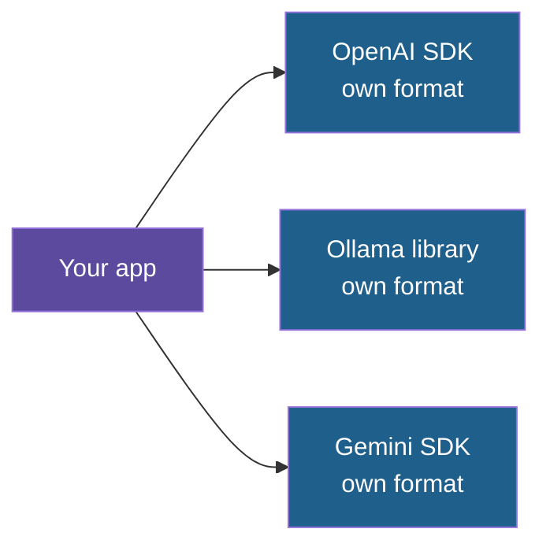
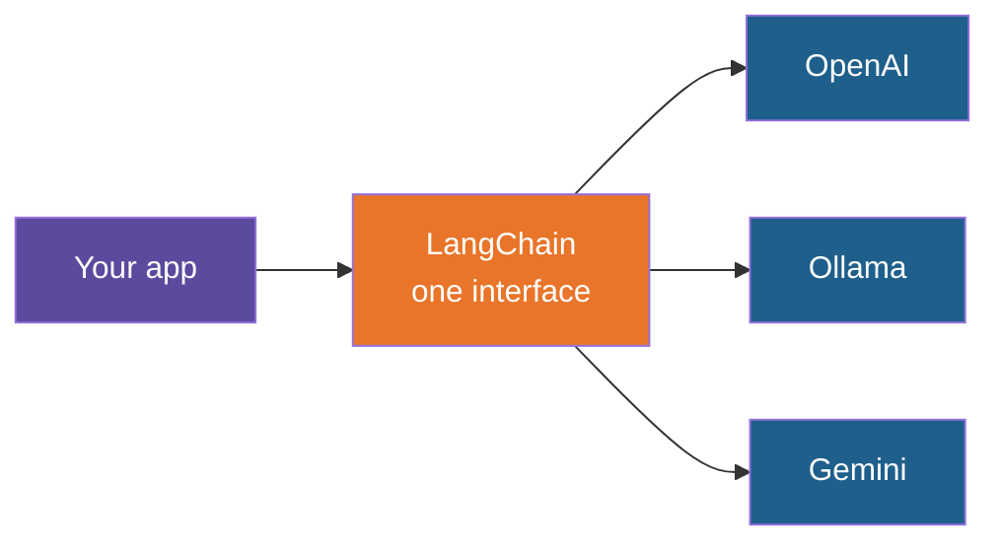
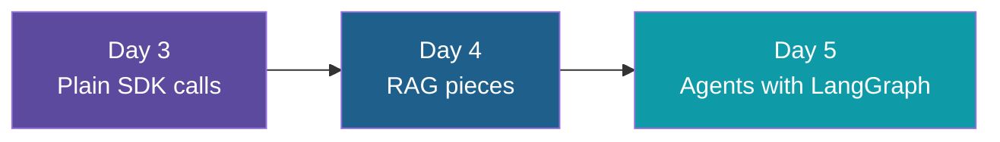

# Why LangChain: Beyond the Plain SDKs

**Day 3 | Bridge note after Block 5 | Not a scheduled block**

You have called models directly with an SDK. This note explains what that approach costs as an app grows, what LangChain adds on top, and when it is worth the extra layer. It is a look ahead to Day 4 (RAG) and Day 5 (agents), not a Day 3 lab.

---

## The Idea

Think of the model SDKs as **raw ingredients**: flour, eggs, butter. LangChain is a **kitchen** with a few standard tools and recipes. You can bake without the kitchen, and for one loaf that is often faster. For a bakery serving many orders, the kitchen saves time.

LangChain does not replace the model. It sits between your code and the SDKs and handles the work around each model call.

---

## The Problem With Plain SDKs

Every provider has its own client, its own request shape and its own way of returning the answer. Your code ends up knowing about all of them.

---

## Six Pain Points

| Pain point | What it looks like |
|---|---|
| Provider lock-in | Switching models means editing every place that calls one |
| Work around the call is yours | History, retries, backoff, streaming and parsing are all hand-written |
| Structured output differs | Asking for JSON that fits a schema works differently on each provider |
| Tool calling differs | Tool formats and the run-and-reply loop vary by provider |
| RAG has many parts | Loaders, splitters, embeddings, a vector store and a retriever. No model SDK provides them |
| Hard to debug | A bad answer from a chain of calls leaves no record of each step |

Think of the chat apps you built earlier. One idea needed three files, each reading the answer a different way, and memory was a list you managed yourself.

---

## One Interface Over Many Providers

Your app talks to one model object. Changing provider means changing which model object you create. The rest of the code stays the same.

---

## What LangChain Brings

| Feature | What it gives you | Replaces |
|---|---|---|
| Unified chat models | The same call and the same answer type for every provider | Several clients and answer paths |
| Message types | Human, AI and System message objects | Hand-built role dictionaries |
| Prompt templates | Reusable prompts with blanks to fill | Text glued together by hand |
| Structured output | Ask for a validated object and get one, on any provider | Per-provider JSON handling |
| Tool calling | Turn a function into a tool any supporting model can use | Hand-written schemas and the reply loop |
| Chat history helpers | Managed stores for earlier messages | The loose `messages` list |
| Document tools | Loaders, splitters, embeddings and vector store wrappers over FAISS, Chroma, pgvector | Glue code for each RAG stage |
| Retrievers | One standard way to fetch relevant chunks | Custom search code |
| Chains | Steps joined as prompt, then model, then parser, with streaming and batching built in | Hand-wired function calls |
| Retries and fallbacks | Settings, such as "if this model fails, try that one" | Your own retry loops |
| Tracing with LangSmith | A recorded view of every step's input and output | Print statements |
| LangGraph | The route to agents that keep state and loop | A hand-built agent loop |

---

## The Honest Downsides

| Downside | Why it matters |
|---|---|
| Extra layer | When something breaks, you debug LangChain's code as well as yours |
| Moving target | The library has changed a lot between versions, so older tutorials often fail |
| Lowest common denominator | A provider's special feature may need a step back to the raw SDK |
| Overkill for small apps | One prompt to one model is clearer with the plain SDK |

---

## When to Reach for It

| Situation | Better choice |
|---|---|
| One model, one prompt, learning how calls work | Plain SDK |
| You may switch or compare providers | LangChain |
| RAG with several moving parts (Day 4) | LangChain |
| Agents with state and loops (Day 5) | LangGraph |
| Tight control over speed and cost | Plain SDK |

---

## Where It Fits in This Program

Learning the plain SDK first is the right order. Once you know what a request, a message list and a response look like, each LangChain feature is easy to read: it is the same work, done for you.

---

## Explore It Yourself

1. Run a model in Ollama chat, then in a hosted chat website. Notice that to you they look the same. That sameness is what LangChain gives your code.
2. Open the LangChain documentation and find the list of chat model integrations. Count how many providers share one interface.
3. Take one of your chat apps and write down every line that would need to change to switch provider. That list is what LangChain shrinks.

---

*Prepared for Kalpataru Projects | AIM ADaSci | Confidential*
