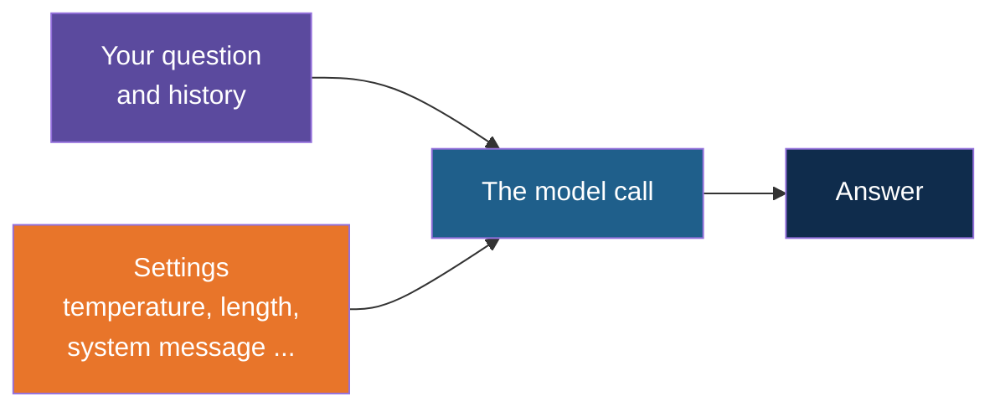

# Tuning the Simple Chat: Temperature and Other Basics

**Day 3 | Block 2: API Calls and Authentication | Companion to the simple-chat apps**

The simple chat apps use the model's default behaviour. This note shows where to change that: how random the answers are, how long they can be, who the model pretends to be, and a few more. The ideas behind the settings are in the Parameters, Tokens and Retries note; this note is about where each one goes in the code.

---

## The Idea

Think of the model as a **radio with a few dials**. The chat app plays whatever station it is tuned to. The dials, such as temperature and maximum length, are extra arguments on the same call. You do not change the app. You add one argument to the line that calls the model.



---

## The Basic Settings

| Setting | What it does | Typical values |
|---|---|---|
| Temperature | How random the word choice is. Low is steady and repeatable; high is varied and creative | 0 to 0.3 for facts, 0.7 to 1 for ideas |
| Maximum length | The most tokens the answer may use. A longer answer is cut off | 100 for short, 500 or more for long |
| System message | An instruction that sets the model's role and style for the whole chat | "Answer in one short sentence." |
| Top p | Another way to limit randomness. Change this or temperature, not both | 0.9 |
| Seed | A fixed number that makes repeated runs more alike | Any integer |
| Streaming | Show the answer word by word instead of all at once | On or off |
| Context size | How much of the conversation the local model can read at once. Ollama only | 4096 or more |

---

## Where Each Setting Goes

The names differ slightly between the three approaches used in these projects.

| Setting | OpenAI SDK (`chat.py`) | Ollama library (`chat_ollama.py`) | LangChain (`simple-chat-langchain`) |
|---|---|---|---|
| Temperature | `temperature=0.2` | `options={"temperature": 0.2}` | `temperature=0.2` on the model |
| Maximum length | `max_tokens=100` | `options={"num_predict": 100}` | `num_predict=100` on `ChatOllama`, `max_tokens=100` on `ChatOpenAI` |
| Top p | `top_p=0.9` | `options={"top_p": 0.9}` | `top_p=0.9` on the model |
| Seed | `seed=1` | `options={"seed": 1}` | `seed=1` on the model |
| Context size | Not available | `options={"num_ctx": 4096}` | `num_ctx=4096` on `ChatOllama` |
| Streaming | `stream=True` | `stream=True` | `model.stream(...)` instead of `invoke` |
| System message | A first message with role `system` | A first message with role `system` | A `SystemMessage` first in the list |

The pattern: with the OpenAI SDK, settings are extra arguments on the call. With the Ollama library, they sit inside one `options` dictionary. With LangChain, they are given once when the model object is created.

---

## Example: Temperature and Length

In `chat.py`, add two arguments to the existing call:

```python
response = client.chat.completions.create(
    model=MODEL,
    messages=[{"role": "user", "content": user_input}],
    temperature=0.2,
    max_tokens=100,
)
```

In `chat_ollama.py`, the same two settings go inside `options`:

```python
response = ollama.chat(
    model=MODEL,
    messages=[{"role": "user", "content": user_input}],
    options={"temperature": 0.2, "num_predict": 100},
)
```

In the LangChain project, set them once where the model is created:

```python
model = ChatOllama(model="llama3:8b", temperature=0.2, num_predict=100)
```

---

## Example: A System Message

A system message is the cheapest way to change how the model behaves. Put it first in the list.

For the history versions, start the list with it instead of leaving it empty:

```python
messages = [{"role": "system", "content": "You are a friendly tutor. Answer in one short sentence."}]
```

In LangChain, use a `SystemMessage` the same way:

```python
messages = [SystemMessage("You are a friendly tutor. Answer in one short sentence.")]
```

For the basic no-memory versions, send it together with the question:

```python
messages=[
    {"role": "system", "content": "Answer in one short sentence."},
    {"role": "user", "content": user_input},
]
```

---

## Example: Streaming

Streaming shows the answer as it is written, which feels much faster in a chat. With the OpenAI SDK, ask for a stream and print each piece:

```python
stream = client.chat.completions.create(model=MODEL, messages=messages, stream=True)

for piece in stream:
    print(piece.choices[0].delta.content or "", end="", flush=True)
```

The `or ""` is needed because the last piece can be empty. With history, collect the pieces into one string so you can add the whole answer to the history afterwards.

---

## Two Things to Watch

| Watch out | Why |
|---|---|
| A short maximum length cuts the answer mid-sentence | The model stops at the limit without finishing. The finish reason in the response then says `length` instead of `stop` |
| Low temperature does not give the same answer every time | It makes repeats more alike. Add a seed for the closest match, but expect small differences |

Also remember that with history, every turn re-sends the whole conversation. A long chat uses more tokens each turn, and a local model with a small context size may start to forget the oldest messages.

---

## Explore It Yourself

1. In `chat.py`, ask "Give me a name for a coffee shop" with temperature 0, three times. Then set temperature to 1.2 and ask again three times. Compare how much the answers vary.
2. Set the maximum length to 10, ask any question, and look at where the answer stops.
3. Add a system message that makes the model answer only in rhyme, then ask something ordinary.
4. Print `response.choices[0].finish_reason` after each answer and see when it says `stop` and when it says `length`.

---

*Prepared for Kalpataru Projects | AIM ADaSci | Confidential*
