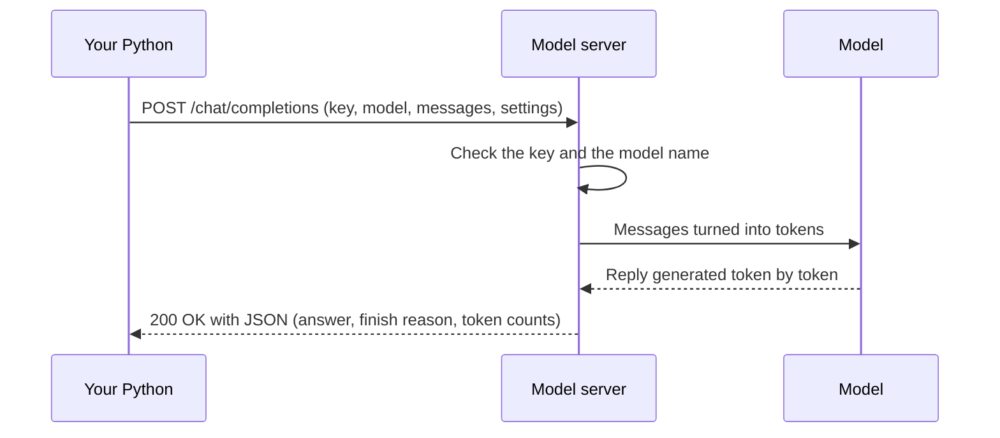

# Step 1 — Concepts Overview

> Back to index · Next: Environment Setup

## Goal

Learn the small vocabulary behind every LLM call, so the code in later steps reads as
familiar pieces rather than magic.

## Why this matters

A language model is not a function inside your program. It is a separate service, running
either on your own machine (Ollama) or in a provider's data centre (OpenAI and others), and
your program talks to it the way a browser talks to a website: it sends an HTTP request
containing JSON, and reads an HTTP response containing JSON.

Once you see that, most of what feels new about "calling an AI" goes away. There is no
special protocol, only a well-known request shape. It also explains the design of this
project: because Ollama copies the OpenAI request shape, **switching providers is a
configuration change, not a code change**. That is why the API address, key and model name
live in a separate config file rather than being typed into the calling code.

The project builds the same call twice on purpose. The first version uses a plain HTTP
library so you can see every byte that travels. The second uses the official SDK, so you can
see exactly what it saves you.



## Vocabulary

| Term | Meaning | Where it appears |
|---|---|---|
| Base URL | The address of the API, such as `http://localhost:11434/v1` for Ollama | `config.py`, used to build the request URL |
| Endpoint | One path on that API. Ours is `/chat/completions` | `01_raw_http_call.py` |
| API key | A secret that proves who is calling. Ollama ignores it; hosted providers require it | `config.py`, sent in the `Authorization` header |
| Model | Which model should answer, for example `llama3:8b` | `config.py`, sent in the request body |
| Messages | The conversation so far: a list of dicts, each with a `role` and `content` | Request body |
| Role | Who is speaking: `system` (your instructions), `user` (the question), `assistant` (the model's earlier answers) | Every message |
| Temperature | Randomness. Near 0 gives steady answers, higher gives more varied ones | Request body |
| Max tokens | The upper limit on the length of the answer | SDK call |
| Token | A chunk of text, roughly three quarters of a word. Models read and bill in tokens | `usage` in the response |
| Finish reason | Why the model stopped: `stop` (finished) or `length` (hit the limit) | Response |
| OpenAI-compatible | An API that accepts the same request shape as OpenAI's, which Ollama does | The reason one codebase works for both |
| SDK | A provider's Python library that builds requests and reads responses for you | `02_sdk_call.py` |

## Try it

Before writing any code, talk to the model directly. In a terminal:

```bash
ollama list
ollama run llama3:8b
```

At the `>>>` prompt ask `What is an API?`, read the answer, then type `/bye` to leave. This
is the same model your Python code will call in the next steps.

## Common mistakes

| Symptom | Cause | Fix |
|---|---|---|
| `ollama: command not found` | Ollama is not installed | Install it from the Ollama website, then reopen the terminal |
| `ollama list` shows no `llama3:8b` | The model was never downloaded | Run `ollama pull llama3:8b` once (a few GB) |
| `could not connect to ollama app` | The Ollama app or service is not running | Start the Ollama app, or run `ollama serve` in another terminal |

Next: **Step 2 — Environment Setup**.
