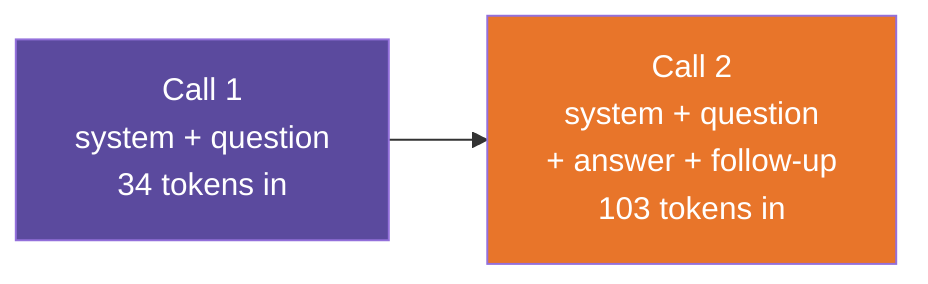

# Step 9 — Conversation History

> Back to index · Previous: SDK Error Handling · Next: Recap and Exercises

## Goal

Send a follow-up question and see, in the token counts, that the model remembers nothing
between calls: your program must send the whole conversation every time.

## Why this matters

A chat app feels like a continuous conversation, but the model itself has **no memory**. Each
call is a fresh, independent request. When you ask "Now give me an example", the model only
knows what "an example of what?" refers to because your code sent the earlier question and
the earlier answer along with it.

That has three practical consequences you will meet again and again:

- **You own the memory.** The conversation is a list in your program. Appending to it is how
  a chat "remembers".
- **Cost and delay grow.** Every earlier message is sent, and counted as prompt tokens, on
  every call. A long chat costs more per turn than a short one.
- **Limits apply.** Models have a maximum size for what they can read at once. Long chats
  eventually need trimming, which is a design decision later in the course.

This is also the seed of how agents keep track of what they have done so far.



## 1. Add the model's answer and a new question to the list

```python
# ---------------------------------------------------------------
# 5. Remember: the model has NO memory between calls
# ---------------------------------------------------------------
# Each call is independent. To continue a conversation, add the model's
# answer and the next question to the list, and send the WHOLE list again.
messages.append({"role": "assistant", "content": choice.message.content})
messages.append({"role": "user", "content": "Now give me one real-life example."})
```

The model's reply goes back into `messages` with the role `assistant`, followed by the new
`user` question. The list now holds four messages.

## 2. Send the whole list again

```python
follow_up = client.chat.completions.create(
    model=config.MODEL,
    messages=messages,
    temperature=0.2,
    max_tokens=150,
)
```

## 3. Compare the token counts

```python
print("\nFollow-up answer:", follow_up.choices[0].message.content)
print("Prompt tokens grew to:", follow_up.usage.prompt_tokens, "because the history was re-sent")
```

The first call's `prompt_tokens` was about 34. The follow-up's is about 100, even though the
new question is only a few words. The difference is the earlier messages travelling along
again.

## Try it

```bash
uv run python 02_sdk_call.py
```

After the output from Step 7, you should also see:

```text
Follow-up answer: A great example of an API in action is the Uber API, which allows developers to access ...
Prompt tokens grew to: 103 because the history was re-sent
```

The wording and exact numbers will differ, but the second prompt count should be clearly
larger than the first.

For a good test, comment out the two `messages.append(...)` lines and run again. The model
now has no idea what "an example" refers to.

## Checkpoint

<details>
<summary>Full <code>02_sdk_call.py</code></summary>

```python
"""
Step 2: The same call, using the official OpenAI Python SDK.

Compare with 01_raw_http_call.py. The request and response are identical;
the SDK just does the plumbing for you:
  - builds the URL and headers
  - turns the reply into an object (response.choices[0]...) instead of a dict
  - raises specific, well-named errors

The SDK works with Ollama too, because Ollama speaks the same API.
Only base_url, api_key and model (all in config.py) change.

Run (from this folder):
    uv run python 02_sdk_call.py
"""

import openai
from openai import OpenAI

import config

# ---------------------------------------------------------------
# 1. Create the client once, reuse it for every call
# ---------------------------------------------------------------
client = OpenAI(
    base_url=config.BASE_URL,
    api_key=config.API_KEY,
    timeout=120,  # seconds
)

# ---------------------------------------------------------------
# 2. Messages: a conversation as a list of role + content
# ---------------------------------------------------------------
# system    sets the behaviour and tone (the model's "job description")
# user      what the person asks
# assistant what the model said earlier (used when you send a longer chat)
messages = [
    {"role": "system", "content": "You are a friendly teacher. Answer in two short sentences."},
    {"role": "user", "content": "Explain what an API is."},
]

# ---------------------------------------------------------------
# 3. Make the call
# ---------------------------------------------------------------
try:
    response = client.chat.completions.create(
        model=config.MODEL,
        messages=messages,
        temperature=0.2,
        max_tokens=150,  # upper limit on the length of the answer
    )
except openai.APIConnectionError:
    raise SystemExit(f"Could not connect to {config.BASE_URL}. Is Ollama running?")
except openai.AuthenticationError:
    raise SystemExit("The API key was rejected. Check LLM_API_KEY in your .env file.")
except openai.NotFoundError:
    raise SystemExit(f"Model '{config.MODEL}' not found. For Ollama, run: ollama pull {config.MODEL}")
except openai.RateLimitError:
    raise SystemExit("Too many requests. Wait a little and try again.")
except openai.APIStatusError as error:
    raise SystemExit(f"API returned an error: {error.status_code}")

# ---------------------------------------------------------------
# 4. Read the response
# ---------------------------------------------------------------
# Same fields as the raw JSON, now reached with dots instead of brackets.
choice = response.choices[0]
print("Answer:", choice.message.content)
print("Finish reason:", choice.finish_reason)
print("Model that answered:", response.model)

print("\nTokens")
print("  prompt (what we sent):", response.usage.prompt_tokens)
print("  completion (what came back):", response.usage.completion_tokens)
print("  total:", response.usage.total_tokens)

# ---------------------------------------------------------------
# 5. Remember: the model has NO memory between calls
# ---------------------------------------------------------------
# Each call is independent. To continue a conversation, add the model's
# answer and the next question to the list, and send the WHOLE list again.
messages.append({"role": "assistant", "content": choice.message.content})
messages.append({"role": "user", "content": "Now give me one real-life example."})

follow_up = client.chat.completions.create(
    model=config.MODEL,
    messages=messages,
    temperature=0.2,
    max_tokens=150,
)
print("\nFollow-up answer:", follow_up.choices[0].message.content)
print("Prompt tokens grew to:", follow_up.usage.prompt_tokens, "because the history was re-sent")
```

</details>

This matches the reference project's `02_sdk_call.py` exactly.

## Common mistakes

| Symptom | Cause | Fix |
|---|---|---|
| The follow-up answer ignores the earlier topic | The `messages.append(...)` lines are missing, so the model got only the new question | Append both the assistant answer and the new user message before the second call |
| `NameError: name 'choice' is not defined` | The follow-up code was pasted above the section that defines `choice` | Keep it at the bottom, after the response has been read |
| Prompt tokens do not grow | The second call still sends the original two messages | Send the same `messages` list you appended to |
| The follow-up call crashes with a long trace | Only the first call has the `try` and `except` | Expected in this reference file. Exercise 5 asks you to protect it too |

Next: **Step 10 — Recap and Exercises**.
