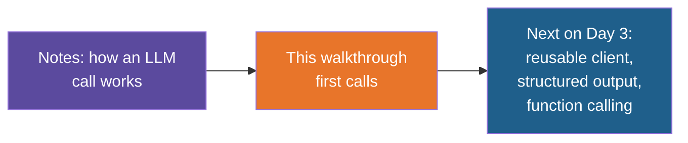

# Calling an LLM from Python — Build Walkthrough

A step-by-step guide to hand-building the `ai-and-python` reference project: a small Python
program that sends a question to a language model and reads the answer, first with a plain
HTTP request and then with the OpenAI SDK.

## What You'll Build

A uv-managed Python project with three code files and a few supporting files:

| File | What it is |
|---|---|
| `config.py` | Reads the API address, key and model name from environment variables |
| `01_raw_http_call.py` | Calls the model with a plain HTTP request and prints everything that travels back and forth |
| `02_sdk_call.py` | Makes the same call through the OpenAI SDK, then shows that the model has no memory between calls |
| `.env.example`, `.gitignore`, `pyproject.toml` | Settings template, Git safety net, dependencies |

The same code runs against a local Ollama model or a hosted OpenAI model. Only three
environment variables change.

## Who This Is For / Prerequisites

- Comfortable with Python dicts, lists, functions and `try`/`except`. The Python essentials
  notes cover these.
- `uv` installed. If it is new to you, read the environment setup note and do the with-uv
  Site Status API walkthrough first; this guide does not re-explain what `uv sync` and
  `uv run` do.
- A model to call: **Ollama** with `llama3:8b` (free, runs on your machine), or an API key
  for a hosted provider such as OpenAI (free tier only).

Budget about 75 minutes to build everything. In a live session, demo Steps 4 to 6 and
Steps 7 to 9 in the 40-minute API Calls block, and hand Steps 2 and 3 out as pre-work.

## Steps

| Step | File | What You'll Add | Est. Time |
|---|---|---|---|
| 1 | 01-concepts-overview.md | Vocabulary: endpoint, key, model, messages, roles, tokens | 5 min |
| 2 | 02-environment-setup.md | Project folder, dependencies, `.gitignore`, a working Ollama | 10 min |
| 3 | 03-configuration.md | `config.py` and `.env.example` | 5 min |
| 4 | 04-building-the-request.md | The URL, headers and JSON body, printed but not yet sent | 10 min |
| 5 | 05-sending-and-reading-the-response.md | The HTTP call and pulling the answer out of the JSON | 10 min |
| 6 | 06-handling-failures.md | Friendly errors for a dead server and a bad model name | 10 min |
| 7 | 07-the-same-call-with-the-sdk.md | `02_sdk_call.py`: client, messages with roles, response object | 10 min |
| 8 | 08-sdk-error-handling.md | The SDK's named exceptions | 5 min |
| 9 | 09-conversation-history.md | A follow-up call that proves the model has no memory | 5 min |
| 10 | 10-recap-and-exercises.md | Review, gotchas, practice | 5 min |

## Relationship to the Reference Implementation

By the end of the walkthrough your files should match the reference project's files exactly:
`config.py` (Step 3), `01_raw_http_call.py` (Step 6), `02_sdk_call.py` (Step 9),
`pyproject.toml`, `.gitignore` and `.python-version` (Step 2) and `.env.example` (Step 3).
This walkthrough was generated from those files, and every full-file checkpoint was
checked for valid Python syntax and compared against the reference.

## Suggested Demo Flow

1. Before any code, run `ollama run llama3:8b` and ask it what an API is. Later, when
   Step 5 returns the same kind of answer, trainees see that the script is just a
   different way of talking to the same model.
2. Stop at the end of Step 4 and look at the printed request body for a full minute. It is
   the entire "conversation" with the model: a model name, a list of messages, a
   temperature. Everything after that is plumbing.
3. In Step 6, trigger the failures on purpose before showing the fix: run with
   `LLM_MODEL=nope` and read the raw 404, then stop Ollama or point the URL at a dead port.
   Trainees remember the error they caused.
4. After Step 9, put the two prompt token counts on the board (34, then 103 in the
   reference run) and ask why the second is bigger. That is the "no memory" idea, and it
   sets up why long chats get expensive.
5. Change `LLM_MODEL` to a different local model in `.env` and rerun without touching a
   `.py` file. If you have a hosted key, switch all three variables the same way. This is
   the point of Step 3.

## Series

Start with Step 1 — Concepts Overview.
