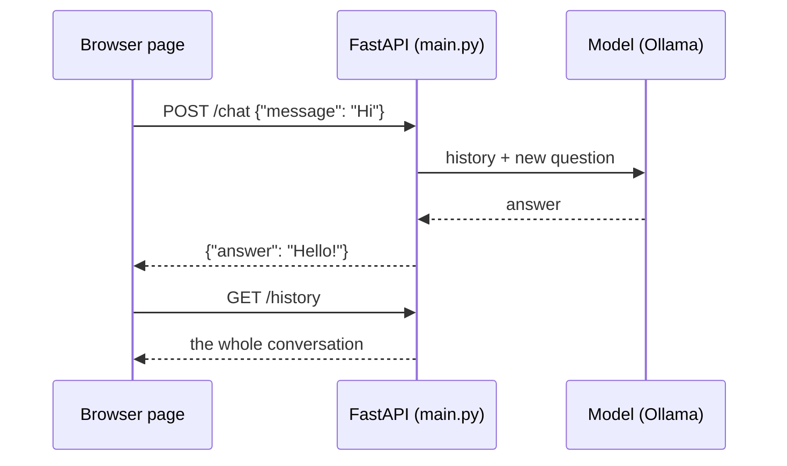

# Step 1 — Concepts Overview

> Back to index · Next: Project Setup

## Goal

Learn the handful of web words you need before writing any code, and see how the browser,
the API and the model fit together.

## Why this matters

In `simple-chat` the program owned everything: it asked you for input, called the model and
printed the answer. A web app splits that job in two. A page in the browser takes the input
and shows the output. A server in the middle talks to the model. They only communicate by
sending small messages to each other.

Think of a restaurant. The page is the customer, the API is the waiter and the model is the
kitchen. The customer never walks into the kitchen. The waiter takes an order in a fixed
format, brings it to the kitchen, and returns with the dish, or with "sorry, the kitchen is
closed". Everything in this walkthrough is about building a good waiter.

## The Vocabulary

| Word | Meaning | Where you will see it |
|---|---|---|
| Endpoint | One address the server answers, such as `/chat` | `@app.post("/chat")` |
| HTTP method | What you want to do: GET reads, POST sends, DELETE removes | `@app.get`, `@app.post`, `@app.delete` |
| Request body | The data sent along with a POST | `{"message": "Hello"}` |
| JSON | The text format both sides use to write down data | Request and response bodies |
| Status code | A number saying how it went. 200 is fine, 503 is "service unavailable" | `status_code=503` |
| Schema | The shape a request must have, checked before your code runs | `class ChatRequest(BaseModel)` |
| Static file | A file the server hands over unchanged | `static/index.html` |

## The Shape of the App

The server keeps the conversation. The page only displays it. That is why a browser refresh
can bring the conversation back: the page asks `GET /history` for it.

## What Changed From simple-chat

| Area | simple-chat | This project |
|---|---|---|
| Input and output | `input()` and `print()` | A browser page calling `POST /chat` |
| The loop | `while True` | One request per message; the server handles each one |
| History | A `messages` list in the loop | The same list, at module level, living as long as the server runs |
| Errors | The program crashes | A 503 with a message the page shows |

## Check Yourself

Before moving on, you should be able to say who holds the conversation in this design, the
page or the server. It is the server. Keep that in mind for Step 5.

Next: **Step 2 — Project Setup**.
