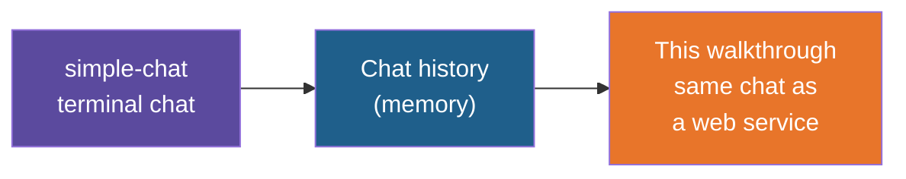

# Simple Chat with FastAPI — Build Walkthrough

A step-by-step guide to hand-building the `simple-chat-fastapi` reference project: the chat
app with history, turned into a web service with a one-page browser UI. You type in the
browser, the page calls the API, the API calls a local model through Ollama, and the page
shows the whole conversation.

## What You'll Build

A uv-managed Python project with a small API and one HTML page:

| File | What it is |
|---|---|
| `main.py` | The FastAPI app: serves the page, answers `POST /chat`, keeps the history |
| `static/index.html` | The chat page: message list, input box, Send and New chat buttons. Plain HTML and JavaScript, no build step |
| `pyproject.toml`, `.gitignore` | Dependencies and Git safety net |

The API has four endpoints:

| Method | Path | What it does |
|---|---|---|
| GET | `/` | The chat page |
| POST | `/chat` | Takes `{"message": "..."}`, returns `{"answer": "..."}` |
| GET | `/history` | The conversation so far |
| DELETE | `/history` | Starts a new conversation |

## Who This Is For / Prerequisites

- Comfortable with Python functions, dicts and lists, and with what an HTTP request is.
- Having built the `simple-chat` app (especially its chat-history step) is strongly
  recommended. This guide reuses that idea and does not re-teach it.
- `uv` installed. Ollama installed and running, with `ollama pull llama3:8b` done once.
  The `simple-chat` walkthrough, Step 2, covers both.
- No JavaScript experience needed. The page is short and every line is explained.

Budget about 60 minutes to build everything. In a live session Steps 4 to 6 are the core
(25 minutes); Step 7 is the payoff and is mostly typing HTML.

## Steps

| Step | File | What You'll Add | Est. Time |
|---|---|---|---|
| 1 | 01-concepts-overview.md | Vocabulary: endpoint, request body, JSON, status code, static file | 5 min |
| 2 | 02-project-setup.md | Project folder, dependencies, `.gitignore`, a working Ollama | 5 min |
| 3 | 03-your-first-endpoint.md | A running FastAPI app, `fastapi dev`, Swagger at `/docs` | 7 min |
| 4 | 04-the-chat-endpoint.md | `POST /chat`: the model client and a validated request body | 10 min |
| 5 | 05-adding-chat-history.md | The `messages` list, `GET /history` and `DELETE /history` | 10 min |
| 6 | 06-handling-model-errors.md | A clear 503 when the model cannot be reached | 6 min |
| 7 | 07-the-chat-page.md | `static/index.html` and serving it from `/` | 12 min |
| 8 | 08-recap-and-exercises.md | Review, gotchas, practice | 5 min |

## Relationship to the Reference Implementation

By the end your files should match the reference project exactly: `pyproject.toml` and
`.gitignore` (Step 2), `main.py` (Steps 3 to 7) and `static/index.html` (Step 7). This
walkthrough was generated from those files, and every full-file checkpoint was checked for
valid syntax and compared against the reference.

## Suggested Demo Flow

1. Before typing anything, run the finished `simple-chat-fastapi` app and chat with it for
   a minute, then press F5. The conversation comes back. Ask the room where it is stored.
   That question is Step 5.
2. At the end of Step 3, open `/docs` and call the endpoint from Swagger. Trainees see an
   API they have not yet built any UI for, which makes the browser page in Step 7 feel like
   one client among many.
3. In Step 4, send the same message twice from Swagger and ask "What is my name?" after
   introducing yourself. The model forgets, exactly as in the first `simple-chat`. Step 5
   fixes it with the same list as before, now at module level.
4. In Step 6, stop Ollama, send a message from Swagger and read the 503 aloud. Then show
   what the same failure did to `simple-chat`: it crashed the program.
5. In Step 7, open the browser dev tools Network tab while sending a message so trainees see
   the `POST /chat` request with the JSON body you defined in Step 4.
6. Open the page in two browser windows and send from each. They share one conversation.
   Use it to introduce the limitation in the recap.

## Series

Start with Step 1 — Concepts Overview.
