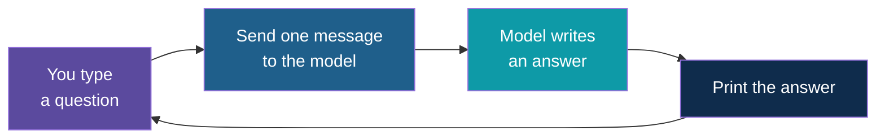

# Step 1 — Concepts Overview

> Back to index · Next: Project Setup

## Goal

Learn the six words you need before writing any code, and see the shape of the app you are
about to build.

## Why this matters

A chat with a language model feels like talking to someone who is listening. It is closer
to sending a letter to a very well-read stranger who throws away every letter after
replying. Each request is complete in itself. If you want the stranger to know something,
the letter must say it.

Holding this picture in your head explains the one surprising behaviour of the first
versions of this app, that they forget your name, and it explains the fix in Step 7.

## The Vocabulary

| Word | Meaning | Where you will see it |
|---|---|---|
| Model | The language model that writes the answer | `MODEL = "llama3:8b"` |
| Message | One piece of text with a role attached | `{"role": "user", "content": "..."}` |
| Role | Who said it. `user` is you; `assistant` is the model | The `role` key |
| Request | The model name plus a list of messages, sent to the model | `chat.completions.create(...)` |
| Response | What comes back: the answer plus extra details | `response.choices[0].message.content` |
| Memory | Earlier messages sent again with the new one | Missing in `chat.py`, added in Step 7 |

## The Shape of the App

The arrow from "Print the answer" back to "You type a question" is only the loop. Nothing
travels along it. The list of messages is built fresh every turn with one item in it.

## Three Ways to Reach a Model

| File | Reaches the model through | Needs a key |
|---|---|---|
| `chat.py` | The OpenAI SDK, pointed at your own computer | No |
| `chat_ollama.py` | The `ollama` library | No |
| `chat_openai.py` | The OpenAI SDK, pointed at OpenAI's servers | Yes |

Ollama speaks the same "chat completions" language as OpenAI, which is why one SDK can talk
to both. You will build the app once and then see how little changes.

## Check Yourself

Before moving on, you should be able to say what is in the list of messages that gets sent
for your third question in a chat. For `chat.py` the answer is "one message, the third
question". Keep that in mind for Step 4, and ask it again after Step 7.

Next: **Step 2 — Project Setup**.
