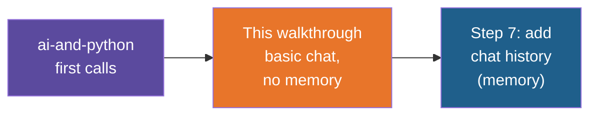

# Simple Chat — Build Walkthrough

A step-by-step guide to hand-building the `simple-chat` reference project: the most basic
chat app. You type a question, a model answers, and nothing is remembered between turns.
It is built first on a local Ollama model, then repeated with the Ollama library and with
OpenAI. The last build step adds chat history so the model remembers the conversation.

## What You'll Build

A uv-managed Python project with four small chat programs and a few supporting files:

| File | What it is |
|---|---|
| `chat.py` | A chat loop that calls local `llama3:8b` through the OpenAI SDK |
| `chat_ollama.py` | The same chat loop using the `ollama` library |
| `chat_openai.py` | The same chat loop calling OpenAI's `gpt-4o-mini` with your own API key |
| `chat_with_history.py` | `chat.py` plus a growing `messages` list, so the model remembers earlier turns |
| `.env.example`, `.gitignore`, `pyproject.toml` | Key template, Git safety net, dependencies |

## Who This Is For / Prerequisites

- Comfortable with Python variables, `while` loops, `if` and dicts.
- `uv` installed. The environment setup note and the with-uv Site Status API walkthrough
  explain `uv sync` and `uv run`; this guide does not repeat them.
- Ollama installed and running, with the model downloaded once: `ollama pull llama3:8b`.
  Step 2 gives the one-line check. The `ai-and-python` walkthrough, Step 2, covers Ollama
  setup in more detail.
- For Step 6 only: an OpenAI API key.

Budget about 55 minutes to build everything. In a live session Steps 3 and 4 are the core
(20 minutes); Steps 5 and 6 can be shown as variations, and Step 7 is the payoff.

## Steps

| Step | File | What You'll Add | Est. Time |
|---|---|---|---|
| 1 | 01-concepts-overview.md | Vocabulary: model, message, role, request, response, memory | 5 min |
| 2 | 02-project-setup.md | Project folder, dependencies, `.gitignore`, a working Ollama | 7 min |
| 3 | 03-your-first-call.md | One hard-coded question sent to the model, answer printed | 8 min |
| 4 | 04-the-chat-loop.md | `input()`, the `while` loop, quitting, and proof of no memory | 10 min |
| 5 | 05-the-ollama-library-version.md | `chat_ollama.py`: the same app with the `ollama` library | 5 min |
| 6 | 06-the-openai-version.md | `chat_openai.py`, `.env` and `.env.example` for an API key | 8 min |
| 7 | 07-adding-chat-history.md | `chat_with_history.py`: a `messages` list that grows every turn | 10 min |
| 8 | 08-recap-and-exercises.md | Review, gotchas, practice | 5 min |

## Relationship to the Reference Implementation

By the end your files should match the reference project's files exactly: `pyproject.toml`
and `.gitignore` (Steps 2 and 6), `chat.py` (Step 4), `chat_ollama.py` (Step 5),
`chat_openai.py` and `.env.example` (Step 6), `chat_with_history.py` (Step 7). This walkthrough was generated from those
files, and every full-file checkpoint was checked for valid Python syntax and compared
against the reference.

## Suggested Demo Flow

1. Open a terminal and run `ollama run llama3:8b`, ask "What is my name?", then quit. Do
   it once more after introducing yourself in the same session to show that Ollama's own
   chat does remember. Trainees then know what the app you are about to build is missing.
2. At the end of Step 3, change the hard-coded question twice and rerun. It makes the point
   that the whole "conversation" is one list with one message in it.
3. In Step 4, say "My name is Asha", then ask "What is my name?" and let the wrong answer
   land before explaining. Ask the room what the model would need to be sent to answer
   correctly. That question is the next lesson.
4. In Step 5, put `chat.py` and `chat_ollama.py` side by side and point at the only lines
   that differ: the client setup and where the answer is read from.
5. In Step 6, run the app once with the key missing from `.env` and read the error aloud
   before fixing it. Then show `git status` to prove `.env` is ignored.
6. In Step 7, add `print(messages)` just before the model call and run two turns. Seeing the
   list grow from one item to three is the whole idea of memory.

## Series

Start with Step 1 — Concepts Overview.
