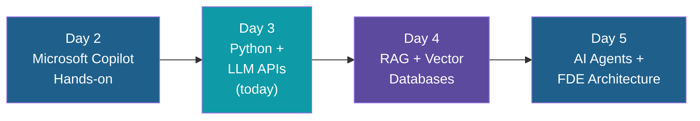
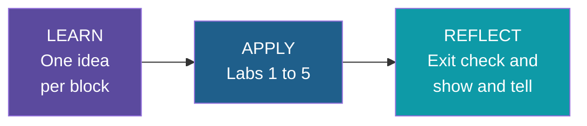

# Day 3: Python + LLM APIs — Introduction

**AI Developer & FDE Training | Kalpataru Projects, Ahmedabad**
Week 1, Day 3 of 6 | 4 hours | Batch 1 (forenoon) and Batch 2 (afternoon)

---

## Welcome

Until now you have used AI through a chat window. Today you make your own program do the talking. By the end of the day, a small Python app will send a request to a model, get back clean data, and let the model ask your code to look things up.

You do not need prior AI experience, and the Python needed is small. Each block teaches one main idea, and every lab starts from provided starter code.

## Why This Day Exists

Everything from here on builds on the ideas in today's blocks.

- Day 4's document assistant sends retrieved text to a model with exactly the call you write today.
- Day 5's agents are today's function calling placed in a loop.
- Structured, validated output is what lets an AI step feed a real business system safely.

## How Today Fits Into the Program

## Learn, Apply, Reflect — Today

## Today's Journey

| Block | Focus | You'll produce |
|---|---|---|
| 1. Python for AI in Practice | Project setup, secrets, JSON, Pydantic basics | Project skeleton (Lab 1) |
| 2. API Calls and Authentication | One call, messages, tokens, failures, one retry | First call and reusable helper (Lab 2) |
| 3. Structured Outputs | Asking for JSON, validating it, one retry | Structured extraction (Lab 3) |
| 4. Function Calling | The model asks, your code acts | Function calling with one tool (Lab 4) |
| 5. Integration and Utility App | Combining the pieces | LLM-powered utility app (Lab 5) |

Full timing and topic-by-topic detail live in the schedule file for this day.

## Before You Start

- Laptop with Python 3.10+, VS Code and Git
- uv installed (covered in the Day 1 notes on virtual environments)
- Ollama installed with a model downloaded, or a free-tier API key issued for training
- If you use Ollama for Block 4, a model that supports tools (check its Ollama page)
- No confidential documents, datasets or credentials on the machine

## How These Notes Are Organized

- The schedule file: agenda, timing, topic lists, labs and ground rules.
- `intro.md`: this page.
- `notes/`: Python foundations for Block 1 (Python essentials, FastAPI, Pydantic).
- `ai-and-python/`: the LLM notes for Blocks 2 to 5, in the order taught.
- `code/`: runnable examples that the notes refer to by folder name.

## Ground Rules

- Use only the provided synthetic or sanitized datasets
- Keep API keys out of code and Git
- Stay within free-tier limits, or use a local open-weight model

---

*Prepared for Kalpataru Projects | AIM ADaSci | Confidential*
