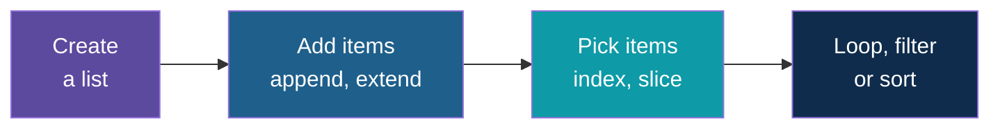
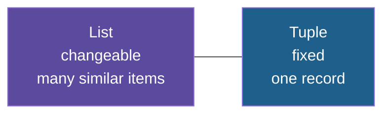
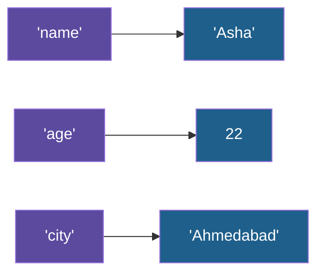
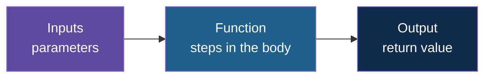
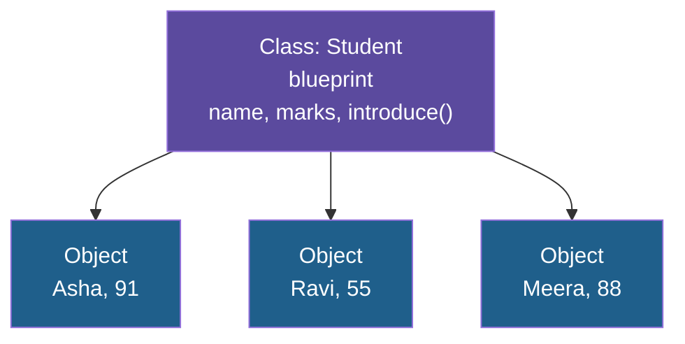
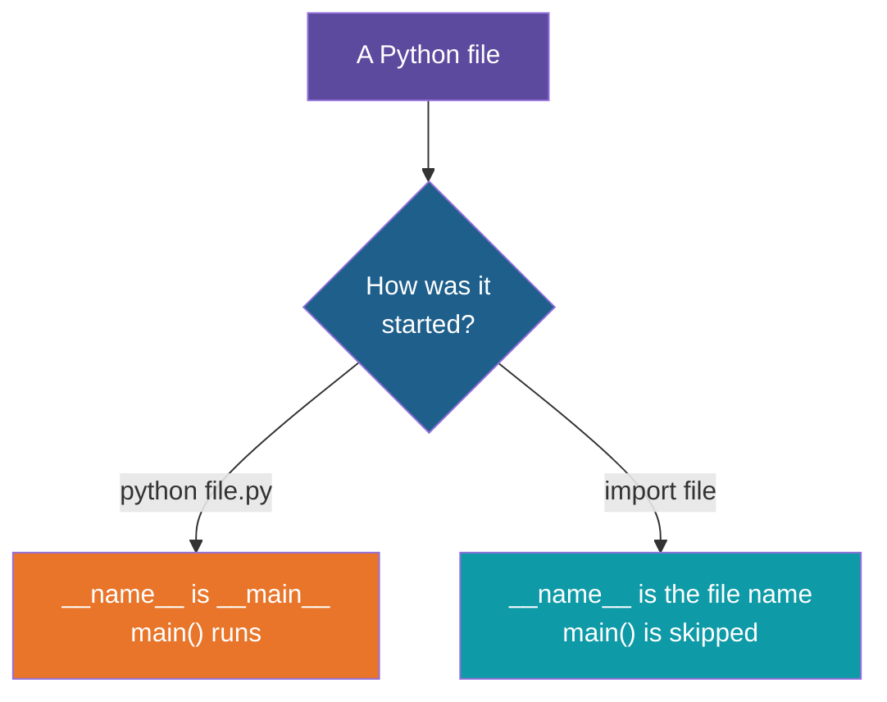
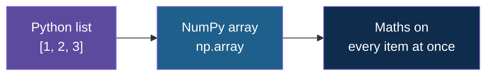
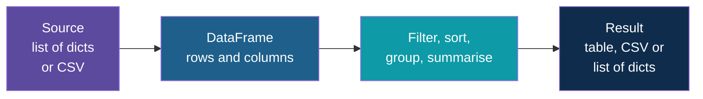

# Python Essentials

**Day 3 | Block 1: Python for AI in Practice**

The small set of Python building blocks used in almost every program. The runnable code lives in the project folder `session-03/code/solutions/python-essentials/`, one file per concept. These notes explain the idea; the file shows it.

---

## The Building Blocks

| Concept | Everyday picture | Project file |
|---|---|---|
| Lists | Shopping list, playlist | `01_lists.py` |
| Tuples | A fixed pair, like (latitude, longitude) | `02_tuples.py` |
| Dicts | A phone book: name to number | `03_dicts.py` |
| Functions | A recipe you can reuse | `04_functions.py` |
| Classes and objects | A blueprint and the things built from it | `05_classes_and_objects.py` |
| `main` method | The front door of a program | `06_main_method.py` (with helper `area_tools.py`) |
| NumPy | A spreadsheet column you can do maths on | `07_numpy_basics.py` |
| pandas | An Excel sheet you control with code | `08_pandas_basics.py` |

Each concept is one file, and later files reuse the ideas of earlier ones. Concepts 1 to 6 use only built-in Python. NumPy and pandas are extra packages installed once with `pip install -r requirements.txt` from the project folder.

---

## Concept 1: Lists

Think of a **WhatsApp chat**. Messages arrive in order, new ones are added at the bottom, you can scroll to the latest few, and you can delete one. A Python list is that chat: an ordered collection you can grow, shrink and look through.

---

## Lists: The Operations That Matter

| Need | Idea | Everyday example |
|---|---|---|
| Add one item | append | Add milk to the shopping list |
| Add many items | extend | Add a whole recipe's ingredients |
| Latest few items | slicing with a negative start | Show the last 3 chat messages |
| Count | len | How many songs in the playlist? |
| Is it there? | the `in` check | Is mango already on the list? |
| Filter or transform | list comprehension | Keep only the long names |
| Best first | sorted | Rank students by marks |
| Independent copy | copy | Edit a draft without touching the original |

---

## Lists: Two Things That Trip People Up

1. **Assigning a list does not copy it.** Two names can point to the same list, so a change through one name shows up under the other. It is like two people sharing one notebook: both see every edit.
2. **sorted and sort are different.** `sorted` gives back a new list. `sort` changes the original and returns nothing.

---

## Explore It Yourself

Open `session-03/code/solutions/python-essentials/01_lists.py` and run it. Every section has a comment explaining what it does.

Then try:
1. Change the slice so only the last fruit is shown.
2. Add a fourth fruit and test it with the `in` check.
3. Sort the marks from lowest to highest.

---

## Concept 2: Tuples

Think of a **printed train ticket**: passenger name, coach, seat number. Once printed, it is not edited; if something changes you print a new ticket. A tuple is a list that is locked after creation, used for a small fixed record whose parts mean different things.

---

## Tuples: The Operations That Matter

| Need | Idea | Everyday example |
|---|---|---|
| Create | round brackets or just commas | A map point (latitude, longitude) |
| One-item tuple | trailing comma | (5,) is a tuple, (5) is just a number |
| Read | index and slice, same as lists | The second value of a colour |
| Change | not allowed, build a new tuple | Reprint the ticket |
| Unpack | one variable per item | Split a colour into red, green, blue |
| Swap | unpack in one line | Swap two values without a temporary |
| Return several values | function returns a tuple | Give back the lowest and highest mark together |
| Records in a list | list of tuples | Pairs of (name, marks) |

---

## Tuples: Two Things That Trip People Up

1. **A single item needs a comma.** `(5)` is only the number 5 in brackets; `(5,)` is a tuple.
2. **Locked means the tuple itself.** Trying to assign to a position raises an error. To get a modified version, create a new tuple, or convert to a list, edit, and convert back.

---

## Tuples: Explore It Yourself

Open `session-03/code/solutions/python-essentials/02_tuples.py` and run it.

Then try:
1. Unpack a date tuple `(day, month, year)` into three variables.
2. Rank the students from lowest to highest marks.
3. Write a tuple with one item and check its type.

---

## Concept 3: Dicts

Think of a **phone book**. You do not flip to "the 47th entry"; you look up a name and get a number. A dict works the same way: each **key** (the name) points to a **value** (the number). Keys are unique, and lookup is by key, not by position.

---

## Dicts: The Operations That Matter

| Need | Idea | Everyday example |
|---|---|---|
| Create | curly brackets with key: value | A student record |
| Read | square brackets with the key | Look up a phone number |
| Read safely | get, with an optional default | "Not provided" when there is no email |
| Add or update | assign to a key | Save a new number, or change an old one |
| Remove | del or pop | Delete a contact |
| Is the key there? | the `in` check (checks keys only) | Is this name in the phone book? |
| Loop | keys, values, or items | Print the whole price list |
| Go deeper | chain the brackets | The city inside an address inside a profile |
| Table of records | list of dicts | One dict per student |
| Count things | get with a default of 0 | How many times each word appears |
| Merge | the merge operator (a single vertical bar) | Apply a user's settings over the defaults |

---

## Dicts: Two Things That Trip People Up

1. **A missing key stops the program.** Square brackets raise a `KeyError`; `get` returns a default instead. Use `get` whenever the key might not exist.
2. **Copies are shallow.** Like lists, assigning a dict does not copy it, and even `copy` shares any list or dict nested inside. A fully independent copy needs `copy.deepcopy`.

---

## Dicts: Explore It Yourself

Open `session-03/code/solutions/python-essentials/03_dicts.py` and run it.

Then try:
1. Add a fourth item to the price list and print the new total.
2. Add a `"phone"` key to a student and read it with `get`.
3. Count the letters in a word instead of the words in a list.

---

## Concept 4: Functions

Think of a **recipe card** for making tea. It has a name, a list of ingredients (inputs), a set of steps, and a result (the cup of tea). You do not rewrite the steps every morning; you just follow the card. A function is that card: write the steps once, call it whenever you need it.

---

## Functions: The Ideas That Matter

| Need | Idea | Everyday example |
|---|---|---|
| Define and call | def, then the name with brackets | Write the recipe once, cook it many times |
| Inputs | parameters (in the definition), arguments (in the call) | The recipe says "sugar", you say "2 spoons" |
| Give a result back | return, not print | The cup of tea, not just a smell in the kitchen |
| Optional inputs | default values | Sugar defaults to 1 spoon |
| Clear calls | keyword arguments | "large tea, no milk" in any order |
| Several results | return a tuple, unpack it | Lowest and highest mark together |
| Any number of inputs | `*args` collects them into a tuple | Add up as many bills as there are |
| Any number of named inputs | `**kwargs` collects them into a dict | A form with optional fields |
| Explain it | docstring and type hints | A label on the recipe card |
| Function as a value | pass it in, store it in a dict, or use a lambda | Pick the recipe by name from a menu |
| Local variables | scope | Ingredients used inside the recipe stay in the kitchen |

---

## Functions: Two Things That Trip People Up

1. **print is not return.** Print shows text on screen and gives back nothing (`None`). If another part of the program needs the result, the function must return it.
2. **Never use a list or dict as a default value.** The default is created once and shared by every call, so items pile up between calls. Default to `None` and create a fresh list inside the function.

---

## Functions: Explore It Yourself

Open `session-03/code/solutions/python-essentials/04_functions.py` and run it.

Then try:
1. Write a function that takes a price and a discount percentage and returns the final price, with a default discount of 10.
2. Call it once with positional arguments and once with keyword arguments.
3. Write a function using `*args` that returns the largest of any number of values.

---

## Concept 5: Classes and Objects

Think of an **architect's house plan**. The plan says every house has a door, a colour and rooms, and can be locked or unlocked. From that one plan you build many houses, and each has its own address, its own colour and its own residents. The plan is the **class**; each house is an **object**.

A class bundles two things: **attributes** (the data it holds) and **methods** (the actions it can perform on that data).

---

## Classes: The Ideas That Matter

| Need | Idea | Everyday example |
|---|---|---|
| Blueprint | class, named in CapitalCase | The house plan |
| Build one | call the class like a function | Construct a house from the plan |
| Set up its data | the `__init__` method, runs on creation | Paint it and set the address |
| The object itself | self, always the first parameter of a method | "This house" |
| Data it holds | attributes, read and changed with a dot | The colour of this house |
| Actions it can do | methods | Lock the door |
| Remember over time | methods that update attributes | A bank balance changing with each deposit |
| Print nicely | the `__str__` method | A readable label instead of a memory address |
| Shared by all | class attribute | The builder's company name |
| Belongs to one | instance attribute (set on self) | This house's address |
| Internal detail | leading underscore, by convention | The wiring behind the wall |
| Build on another class | inheritance | A villa is a house with a pool |
| Contain other objects | composition | A classroom has students |
| Mostly just data | `@dataclass` shortcut | A book: title, author, pages |

---

## Classes: Two Things That Trip People Up

1. **Forgetting self.** Inside a class, data must be stored on `self` (`self.name = name`). A plain variable disappears when the method ends, and a method without `self` cannot see the object's data.
2. **Sharing a list by accident.** A list created inside `__init__` (on `self`) is separate for every object. A list created directly in the class body is one shared list for all objects.

---

## Classes: Explore It Yourself

Open `session-03/code/solutions/python-essentials/05_classes_and_objects.py` and run it.

Then try:
1. Add a `grade()` method to `Student` that returns "A" for 80 and above, "B" for 60 and above, and "C" otherwise.
2. Create two `BankAccount` objects and confirm that a deposit into one does not change the other.
3. Create a `FixedDeposit` class that inherits from `BankAccount` and blocks withdrawals.

---

## Concept 6: The Main Method

Think of a **shop with a front door**. Customers can walk in and use what is on the shelves, but the shop only opens for business when the owner unlocks it in the morning. In Python, a file can be used in two ways: **run directly** (the owner opens the shop) or **imported** by another file (a customer just browses the shelves). The main method pattern lets one file behave correctly in both cases.

Python has no special `main` keyword. By convention we write a function named `main` and start it behind a small check on the built-in variable `__name__`.

---

## Main Method: The Ideas That Matter

| Need | Idea | Everyday example |
|---|---|---|
| A starting point | a function named `main` | The shop's opening routine |
| Run only when started directly | the `__name__` equals `"__main__"` check | Open only when the owner unlocks |
| Reuse without side effects | import the file, main is skipped | A customer browses without the shop opening |
| Read typed input | command-line arguments in `sys.argv` | Telling the shop your name at the door |
| Report success or failure | a return value of 0 for success, passed to `sys.exit` | A closing note: "all fine" or "problem" |
| Built-in help and flags | the `argparse` module | A sign listing the shop's rules |

---

## Main Method: Two Things That Trip People Up

1. **Work at the top level runs on import.** Any print or calculation outside a function and outside the guard runs the moment another file imports this one. Keep the top level for definitions only.
2. **File names that start with a digit cannot be imported.** That is why the project keeps a separate helper file, `area_tools.py`, for the import demonstration.

---

## Main Method: Explore It Yourself

Open `session-03/code/solutions/python-essentials/06_main_method.py` and run it. Then run the helper on its own with `python area_tools.py` and compare the two outputs.

Then try:
1. Run `06_main_method.py` with your own name as an argument.
2. Remove the guard from `area_tools.py`, run `06_main_method.py` again, and see what changes.
3. Add a `triangle_area` function to `area_tools.py` and call it from `main`.

---

## Concept 7: NumPy Basics

Think of a **spreadsheet column of numbers**. If you want to add 10% tax to every price, you do not retype each cell; you apply one formula to the whole column. A Python list needs a loop for that. NumPy gives you an **array**: a fixed-type collection of numbers where one operation applies to every item at once, and it runs much faster than a loop.

NumPy is not part of built-in Python. It is installed once with pip and imported under the nickname `np`.

---

## NumPy: The Ideas That Matter

| Need | Idea | Everyday example |
|---|---|---|
| Make an array | `np.array` from a list, or zeros, ones, arange, linspace | A column of prices |
| Maths on everything | operators work item by item | Add 10% tax to every price |
| Size and type | shape and dtype | 5 rows, 1 column, whole numbers |
| Pick items | index and slice, as with lists | The last two marks |
| Summaries | sum, mean, max, min, std | Class average |
| Keep some items | a condition gives a True/False mask, use it as an index | Only the passing marks |
| A table of numbers | 2D array, rows and columns | Students by subjects |
| Row or column summary | the axis setting | Average per subject, average per student |
| Change the layout | reshape | Six numbers as 2 rows of 3 |
| Combine arrays | item-by-item maths, dot product | Marks times weightage |

---

## NumPy: Two Things That Trip People Up

1. **A list and an array behave differently with `*`.** `[1, 2] * 2` repeats the list to `[1, 2, 1, 2]`; an array times 2 doubles every number.
2. **One type per array.** Mixing whole numbers and decimals turns everything into decimals, and mixing numbers with text turns everything into text. Use arrays for numbers only.

---

## NumPy: Explore It Yourself

Open `session-03/code/solutions/python-essentials/07_numpy_basics.py` and run it.

Then try:
1. Convert a list of temperatures from Celsius to Fahrenheit in one line.
2. Find how many marks are above the class average.
3. Make a 3 by 3 table of your own numbers and print the average of each column.

---

## Concept 8: pandas Basics

Think of an **Excel sheet** you can control with code: named columns, one row per record, and the ability to filter, sort, group and summarise without clicking. pandas provides this as the **DataFrame**. Under the hood each column is a NumPy array, so the maths you just learned carries over.

Like NumPy, pandas is installed with pip and imported under a nickname, `pd`.

---

## pandas: The Ideas That Matter

| Need | Idea | Everyday example |
|---|---|---|
| Make a table | DataFrame from a list of dicts | A class register |
| Take a look | shape, columns, head, describe | The first few rows and quick statistics |
| One column | square brackets with the column name | Just the marks |
| Some columns | a list of names in the brackets | Name and marks only |
| Keep some rows | a condition inside the brackets | Only marks of 80 or more |
| Combine conditions | the and/or symbols, each condition in brackets | Surat and passing |
| New column | assign to a new name | Pass or Fail for every student |
| Order the rows | sort_values | Rank by marks |
| Summaries by group | groupby, then mean or count | Average marks per city |
| Count each value | value_counts | Students per city |
| Handle gaps | isna, fillna, dropna | A student with no marks recorded |
| Read and write files | read_csv and to_csv | Load a class register from a CSV file |
| Back to plain Python | to_dict with orient set to records | A list of dicts |

---

## pandas: Two Things That Trip People Up

1. **Combine conditions with `&` and `|`, not `and` and `or`.** Wrap each condition in its own brackets, otherwise Python raises an error.
2. **Filtering gives back a new table.** `df[df["marks"] >= 80]` does not change `df`; store the result in a name if you want to keep it.

---

## pandas: Explore It Yourself

Open `session-03/code/solutions/python-essentials/08_pandas_basics.py` and run it.

Then try:
1. Add a student from a new city and see how the group averages change.
2. Add a `grade` column using the same `apply` idea as the Pass or Fail column.
3. Save the table with `to_csv`, open the file in Excel, then read it back with `read_csv`.

---

*Prepared for Kalpataru Projects | AIM ADaSci | Confidential*
