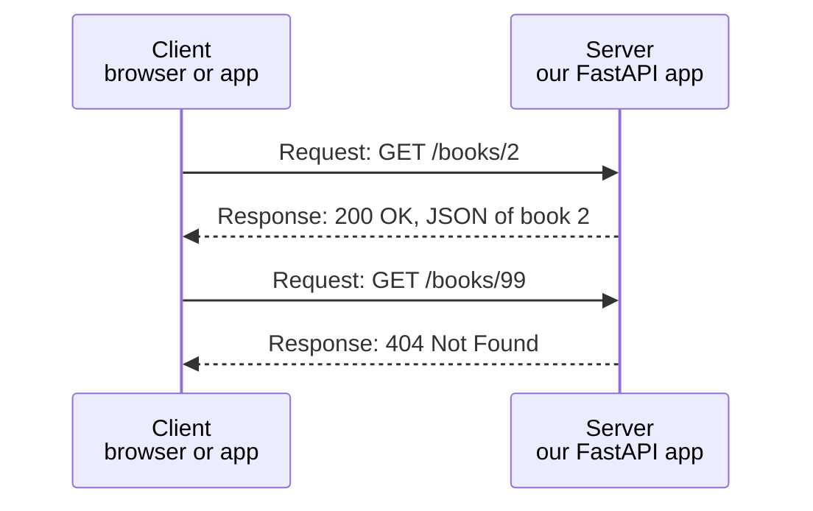
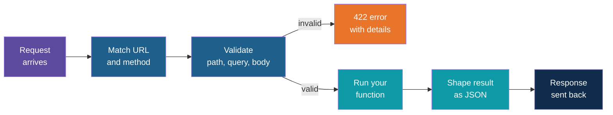
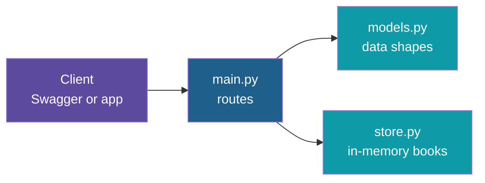

# FastAPI: Building a REST API

**Day 3 | Block 1: Python for AI in Practice (HTTP basics, project structure)**

How programs talk to each other over the web, and how to build your own service in Python. The runnable project lives in `session-03/code/fastapi-crud/`: a small book library API with create, read, update and delete, no database, and automatic Swagger documentation. It is set up with `uv`.

---

## What Is an API?

Think of a **restaurant**. You (the client) do not walk into the kitchen. You tell the waiter what you want, the waiter takes the order to the kitchen (the server), and brings back the dish. The menu lists what you are allowed to ask for.

An **API** is that waiter plus menu: a fixed way for one program to ask another program for something. A **REST API** does this over the web using ordinary URLs and HTTP.

---

## REST and HTTP in One Slide

In REST, everything is a **resource** (a book, an order, a user) with its own URL. The HTTP **method** says what you want to do with it, and the **status code** in the reply says how it went.

| Method | Meaning | CRUD | Example URL |
|---|---|---|---|
| POST | Create a new one | Create | `/books` |
| GET | Read | Read | `/books` and `/books/2` |
| PUT | Replace completely | Update | `/books/2` |
| PATCH | Change some fields | Update | `/books/2` |
| DELETE | Remove | Delete | `/books/2` |

| Status code | Meaning | When you see it |
|---|---|---|
| 200 | OK | A read or update worked |
| 201 | Created | A new item was made |
| 204 | No Content | A delete worked, nothing to send back |
| 404 | Not Found | That id does not exist |
| 422 | Unprocessable | The data you sent is invalid |
| 500 | Server Error | Something broke inside the server |

The data travels as **JSON**, the same key and value shape as a Python dict.

---

## What Is FastAPI?

FastAPI is a Python framework for building REST APIs. You write ordinary functions with **type hints**, and FastAPI does the rest.

| You write | FastAPI gives you for free |
|---|---|
| A function with typed parameters | Reading and converting values from the URL and JSON |
| A model describing the data | Automatic validation with clear error messages |
| A route decorator | The URL and method wiring |
| Nothing extra | Interactive documentation (Swagger) built from your code |

Under the hood it uses **Pydantic** for data models and **Uvicorn** as the web server that actually listens for requests.

---

## What Happens to One Request

Your function only runs when the input has already passed validation, so it never has to check for a missing field or a text value where a number should be.

---

## The Building Blocks

| Concept | What it does | Book library example |
|---|---|---|
| App object | The one object everything is attached to | The Book Library API itself |
| Route decorator | Ties a URL and method to a function | GET on `/books` runs the list function |
| Path parameter | A value inside the URL | The 2 in `/books/2` |
| Query parameter | Optional extras after the question mark | `/books?author=narayan&limit=5` |
| Request body | JSON sent with POST, PUT, PATCH | The new book's title, author, year |
| Pydantic model | Describes and validates a body | Title must not be empty, year must be a whole number |
| Response model | Shapes what is sent back | The book plus its id |
| Status code | Sets the success code | 201 for a created book |
| HTTPException | Stops the request with an error | 404 when the id is missing |
| Tags and summaries | Group and label routes in the docs | The Books and System sections |

---

## The Project at a Glance

The project has three small files, each with one job.

| File | Job |
|---|---|
| `main.py` | The app and the seven routes; turns store results into responses and errors |
| `models.py` | Pydantic models: what a client sends to create, to partially update, and what comes back |
| `store.py` | A class that keeps books in a Python dict and offers create, list, get, replace, update, delete |
| `pyproject.toml` and `uv.lock` | The project's dependencies and their exact pinned versions, managed by uv |

The routes never touch the dict directly. That is why the "database" could be swapped for a real one later without rewriting the routes.

---

## The Endpoints

| Method and path | Purpose | Success | Possible errors |
|---|---|---|---|
| GET `/health` | Is the server up? | 200 | None |
| POST `/books` | Add a book | 201 | 422 invalid data |
| GET `/books` | List books, with filters by author and availability, and skip and limit for paging | 200 | 422 bad query values |
| GET `/books/{book_id}` | Get one book | 200 | 404, 422 |
| PUT `/books/{book_id}` | Replace a book completely | 200 | 404, 422 |
| PATCH `/books/{book_id}` | Change only the fields sent | 200 | 404, 422 |
| DELETE `/books/{book_id}` | Remove a book | 204 | 404 |

---

## Swagger: Documentation You Can Click

FastAPI reads your routes and models and produces an **OpenAPI** description of the whole API. Swagger UI turns that description into a web page where you can try every endpoint without writing any client code.

| Address | What you get |
|---|---|
| `/docs` | Swagger UI: read the API and run requests from the browser |
| `/redoc` | ReDoc: a cleaner, read-only version of the same documentation |
| `/openapi.json` | The raw machine-readable description, which other tools can consume |

Try it in Swagger:
1. Open a route such as POST `/books` and click **Try it out**.
2. Edit the pre-filled example JSON, then click **Execute**.
3. Read the status code and response body shown below.
4. Send bad data, for example an empty title, and read the 422 message.

---

## Running It with uv

`uv` creates the environment and installs the packages in one step, so there is nothing to activate.

| Step | Command | What it does |
|---|---|---|
| Create the project (once) | `uv init` | Makes `pyproject.toml` |
| Add FastAPI (once) | `uv add "fastapi[standard]"` | Installs FastAPI, Uvicorn and tools, and records them in the lock file |
| Install on another machine | `uv sync` | Rebuilds the exact same environment from `uv.lock` |
| Start the server | `uv run fastapi dev` | Runs the app and reloads on every file save |

Then open `http://127.0.0.1:8000/docs` in a browser. Stop the server with Ctrl+C.

---

## Things That Trip People Up

1. **PUT and PATCH are not the same.** PUT replaces the whole book, so every field must be sent. PATCH changes only the fields you send, and the rest are left alone.
2. **A 422 is not a server bug.** It means the data sent did not match the model. Read the message: it names the field and the rule that failed.
3. **The data is temporary.** The books live in memory, so a restart brings back the original three and forgets every change. A real database is what makes changes permanent.
4. **Data sent in the URL and data sent in the body are different things.** The id belongs in the path, the book's details belong in the JSON body.

---

## Explore It Yourself

Open `session-03/code/fastapi-crud/`, start the server, and use Swagger at `/docs`.

Try these in order:
1. List the books, then filter by author and by availability.
2. Add a book, then fetch it by the id in the response.
3. Replace it with PUT, then change one field with PATCH.
4. Delete it, then fetch it again and read the 404.
5. Send an invalid year and read the 422 message.

Then extend the code:
1. Add a `genre` field to the models and see it appear in Swagger.
2. Add a query filter for books published after a given year.
3. Add a route that lists only borrowed books.

---

*Prepared for Kalpataru Projects | AIM ADaSci | Confidential*
