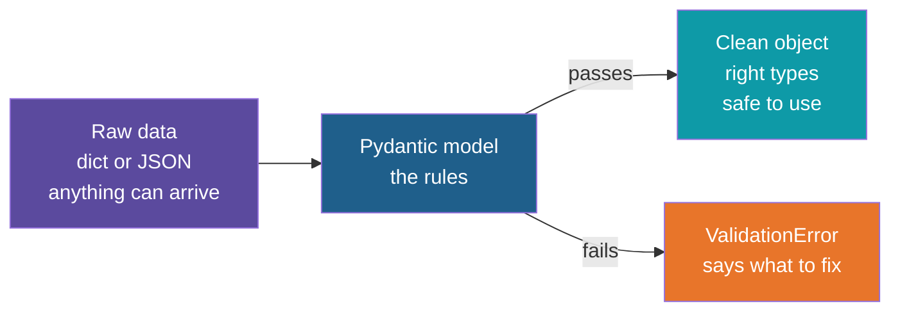
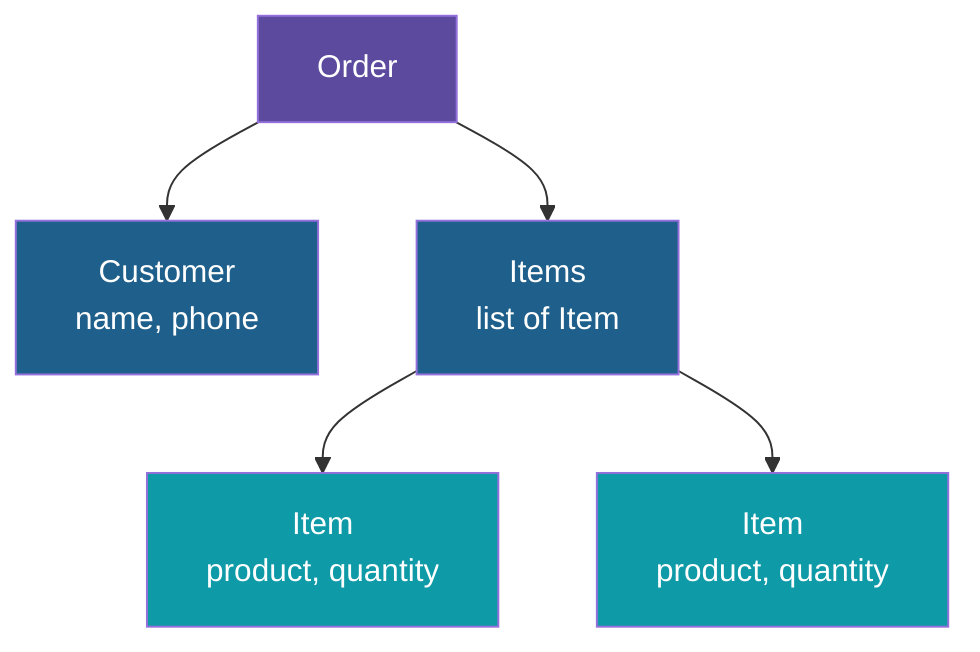
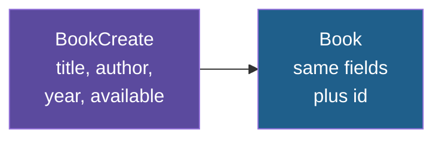
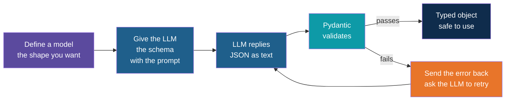

# Pydantic: Data Validation

**Day 3 | Block 1: Python for AI in Practice (JSON handling, validation)**

How to describe the shape of your data once, and let Python check it for you. Pydantic is the library FastAPI uses for every request and response. The runnable example is the set of models in `session-03/code/solutions/fastapi-crud/models.py`. Everything here refers to Pydantic version 2, the version that project installs.

---

## The Problem

Think of the **reception desk of an office**. Visitors fill in a form: name, phone number, whom they are meeting. If the receptionist accepted every form as written, the building would soon fill with forms that have no name, a phone number of "abc", or a meeting with nobody. So the desk has **rules**, and a form that breaks them goes back to the visitor with a note saying what to fix.

Data reaching a program is like those forms. JSON from a web request, a file, or another system is just dicts and strings, and nothing promises it is complete or correct.

---

## What Is Pydantic?

Pydantic lets you describe your data as a **model**: a class whose fields are declared with type hints. When you create an object from a model, Pydantic checks every field against the rules before handing the object back.

| Approach | Checks types | Converts values | Reads and writes JSON | Typical use |
|---|---|---|---|---|
| Plain dict | No | No | Manual | Quick scripts |
| Dataclass | No, hints are only labels | No | Manual | Simple data holders |
| Pydantic model | Yes | Yes | Built in | Data from outside the program |

The key habit: **validate once, at the edge**, where data enters the program. After that, the rest of the code can trust it.

---

## A Model Is a Class of Fields

A model lists its fields and their types. Each field is one of three kinds:

| Kind | Meaning | Book example |
|---|---|---|
| Required | Must be provided, otherwise an error | The title |
| Default | Optional, and a fallback is used when missing | Available, which defaults to true |
| Optional with no value | May be left out, and then it is None | A partial update where every field is optional |

In `models.py`, the create model has a required title, author and year, plus a defaulted `available`. The update model has every field optional so a client can send only what changed.

---

## Type Conversion

By default Pydantic is friendly: if a value can safely be converted to the declared type, it converts it. This suits JSON and form data, where numbers often arrive as text.

| Field type | Value received | Result |
|---|---|---|
| Whole number | The text "22" | The number 22 |
| Whole number | The text "abc" | Error |
| Whole number | The decimal 22.5 | Error, because it would lose the .5 |
| True or false | The text "true" or the number 1 | True |
| Text | The number 5 | Error, numbers are not silently turned into text |

A **strict mode** exists for when no conversion at all is wanted.

---

## Field Rules

Types alone are not enough: a year must be a number, but also a sensible one. Field rules add limits on top of the type.

| Rule | Applies to | Meaning | Example |
|---|---|---|---|
| Minimum length | Text, lists | At least this many characters or items | A title cannot be empty |
| Maximum length | Text, lists | At most this many | A title is 100 characters at most |
| Greater or equal, less or equal | Numbers | Inclusive range | A year from 1000 to 2100 |
| Greater than, less than | Numbers | Exclusive range | A price above zero |
| Pattern | Text | Must match a regular expression | A pin code of six digits |
| Description and examples | Any | Shown in the documentation | Pre-filled values in Swagger |

Because FastAPI builds Swagger from the models, these rules also appear in the API documentation without extra work.

---

## What a Failure Looks Like

When data breaks the rules, Pydantic raises a **ValidationError** that lists every problem at once, not just the first.

| Part of each error | What it tells you | Example |
|---|---|---|
| Location | Which field | The title inside the body |
| Message | What went wrong, in words | String should have at least 1 character |
| Type | A short code for the kind of failure | Too short, missing, integer parsing |
| Input | The value that was received | An empty string |

FastAPI catches this error itself and returns it as an HTTP **422** response, so the client sees exactly which fields to fix. In your own code you catch it and handle it like any other error.

---

## Nested Models and Lists

Fields can be other models, or lists of models. Pydantic then validates the whole tree, and the error location shows the exact path to the bad value.

A bad quantity in the second item is reported at the location "items, then 1, then quantity", so you can find it even in a large payload.

---

## Reuse: One Model Built on Another

Models can inherit, just like classes. The project uses this so that the shape a client sends and the shape the server returns never drift apart.

The server chooses the id, so a client never sends one. That is why the id lives only on the model that is returned.

---

## Moving Data In and Out

A model object is easy to convert to and from plain Python and JSON.

| Need | Method | Everyday picture |
|---|---|---|
| Dict to validated object | `model_validate` | Checking a filled form |
| JSON text to validated object | `model_validate_json` | Checking a scanned form |
| Object to dict | `model_dump` | A plain copy to hand to other code |
| Object to JSON text | `model_dump_json` | A copy ready to send over the web |
| Dump only what was sent | `model_dump` with the exclude-unset option | Only the boxes the visitor actually filled |
| Copy with changes | `model_copy` with an update | A photocopy with one field corrected |

The exclude-unset option is what powers PATCH in the project: fields the client omitted are left alone rather than overwritten with empty values.

---

## Custom Rules

Some rules cannot be written as a simple limit. Pydantic lets you add your own checks as small functions attached to the model.

| Kind | Checks | Example |
|---|---|---|
| Field validator | One field, and can also clean it | Trim spaces and capitalise a name, or reject a title that is only spaces |
| Model validator | Several fields together | An end date must be after the start date |

Use built-in field rules first. Reach for a custom validator only when a rule involves logic or several fields.

---

## Where Pydantic Shows Up

| Place | What it does there |
|---|---|
| FastAPI request bodies | Validates incoming JSON before your function runs |
| FastAPI responses | Shapes and documents what is returned |
| Reading JSON files | Turns loose dicts into checked objects |
| Settings from environment variables and `.env` files | The companion package pydantic-settings reads configuration into a validated model |
| LLM and agent code | Describes and checks what a language model returns (next slide) |

---

## Why Pydantic Matters for AI

Think of an LLM as a **very fast, very helpful clerk who sometimes gets creative**. Ask for a form and you usually get a good one, but now and then a field is missing, a name is spelled differently, "twenty" appears where 20 was needed, or the answer arrives wrapped in friendly chat around the data. A human reader shrugs and moves on. A program cannot.

An LLM's reply is **text that looks like JSON**, not guaranteed data. Programs downstream (a database write, an email, a payment) need exact fields and types. Pydantic is the checker standing between the two.

---

## Where It Helps in AI Applications

| Job | How Pydantic helps | Day 3 block it supports |
|---|---|---|
| Ask for a specific shape | A model can generate its own JSON schema, and many LLM libraries accept a model directly as the wanted output format | Structured outputs |
| Check the reply | The reply text is validated against the model, so wrong types and missing fields are caught at once | Structured outputs |
| Guard tool calls | When an LLM asks to run a function, the arguments it made up are validated before anything runs, for example a negative amount or an unknown option | Function calling |
| Retry with feedback | A ValidationError is a plain-language list of what was wrong, which can be sent back to the LLM so it fixes its own answer | Structured outputs |
| Keep secrets and settings tidy | API keys and model names are read from the environment into a validated settings model | Project skeleton |
| Agents and frameworks | Agent libraries commonly use Pydantic models to describe tool inputs and the shared state between steps | Agents on Day 5 |

The mindset: **treat LLM output like user input.** You would never trust a web form blindly, and a model's reply deserves the same care.

---

## What Pydantic Can and Cannot Promise for AI

| Pydantic checks | Pydantic does not check |
|---|---|
| The reply has every field | That the values are true |
| Numbers are numbers, dates are dates | That a summary is faithful to the source |
| Values stay inside the allowed range or list | That the model chose the right tool |

A reply can be perfectly shaped and still wrong. Validation makes the output **safe to handle**; checking that it is **correct** still needs other measures.

---

## Things That Trip People Up

1. **Optional does not mean not required.** In version 2, a field typed as "text or None" with no default must still be provided; it just may be None. To make a field truly omittable, give it a default such as None.
2. **Validation runs when the object is created, not afterwards.** Changing a field on an existing object is not checked unless validate-on-assignment is switched on.
3. **Conversion can surprise you.** The text "22" becomes 22, and "true" becomes True. That is convenient for web data, but use strict mode when exact types matter.
4. **A model is not a dict.** Read fields with a dot (`book.title`), not with square brackets. Use `model_dump` when a plain dict is needed.

---

## Explore It Yourself

1. Open `session-03/code/solutions/fastapi-crud/models.py` and find the required, defaulted and optional fields.
2. Start the API, open `/docs`, and send a book with an empty title, a year of 5000 and no author. Read every entry in the 422 response.
3. Send the year as the text "1999" and see it accepted, then as "nineteen" and see it rejected.
4. Send a PATCH with a single field, then a PUT with a single field, and compare what each does.
5. In the models file, add a `genre` field with a default and watch it appear in Swagger.
6. Imagine an LLM was asked for a book as JSON. Write down three ways its reply could break the `BookCreate` rules, then check which rule would catch each.

---

*Prepared for Kalpataru Projects | AIM ADaSci | Confidential*
