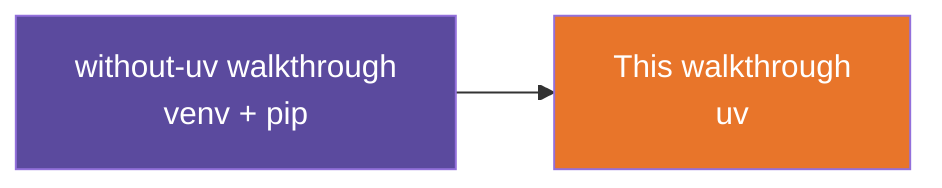

# Site Status API — With uv — Build Walkthrough

A step-by-step guide to hand-building the with-uv reference app: the same Site Status API
as the without-uv walkthrough, set up with `uv` instead of `venv` + `pip`.

## What You'll Build

The exact same two-route FastAPI app you built in the without-uv walkthrough — `GET /`
and `GET /sites/{site_id}/status` — with byte-identical `main.py` logic. Nothing about the
app's code changes here; only how you manage its dependencies and run it does.

## Who This Is For / Prerequisites

Complete the without-uv walkthrough first. This guide assumes you already know what the
app does and why (routes, path parameters, the `SITE_STATUS` dict, the 404 error handling)
and does not re-explain any of it — it covers only what's new: `uv`. Confirm `uv` is
installed via the environment setup note before starting. Budget 15-20 minutes — this is
intentionally shorter than the without-uv guide.

## Steps

| Step | File | What You'll Add | Est. Time |
|---|---|---|---|
| 1 | 01-concepts-overview.md | Vocabulary: `pyproject.toml`, lockfile, `uv sync`, `uv run` | 5 min |
| 2 | 02-project-setup-with-uv.md | `pyproject.toml` + a synced `.venv` | 5 min |
| 3 | 03-same-app-same-code.md | The unchanged `main.py`, run via `uv run` | 5 min |
| 4 | 04-recap-and-exercises.md | Review, tradeoffs, practice | 5 min |

## Relationship to the Reference Implementation

By the end of Step 3, your `main.py` should match the with-uv reference project's file
exactly — which is itself identical to the without-uv reference project's `main.py` — and
your `pyproject.toml` should match the with-uv reference project's `pyproject.toml`. This
walkthrough was generated from, and statically checked against, that reference.

## Suggested Demo Flow

1. Open the without-uv project's `main.py` and this one side by side once both are built,
   and let trainees notice the files are identical before you say so — that's the point of
   the whole exercise landing on its own.
2. Time both setups back to back on the same machine (`venv`+`pip`+`activate` vs.
   `uv sync`) so the step-count difference is felt, not just described.
3. Show `uv.lock` after `uv sync` and ask what problem it solves that a loose
   `requirements.txt` doesn't (exact, reproducible versions for everyone on the team).
4. Close by asking: "if the app code never changed, what did `uv` actually buy us?" — the
   answer is the whole recap.

## Series

Start with Step 1 — Concepts Overview.
