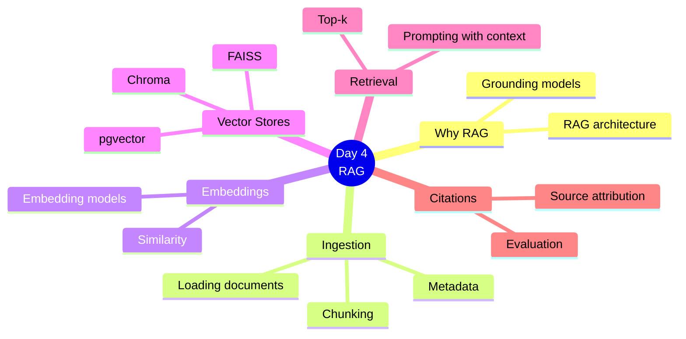
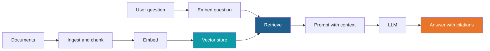
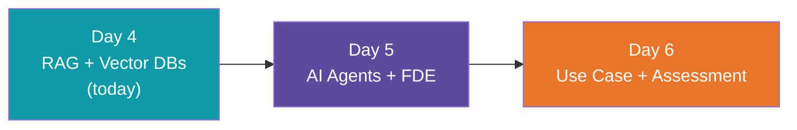

# Day 4: RAG + Vector Databases

**AI Developer & FDE Training | Kalpataru Projects, Ahmedabad**
Week 2, Day 4 of 6 | 4 hours | Batch 1 (forenoon) and Batch 2 (afternoon)

> Scope note: this document covers structure, timing, topics and outputs only. Code, worked examples, datasets and demo content will be developed separately.

---

## Today at a Glance

Build a document knowledge assistant, one pipeline stage at a time.

---

## Agenda

```mermaid
gantt
    title Day 4 Agenda (240 minutes)
    dateFormat HH:mm
    axisFormat %H:%M
    section Opening
    Kickoff and Day 3 recap         :a1, 09:30, 15m
    section Concepts
    Why RAG and architecture        :a2, after a1, 25m
    Ingestion and chunking          :a3, after a2, 40m
    Break                           :crit, a4, after a3, 15m
    section Retrieval Stack
    Embeddings                      :a5, after a4, 25m
    Vector stores                   :a6, after a5, 40m
    Retrieval and generation        :a7, after a6, 35m
    section Trust
    Citations and evaluation        :a8, after a7, 35m
    section Close
    Wrap-up and exit check          :a9, after a8, 10m
```

| Time | Duration | Topic Block | Type |
|---|---|---|---|
| 00:00 to 00:15 | 15 min | Kickoff and Day 3 recap | Intro |
| 00:15 to 00:40 | 25 min | 1. Why RAG and Architecture | Learn |
| 00:40 to 01:20 | 40 min | 2. Ingestion and Chunking | Learn + Apply |
| 01:20 to 01:35 | 15 min | Break | |
| 01:35 to 02:00 | 25 min | 3. Embeddings | Learn + Apply |
| 02:00 to 02:40 | 40 min | 4. Vector Stores | Learn + Apply |
| 02:40 to 03:15 | 35 min | 5. Retrieval and Generation | Learn + Apply |
| 03:15 to 03:50 | 35 min | 6. Citations and Evaluation | Learn + Apply |
| 03:50 to 04:00 | 10 min | Wrap-up and exit check | Reflect |

Clock times are indicative and can be shifted; Batch 2 follows the same durations.

---

## Topics Covered

### Kickoff and Day 3 Recap (15 min)

1. Day 4 objectives
2. Recap of Day 3: API client, structured output and function calling
3. Environment and API access check

### Block 1: Why RAG and Architecture (25 min)

1. Limits of LLMs: knowledge cutoff, private data, hallucination
2. RAG compared with prompt stuffing and fine-tuning
3. The RAG pipeline end to end
4. Enterprise considerations: data sensitivity and access control

### Block 2: Ingestion and Chunking (40 min)

1. Loading documents from common formats
2. Cleaning and parsing
3. Chunking strategies
4. Chunk size and overlap trade-offs
5. Metadata for filtering and citations

**Lab 1:** Ingestion and chunking

### Block 3: Embeddings (25 min)

1. What embeddings are
2. Embedding models and their trade-offs
3. Similarity measures
4. Dimensions, cost and free-tier limits

**Lab 2:** Generate embeddings

### Block 4: Vector Stores (40 min)

1. What a vector store does
2. Indexing and similarity search
3. FAISS, Chroma and pgvector
4. Metadata filtering
5. Persistence
6. Choosing a vector store

**Lab 3:** Build and query a vector store

### Block 5: Retrieval and Generation (35 min)

1. Top-k retrieval
2. Retrieval quality and tuning
3. Building the prompt with retrieved context
4. Re-ranking and hybrid search overview

**Lab 4:** Retrieval-augmented answers

### Block 6: Citations and Evaluation (35 min)

1. Source attribution and citations
2. Grounded answers and handling "answer not found"
3. Common failure modes
4. Basic evaluation of retrieval and answers

**Lab 5:** Add citations and checks

### Wrap-up and Exit Check (10 min)

1. Exit check on chunking, embeddings, retrieval and citations
2. Show and tell of knowledge assistants
3. Day 5 preview

---

## What You Will Walk Away With

| Output | Block |
|---|---|
| Ingestion and chunking pipeline | Block 2 |
| Embeddings and a working vector store | Blocks 3 and 4 |
| Retrieval-augmented question answering | Block 5 |
| Answers with citations | Block 6 |

**Day 4 output: document knowledge assistant**

### Learning Objectives

By the end of Day 4, you can:

1. Explain when and why to use RAG
2. Build an ingestion, embedding and retrieval pipeline
3. Choose and use a vector store
4. Produce grounded answers with citations and evaluate them

---

## Not Covered Today

- Agent workflows and frameworks (Day 5)
- Docker, containers and deployment (production and DevOps section)

## Ground Rules

- Use only the provided synthetic or sanitized documents
- No confidential Kalpataru documents in any AI tool
- Keep API keys out of code and Git

## What Comes Next

---

*Prepared for Kalpataru Projects | AIM ADaSci | Confidential*
