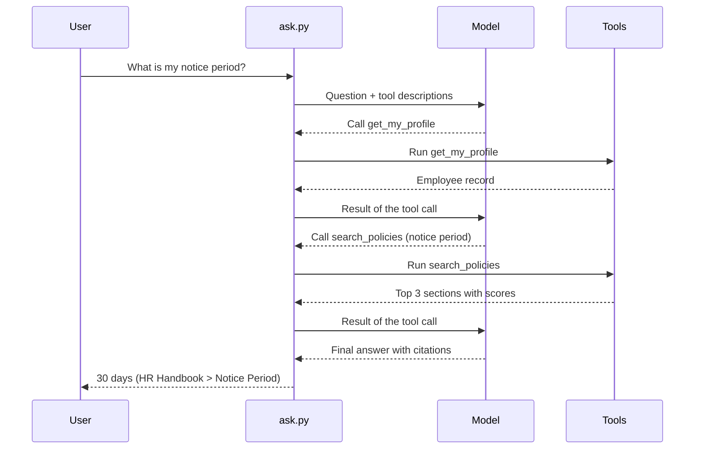

# Step 1 — Concepts Overview

> Back to index · Next: Start From the Hand-Built App

## Goal

Learn the few new words that turn a RAG pipeline into an agent, and what you gain and give
up by letting the model choose its own steps.

## Why this matters

You already know the six steps of RAG, because you wrote each one yourself. In your
`ask.py` they run in a fixed order for every question: embed the question, fetch four
chunks, build the prompt, call the model. The model only ever sees the last step. It never
decides whether to search, where to search, or whether the results are good enough.

That is fine when every question is "find the paragraph that answers this". It breaks down
for "compare the leave policy with the work-from-home policy", which needs two searches, or
"what is my notice period?", which needs to know who is asking before it knows what to
look up.

An **agentic** version hands those decisions to the model. You describe a few **tools**
(ordinary Python functions) and let the model ask for them. Your code still does all the
work: the model never runs anything. It only writes a request such as "please call
`search_policies` with this query", your code runs it, and the result goes back to the
model. Repeat until the model has enough to answer.

The retrieval you built does not change. It becomes one tool among others.

## The Vocabulary

| Word | Plain meaning | Where you will see it |
|---|---|---|
| **Tool** | A Python function the model is allowed to ask for | `search_policies` and `get_my_profile` in `ask.py` |
| **Tool description** | The name, purpose and arguments of a tool, written for the model | The `TOOLS` list |
| **Tool call** | The model's request to run a tool, with the arguments it chose | `reply.tool_calls` |
| **Tool result** | What your code sends back after running the tool | A message with role `tool` |
| **Agent loop** | Ask the model, run any tools it requests, ask again, until it answers | `run_agent` |
| **Step limit** | A cap on how many rounds the loop may run | `MAX_STEPS` |
| **History** | All messages so far, so the model sees the whole conversation | The `messages` list |

The messages in the history have four roles:

| Role | Who writes it | Example |
|---|---|---|
| `system` | You, once | The rules for the assistant |
| `user` | The person asking | "What is my notice period?" |
| `assistant` | The model | Either a final answer, or a list of tool calls |
| `tool` | Your code | The JSON that a tool returned |

## One Question, End to End

The model is asked three times for one question. That is the cost, and also the point.

## What Stays and What Changes

| Stays the same | Changes |
|---|---|
| The six documents and the `docs/` folder | `ask.py`: rewritten around tools and a loop |
| `ingest.py`, the Chroma store and the `policies` collection | `employees.json`: a new data file |
| `text-embedding-3-small` and `gpt-4o-mini` | `pyproject.toml`: the name and description only |
| The OpenAI and Chroma packages | The system message: it now tells the model how to use tools |
| `.env`, `.env.example` and `.gitignore` | |

## What You Gain and What You Give Up

| You gain | You give up |
|---|---|
| Multi-part questions get a search per part | Speed: every round is another model call |
| The model picks the right document, or none | Cost: more calls means more tokens, and the free tier runs out sooner |
| A weak first search can be retried with better words | Predictability: the same question may take different routes |
| The answer can depend on who is asking | Easy testing: you must check the path as well as the answer |

## Check Yourself

Before moving on, you should be able to say who runs a tool (your code, never the model),
and why the tool result goes back to the model (so it can decide what to do next).

Next: **Step 2 — Start From the Hand-Built App**.
