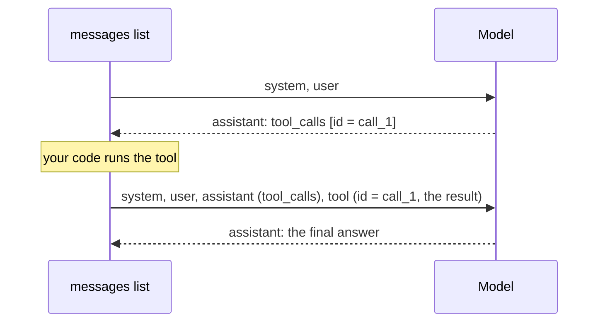

# Step 5 — Run the Tool and Return the Result

> Back to index · Previous: Describe the Tool and Let the Model Decide · Next: The Agent Loop

## Goal

Run each tool the model asked for, give the results back in the form the API requires, and
let the model write its answer from them.

## Why this matters

Step 4 stopped at the request. This step closes the round trip, and the API is strict about
how. The conversation must look like this:



Three rules sit inside that picture:

| Rule | Why | What happens if you break it |
|---|---|---|
| The assistant message holding the request goes into the history **before** the results | The API checks that every `tool` message answers a request that is actually in the history | An error saying a `tool` message must follow a message with `tool_calls` |
| Each result carries the `tool_call_id` of its request | A model can make several requests at once, and the id says which result belongs to which | An error about a missing or unmatched `tool_call_id` |
| Each result is a **string** | The API carries text | An error about invalid `content`. This is why the search tool returns `json.dumps(...)` |

The model asks for tools in a reply, and it also **answers** in a reply. The second call
sends the results back, and the model writes its answer from them. That second call is
where the hand-built app's "context plus question" prompt has gone: the context is now the
tool result, delivered through the conversation.

One more thing the model might do: ask for several tools at once. The comparison question
in Step 4 produced two requests in a single reply. The `for` loop handles all of them.

## 1. Add `run_tool`

Between the tool description and the loop, add:

```python


def run_tool(call):
    name = call.function.name
    args = json.loads(call.function.arguments or "{}")
    shown = ", ".join(f"{key}={value!r}" for key, value in args.items())
    print(f"  -> {name}({shown})")
    return TOOL_FUNCTIONS[name](**args)
```

| Line | What it does |
|---|---|
| `json.loads(call.function.arguments or "{}")` | The arguments arrive as a JSON string. Turn it into a dict. A tool with no arguments sends an empty string, hence `or "{}"` |
| `print(f"  -> ...")` | Prints each tool call as it happens, so you can watch the model decide |
| `TOOL_FUNCTIONS[name](**args)` | Look the function up by the name the model gave, and call it with the arguments the model chose |

## 2. Run the Tools and Return the Results

Replace the whole loop at the bottom with:

```python
print("Ask about company policies. Type 'quit' to exit.\n")

while True:
    question = input("You: ")

    if question.lower() in ("quit", "exit"):
        break

    messages = [
        {"role": "system", "content": SYSTEM},
        {"role": "user", "content": question},
    ]
    reply = client.chat.completions.create(model="gpt-4o-mini", messages=messages, tools=TOOLS).choices[0].message

    if not reply.tool_calls:  # no tool requested: this is the final answer
        print("AI:", reply.content, "\n")
        continue

    # Run what the model asked for, and give each result back with the id of its request.
    messages.append(reply)
    for call in reply.tool_calls:
        messages.append({"role": "tool", "tool_call_id": call.id, "content": run_tool(call)})

    reply = client.chat.completions.create(model="gpt-4o-mini", messages=messages, tools=TOOLS).choices[0].message
    print("AI:", reply.content, "\n")
```

| Part | What it does |
|---|---|
| `if not reply.tool_calls` | No request means the reply is already the answer, so print it and wait for the next question |
| `messages.append(reply)` | Puts the assistant's request into the history first (rule 1) |
| `{"role": "tool", "tool_call_id": call.id, ...}` | One result per request, tied to it by the id (rule 2) |
| The second `create` call | The model now sees its own request and the results, and writes the answer |

## Try it

```bash
uv run ask.py
```

```text
Ask about company policies. Type 'quit' to exit.

You: How long is the notice period?
  -> search_policies(query='notice period', document='HR Handbook')
AI: The notice period is 30 days for employees on probation, 60 days for confirmed
employees, and 90 days for managers and above. ... [HR Handbook > Notice Period].

You: Compare the leave policy and the work from home policy on manager approval.
  -> search_policies(query='manager approval', document='Leave Policy')
  -> search_policies(query='manager approval', document='Work From Home Policy')
AI: In comparing the manager approval aspects of the Leave Policy and the Work From Home
Policy: ... [Leave Policy > How to Apply for Leave] ... [Work From Home Policy > Working
Remotely From Another City] ...

You: quit
```

The `->` lines come from `run_tool`. The answers are shortened here, and their wording
differs from run to run.

The citations are real. The model is quoting section names that were in the tool results,
not inventing them. Compare the answer with the same question in the hand-built app. The
facts are the same, and the difference lies in how it got there.

## What This Version Cannot Do

Look at the code again. The model gets **one** chance to ask for tools, and one chance to
answer. If its second reply is not an answer, but another request, the code prints
`reply.content`, which is empty, and the request is lost.

That happens when one result leads to another need: a weak first search that should be
retried, or a result that has to be looked at before the next lookup. In Step 7 you will
add a tool whose result must be read before the search can even be worded. A single
round cannot do that. Step 6 replaces this with a loop.

## Checkpoint

<details>
<summary>Full <code>ask.py</code> after this step</summary>

```python
import json

import chromadb
from dotenv import load_dotenv
from openai import OpenAI

load_dotenv()
client = OpenAI()

collection = chromadb.PersistentClient(path=".chroma").get_collection("policies")

# The document names in the store, so the agent can search one document at a time.
documents = sorted({m["source"] for m in collection.get(include=["metadatas"])["metadatas"]})

SYSTEM = (
    "You answer questions about company policies. You have one tool: search_policies.\n"
    "- Never state a policy fact from memory. Use ONLY text returned by search_policies.\n"
    "- If a question has several parts, or spans several documents, search for each part "
    "separately.\n"
    "- If the results look weak or off-topic, rewrite the query or try another document "
    "before giving up.\n"
    "- For greetings and small talk, answer directly without any tool.\n"
    "- Cite every fact as [Document > Section]. If the answer is not in the documents, "
    "say 'I could not find that in the policy documents.' Do not guess."
)

# Sources of every chunk the agent reads while answering one question.
retrieved = []


# ---------------------------------------------------------------------------
# The tools: ordinary Python functions the model is allowed to ask for.
# ---------------------------------------------------------------------------
def search_policies(query, document=None):
    embedding = client.embeddings.create(model="text-embedding-3-small", input=query).data[0].embedding
    result = collection.query(
        query_embeddings=[embedding],
        n_results=3,
        where={"source": document} if document else None,
    )
    found = []
    for text, meta, distance in zip(result["documents"][0], result["metadatas"][0], result["distances"][0]):
        retrieved.append(f"{meta['source']} > {meta['section']}")
        # Cosine distance becomes a 0-to-1 relevance score the model can judge.
        found.append({"source": meta["source"], "section": meta["section"], "relevance": round(1 - distance, 2), "text": text})
    return json.dumps(found)


TOOL_FUNCTIONS = {"search_policies": search_policies}

# What the model sees: a name, a description and the arguments for each tool.
TOOLS = [
    {
        "type": "function",
        "function": {
            "name": "search_policies",
            "description": (
                "Search the company policy documents and return the 3 most relevant sections. "
                "Each result has a relevance score from 0 to 1; below about 0.3 usually means "
                "the text is not about the question."
            ),
            "parameters": {
                "type": "object",
                "properties": {
                    "query": {"type": "string", "description": "A complete, standalone search query."},
                    "document": {
                        "type": "string",
                        "enum": documents,
                        "description": "Optional. Search only this document.",
                    },
                },
                "required": ["query"],
            },
        },
    },
]


def run_tool(call):
    name = call.function.name
    args = json.loads(call.function.arguments or "{}")
    shown = ", ".join(f"{key}={value!r}" for key, value in args.items())
    print(f"  -> {name}({shown})")
    return TOOL_FUNCTIONS[name](**args)


print("Ask about company policies. Type 'quit' to exit.\n")

while True:
    question = input("You: ")

    if question.lower() in ("quit", "exit"):
        break

    messages = [
        {"role": "system", "content": SYSTEM},
        {"role": "user", "content": question},
    ]
    reply = client.chat.completions.create(model="gpt-4o-mini", messages=messages, tools=TOOLS).choices[0].message

    if not reply.tool_calls:  # no tool requested: this is the final answer
        print("AI:", reply.content, "\n")
        continue

    # Run what the model asked for, and give each result back with the id of its request.
    messages.append(reply)
    for call in reply.tool_calls:
        messages.append({"role": "tool", "tool_call_id": call.id, "content": run_tool(call)})

    reply = client.chat.completions.create(model="gpt-4o-mini", messages=messages, tools=TOOLS).choices[0].message
    print("AI:", reply.content, "\n")
```

</details>

This file is not finished. Step 8 holds the final version.

## Common Mistakes

| Symptom | Cause | Fix |
|---|---|---|
| `An assistant message with 'tool_calls' must be followed by tool messages` | You made a second call after appending the request but forgot a result for one of the requests | Append one `tool` message for **every** item in `reply.tool_calls` |
| `Invalid parameter: messages with role 'tool' must be a response to a preceding message with 'tool_calls'` | `messages.append(reply)` is missing or comes after the results | Append `reply` first, then the results |
| `content` must be a string | A tool returned a dict or list directly | Return `json.dumps(...)`, as `search_policies` does |
| `KeyError` from `TOOL_FUNCTIONS[name]` | The name in `TOOLS` and the key in `TOOL_FUNCTIONS` differ | Make them identical. Step 8 turns this error into a message for the model |

Next: **Step 6 — The Agent Loop**.
