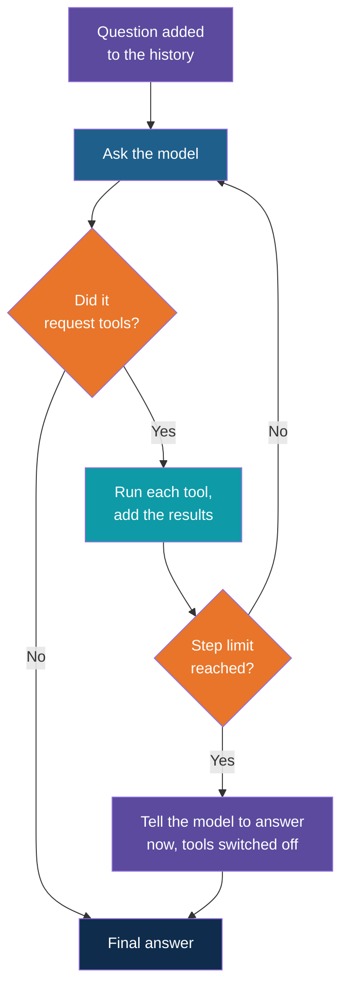

# Step 6 — The Agent Loop

> Back to index · Previous: Run the Tool and Return the Result · Next: A Second Tool, Who Is Asking

## Goal

Replace the single round trip with a loop that keeps going while the model asks for tools,
stops when it answers, remembers earlier questions, and gives up after a fixed number of
rounds.

## Why this matters

This is the step that makes the program an agent. Step 5 gave the model exactly one chance
to ask. A loop gives it as many as it needs: look something up, read the result, decide
whether it is enough, and search again if not. The program never decides when to stop. The
model does, by replying with an answer instead of a request.

A loop with no limit is a risk. If the model keeps asking, because every result looks weak
or two tools keep sending it back and forth, the program runs forever, and each round costs
tokens and a share of your free-tier limit. So the loop gets a **step limit**. When it is
reached, the program stops offering tools and tells the model to answer with what it has.
An agent without a cap is the first thing to remove from a prototype that has run up a bill.

Two smaller pieces arrive with the loop:

- **History.** `messages` now lives outside the question loop, so every question and answer
  stays in it. A follow-up such as "And does it carry forward?" is then understood, because
  the model can see the question before it. The hand-built app had no memory at all.
- **Closing the France gap.** The model answered "Paris" in Step 4. The reply to that is in
  the system message, not in the code: one more rule says that only policy questions get
  answered.



## 1. Add the Step Limit

Directly below `client = OpenAI()`, add:

```python

MAX_STEPS = 5  # the most tool rounds the agent gets for one question
```

Five is enough for the questions in this app, and small enough to stop a runaway quickly.

## 2. Add the Off-Topic Rule

In `SYSTEM`, add two lines after the greeting rule, before the citation rule:

```python
    "- You only answer company policy questions. For anything else, including general "
    "knowledge, do not answer it.\n"
```

Now the system message reads, in full:

| Line of the rule | Position |
|---|---|
| Never state a policy fact from memory | Unchanged |
| Search for each part separately | Unchanged |
| Rewrite or try another document when results are weak | Unchanged |
| For greetings and small talk, answer directly | Unchanged |
| You only answer company policy questions | New |
| Cite every fact | Unchanged |

## 3. Write the Loop

Below `run_tool`, add:

```python


# ---------------------------------------------------------------------------
# The agent loop: ask the model, run the tools it requests, repeat until it answers.
# ---------------------------------------------------------------------------
def run_agent(messages):
    for _ in range(MAX_STEPS):
        reply = client.chat.completions.create(model="gpt-4o-mini", messages=messages, tools=TOOLS).choices[0].message
        messages.append(reply)

        if not reply.tool_calls:  # no tool requested: this is the final answer
            return reply.content

        for call in reply.tool_calls:
            messages.append({"role": "tool", "tool_call_id": call.id, "content": run_tool(call)})

    # Step cap reached: stop the searching and make the model answer with what it has.
    print(f"  (step limit of {MAX_STEPS} reached)")
    messages.append({"role": "user", "content": "Stop searching. Answer now from what you have found, or say you could not find it."})
    reply = client.chat.completions.create(model="gpt-4o-mini", messages=messages, tools=TOOLS, tool_choice="none").choices[0].message
    messages.append(reply)
    return reply.content
```

| Part | What it does |
|---|---|
| `for _ in range(MAX_STEPS)` | Each pass is one round: ask, and run any requested tools. The loop can run at most `MAX_STEPS` times |
| `messages.append(reply)` | Every reply is kept, whether it is a request or an answer, so the history stays complete |
| `if not reply.tool_calls: return reply.content` | The way out. The model stopped asking, so its reply is the answer |
| The inner `for` | The same pairing as Step 5: one `tool` message for each request |
| The code after the loop | Only runs if the loop used every round without an answer |
| `tool_choice="none"` | Keeps the tools in the call, which the history needs, but forbids the model from requesting any. It has to answer in words |

The user message about stopping is needed because a model that has been asking for tools
needs to be told that the time is up. Without it, the model might simply say nothing useful.

## 4. Use It, With Memory

Replace everything from the welcome line to the end of the file:

```python
print("Ask about company policies. Type 'quit' to exit.\n")

# The history is kept between questions, so a follow-up like "and does it carry forward?" still makes sense.
messages = [{"role": "system", "content": SYSTEM}]

while True:
    question = input("You: ")

    if question.lower() in ("quit", "exit"):
        break

    retrieved.clear()
    messages.append({"role": "user", "content": question})

    answer = run_agent(messages)

    print("AI:", answer)
    if retrieved:
        print("Retrieved from:")
        for source in dict.fromkeys(retrieved):  # unique, in the order they were read
            print(f"  - {source}")
    print()
```

| Part | What it does |
|---|---|
| `messages = [system]` outside the loop | One history for the whole session. Step 4 and 5 rebuilt it for every question |
| `retrieved.clear()` | The list of sources starts empty for each question, so only this answer's sources are shown |
| `run_agent(messages)` | Runs the loop, and adds to the same history |
| `dict.fromkeys(retrieved)` | A way to drop repeated sources while keeping the order they were read in |
| `if retrieved:` | A greeting makes no search, so there are no sources to list |

## Try it

```bash
uv run ask.py
```

Ask a question, a follow-up, a greeting and an off-topic question:

```text
You: How many days of sick leave do I get?
  -> search_policies(query='sick leave days', document='Leave Policy')
AI: Employees receive 8 days of paid sick leave each year, separate from paid leave. ...
[Leave Policy > Sick Leave].
Retrieved from:
  - Leave Policy > Sick Leave
  - Leave Policy > Leave Without Pay
  - Leave Policy > How to Apply for Leave

You: And does it carry forward?
AI: Unused sick leave does not carry forward and cannot be encashed [Leave Policy > Sick Leave].

You: Hi, thanks!
AI: You're welcome! If you have any questions about company policies, feel free to ask.

You: What is the capital of France?
AI: I can't answer that. Please ask a question related to company policies.

You: quit
```

Three things to see. The follow-up made **no search at all**: the answer was already in the
history from the first question. The greeting made no search. And Paris is no longer
answered. The exact refusal wording will differ, and a model can still slip now and then,
since a prompt is a request and not a lock.

Now see the step limit working. Change the limit to 1 and ask the comparison question:

```python
MAX_STEPS = 1  # the most tool rounds the agent gets for one question
```

```text
You: Compare the leave policy and the work from home policy on manager approval.
  -> search_policies(query='manager approval', document='Leave Policy')
  -> search_policies(query='manager approval', document='Work From Home Policy')
  (step limit of 1 reached)
AI: In the Leave Policy, leave requests must be raised in the HR portal and approved by the
reporting manager. ... In the Work From Home Policy, requests to work from a different
city ... require approval from both the manager and HR. ...
```

Both searches ran in the one round, then the limit was reached, and the forced answer was
still a good one. Set it back to 5 before moving on. With 1, any question that needs a
second round would be answered from too little, which is what the cap costs you.

## Checkpoint

<details>
<summary>Full <code>ask.py</code> after this step</summary>

```python
import json

import chromadb
from dotenv import load_dotenv
from openai import OpenAI

load_dotenv()
client = OpenAI()

MAX_STEPS = 5  # the most tool rounds the agent gets for one question

collection = chromadb.PersistentClient(path=".chroma").get_collection("policies")

# The document names in the store, so the agent can search one document at a time.
documents = sorted({m["source"] for m in collection.get(include=["metadatas"])["metadatas"]})

SYSTEM = (
    "You answer questions about company policies. You have one tool: search_policies.\n"
    "- Never state a policy fact from memory. Use ONLY text returned by search_policies.\n"
    "- If a question has several parts, or spans several documents, search for each part "
    "separately.\n"
    "- If the results look weak or off-topic, rewrite the query or try another document "
    "before giving up.\n"
    "- For greetings and small talk, answer directly without any tool.\n"
    "- You only answer company policy questions. For anything else, including general "
    "knowledge, do not answer it.\n"
    "- Cite every fact as [Document > Section]. If the answer is not in the documents, "
    "say 'I could not find that in the policy documents.' Do not guess."
)

# Sources of every chunk the agent reads while answering one question.
retrieved = []


# ---------------------------------------------------------------------------
# The tools: ordinary Python functions the model is allowed to ask for.
# ---------------------------------------------------------------------------
def search_policies(query, document=None):
    embedding = client.embeddings.create(model="text-embedding-3-small", input=query).data[0].embedding
    result = collection.query(
        query_embeddings=[embedding],
        n_results=3,
        where={"source": document} if document else None,
    )
    found = []
    for text, meta, distance in zip(result["documents"][0], result["metadatas"][0], result["distances"][0]):
        retrieved.append(f"{meta['source']} > {meta['section']}")
        # Cosine distance becomes a 0-to-1 relevance score the model can judge.
        found.append({"source": meta["source"], "section": meta["section"], "relevance": round(1 - distance, 2), "text": text})
    return json.dumps(found)


TOOL_FUNCTIONS = {"search_policies": search_policies}

# What the model sees: a name, a description and the arguments for each tool.
TOOLS = [
    {
        "type": "function",
        "function": {
            "name": "search_policies",
            "description": (
                "Search the company policy documents and return the 3 most relevant sections. "
                "Each result has a relevance score from 0 to 1; below about 0.3 usually means "
                "the text is not about the question."
            ),
            "parameters": {
                "type": "object",
                "properties": {
                    "query": {"type": "string", "description": "A complete, standalone search query."},
                    "document": {
                        "type": "string",
                        "enum": documents,
                        "description": "Optional. Search only this document.",
                    },
                },
                "required": ["query"],
            },
        },
    },
]


def run_tool(call):
    name = call.function.name
    args = json.loads(call.function.arguments or "{}")
    shown = ", ".join(f"{key}={value!r}" for key, value in args.items())
    print(f"  -> {name}({shown})")
    return TOOL_FUNCTIONS[name](**args)


# ---------------------------------------------------------------------------
# The agent loop: ask the model, run the tools it requests, repeat until it answers.
# ---------------------------------------------------------------------------
def run_agent(messages):
    for _ in range(MAX_STEPS):
        reply = client.chat.completions.create(model="gpt-4o-mini", messages=messages, tools=TOOLS).choices[0].message
        messages.append(reply)

        if not reply.tool_calls:  # no tool requested: this is the final answer
            return reply.content

        for call in reply.tool_calls:
            messages.append({"role": "tool", "tool_call_id": call.id, "content": run_tool(call)})

    # Step cap reached: stop the searching and make the model answer with what it has.
    print(f"  (step limit of {MAX_STEPS} reached)")
    messages.append({"role": "user", "content": "Stop searching. Answer now from what you have found, or say you could not find it."})
    reply = client.chat.completions.create(model="gpt-4o-mini", messages=messages, tools=TOOLS, tool_choice="none").choices[0].message
    messages.append(reply)
    return reply.content


print("Ask about company policies. Type 'quit' to exit.\n")

# The history is kept between questions, so a follow-up like "and does it carry forward?" still makes sense.
messages = [{"role": "system", "content": SYSTEM}]

while True:
    question = input("You: ")

    if question.lower() in ("quit", "exit"):
        break

    retrieved.clear()
    messages.append({"role": "user", "content": question})

    answer = run_agent(messages)

    print("AI:", answer)
    if retrieved:
        print("Retrieved from:")
        for source in dict.fromkeys(retrieved):  # unique, in the order they were read
            print(f"  - {source}")
    print()
```

</details>

This file is not finished. Step 8 holds the final version.

## Common Mistakes

| Symptom | Cause | Fix |
|---|---|---|
| The program asks for tools forever, or the step limit message appears on every question | `MAX_STEPS` was left at 1, or the model keeps requesting because the results are always weak | Set it back to 5, then check the relevance scores from `search_policies` |
| `Invalid parameter: messages with role 'tool'...` after a few questions | A failed turn left half the pairs in `messages` | Restart the program. Step 8 repairs the history after a failure |
| Follow-up questions are answered about the wrong topic | `messages` is built inside the `while` loop, so memory is lost | Keep `messages = [...]` above the loop, as shown |
| Sources from the previous question appear under this answer | `retrieved.clear()` is missing | Call it at the start of each question |
| The France question is still answered | The rule was added to the wrong place, or the program was not restarted | Check `SYSTEM`, and restart. If it persists, make the wording of the rule stricter |

Next: **Step 7 — A Second Tool, Who Is Asking**.
