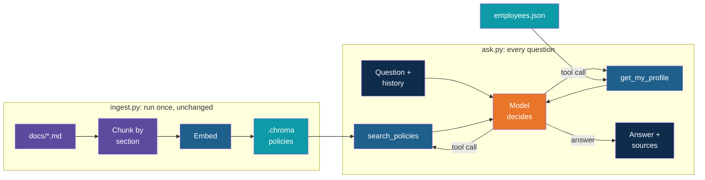

# Step 9 — Recap and Exercises

> Back to index · Previous: Handle Failures

## Goal

Review what changed, weigh what the agent bought against what it cost, and practise by
changing the app.

## What You Built

## Hand-Built Versus Agentic, Step by Step

| RAG step | Hand-built | Agentic | Walkthrough step |
|---|---|---|---|
| Load, chunk, embed, store | `ingest.py` | The same file, untouched | 2 |
| Retrieve | Always one search, four chunks, inline | `search_policies`: optional document filter, three chunks, relevance score | 3 |
| Decide whether and where to search | Not decided: always search everything | The model, from the tool description and the rules | 4 |
| Prompt and answer | Join the chunks into one prompt, one chat call | Tool results arrive as messages, and the model writes the answer | 5 |
| Repeat if needed | Never | `run_agent`: a loop with a step limit | 6 |
| Memory | None | The `messages` list kept across questions | 6 |
| Know who is asking | Not possible | `get_my_profile`, with no arguments | 7 |
| Failure handling | None | Bad tool calls go to the model, failed API calls go to the user | 8 |

## What It Costs

| | Hand-built | Agentic |
|---|---|---|
| Searches per question | Always 1 | 0, 1 or several |
| Model calls per question | 1 | 1 to 6 |
| Embedding calls per question | 1 | 0 or more |
| Same question twice | The same steps | The steps may differ |
| Follow-up questions understood | No | Yes, through the history |
| Knows who is asking | No | Yes |

Time and cost grow with the number of rounds. A question the hand-built app answers in one
model call can take two or three here. On a free tier, that means the rate limit comes
sooner.

## Quick Reference

| Concept | Where it lives |
|---|---|
| A tool | A plain function: `search_policies`, `get_my_profile` |
| What the model knows about a tool | The `TOOLS` list: name, description, arguments |
| Which function a name means | `TOOL_FUNCTIONS` |
| The model's rules | `SYSTEM` |
| The model's request | `reply.tool_calls` |
| The result going back | A message with `"role": "tool"` and the matching `tool_call_id` |
| The loop | `run_agent` |
| The cap | `MAX_STEPS` and `tool_choice="none"` |
| Memory | The `messages` list outside the question loop |
| Access control | `get_my_profile` takes no arguments and reads only `me` |
| Tool mistakes | `run_tool` returns the error as a tool result |
| API failures | `except OpenAIError`, and `del messages[checkpoint:]` |

## Gotchas

| Gotcha | Why it happens | What to do |
|---|---|---|
| The model skips `get_my_profile` and answers "if you are on probation..." | The model chooses its tools, and a small model sometimes chooses badly | Strengthen the rule in `SYSTEM`, test with several runs, and consider a stronger model for production |
| The same question takes different routes | Nothing forces the model to repeat itself | Log the tool calls, and test for the final answer and the path |
| It answers an off-topic question | A rule in a prompt is a request, not a lock | Test the refusals on every change. For firm limits, check the question in code before the model sees it |
| Every question costs several model calls | Each round is a call, and the history grows with each | Keep `MAX_STEPS` small, use the document filter, and trim the history for long sessions |
| A tool result is long | The tool returns whole chunk text, and every round re-sends it | Return fewer or shorter chunks, as the three-chunk limit already does |
| An empty or misspelt document name | The model typed it freely | Keep the `enum`, built from the store |
| A rate limit mid-conversation | Several calls per question use up the free tier | Wait, then ask again. The history was restored by Step 8 |
| The profile answer is wrong after some months | `months_of_service` uses today's date, and `joined` is fixed | Update the joining dates in `employees.json` |

## Discussion Questions

1. In Step 4 the model answered "What is the capital of France?" from memory. The fix was
   one line in a prompt. How much would you trust that line in a real system, and what
   would you add so that the limit does not depend on the model's good behaviour?
2. `get_my_profile` takes no arguments. What could go wrong if it took an `employee_id`
   instead, even if the model were told to pass only the signed-in user's ID?
3. The relevance score is the only thing that tells the model that a search failed. What
   would happen if the tool description did not mention it?
4. A follow-up costs no search at all when the answer is already in the history. When is that
   a benefit, and when is it a risk?
5. Which questions deserve the hand-built version, and which deserve this one? Think about
   cost, speed and the need for repeatable answers.
6. An agent is hard to test because its path varies. What would you log, and what would you
   check, to know that a change to the prompt did not make things worse?

## Exercises

Ordered from easiest to hardest.

1. **Ask your own questions.** Write six questions, two that need one policy, two that need
   two policies, and two that depend on who is asking. Sign in as two different employees.
   Does each go through the tools you expected?
2. **Read the history.** After the first round in `run_agent`, add `print(messages)` and
   look at the order: system, user, assistant with tool calls, tool results. Which field of
   each tool message ties it to its request?
3. **Change the step limit.** Run the comparison question with `MAX_STEPS` at 1, 2 and 5.
   Run a question that needs the profile and then a search with 1 and 2. What is the
   smallest value that lets each kind of question finish properly?
4. **Make the model skip, then fix it.** Remove the profile rule from `SYSTEM` and ask
   "What is my notice period?" five times as E101. Count how often the profile is used.
   Then put the rule back, and count again.
5. **Add a third tool.** Write `list_documents()`, which returns the document names, with
   no arguments. Add it to `TOOL_FUNCTIONS` and `TOOLS`, and ask "Which policies do you
   cover?". Does the model use it, or does it answer from the `enum`?
6. **Tighten access.** Add a tool `list_my_team()` that returns the names of the other
   employees in the signed-in person's department, and refuses unless their `level` is
   `Manager`. Sign in as E101 and as E103 and ask "Who is in my team?". Where did you put
   the check, and why in the code and not in the prompt?
7. **Rebuild `ask.py` from memory.** Close this guide, delete `ask.py`, and rewrite it from
   the diagram in "What You Built". Then compare it with the reference and note every
   difference.

## What's Next

Day 4 continues with citations and evaluation. For an agent, testing has an extra job: it
checks not only whether the answer is right but whether the path was sensible. The
`->` lines you have been reading are the start of that.

On Day 5, the loop you wrote here is what agent frameworks provide ready-made, together with
memory, tool registries and guardrails. Everything in them maps to a part of `ask.py`: the
tool description is your `TOOLS`, the executor is your `run_tool`, and the agent is your
`run_agent`. With this version built by hand, a framework will read as a convenience, not a
mystery.
