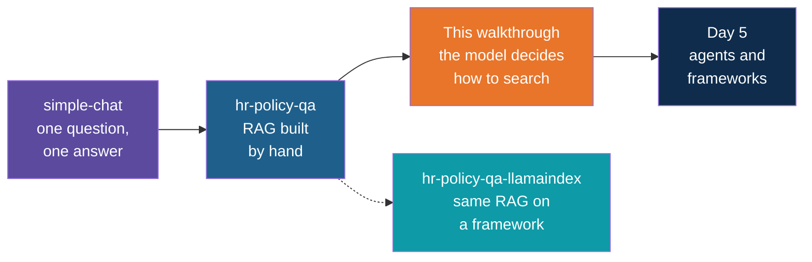

# HR Policy Q&A, Agentic Version — Build Walkthrough

A step-by-step guide to turning the hand-built `hr-policy-qa` app into the
`hr-policy-qa-agentic` reference project. You start from a copy of the finished hand-built
app and change only what makes it agentic. In the hand-built app, every question goes
through one fixed pipeline. Here, the model is given tools and decides for itself what to
do: search one document, search several, look up who is asking, retry with better words,
or answer without searching at all.

Nothing the first walkthrough already taught is repeated. The documents, the environment,
the key handling, chunking, embedding and storing are all reused as they are. In fact
`ingest.py` is not touched at all.

## What You'll Build

The same assistant, with the fixed "embed, fetch four chunks, answer" step replaced by a
loop in which the model chooses its tools.

| File | What happens to it |
|---|---|
| `docs/`, `.gitignore`, `.env.example`, `.env` | Copied unchanged from the hand-built app |
| `ingest.py` | Copied unchanged. It still builds the same Chroma collection |
| `pyproject.toml` | Changed: the name and description only. The dependencies are the same |
| `employees.json` | New: four made-up employees, so the assistant can know who is asking |
| `ask.py` | Rewritten from scratch: two tools, a tool description, an agent loop and error handling |

## Who This Is For / Prerequisites

- You have finished the `hr-policy-qa` walkthrough, or you have the finished `hr-policy-qa`
  app to copy. This guide assumes you know what chunking, embedding, top-k and a system
  message are, and does not explain them again.
- `uv` installed and an OpenAI API key already in the hand-built app's `.env`. Step 2 copies
  that file, so you do not enter the key again.
- Read the Day 4 note on agentic RAG first if you can. Step 1 gives the vocabulary you need.
- No agent framework is used. Frameworks come on Day 5, and they wrap the loop you build
  here.

Budget about 75 minutes. In a live session Steps 4, 5, 6 and 7 are the core (about 40
minutes). Step 2 is mostly copying and can be shown rather than typed.

## Steps

| Step | File | What You'll Add | Est. Time |
|---|---|---|---|
| 1 | 01-concepts-overview.md | Vocabulary: tool, tool call, tool result, agent loop | 5 min |
| 2 | 02-start-from-the-hand-built-app.md | A copy of the app, a new name, `employees.json`, a fresh store | 7 min |
| 3 | 03-the-search-tool.md | `ask.py`, part 1: retrieval as a plain function with a relevance score | 8 min |
| 4 | 04-describe-the-tool-and-let-the-model-decide.md | `ask.py`, part 2: the tool description, and the model's decision, unexecuted | 10 min |
| 5 | 05-run-the-tool-and-return-the-result.md | `ask.py`, part 3: run what the model asked for and hand the result back | 10 min |
| 6 | 06-the-agent-loop.md | `ask.py`, part 4: a loop with memory and a step limit | 12 min |
| 7 | 07-a-second-tool-who-is-asking.md | `ask.py`, part 5: `get_my_profile`, scoped to the signed-in user | 10 min |
| 8 | 08-handle-failures.md | `ask.py`, part 6: bad tool calls and failed model calls | 8 min |
| 9 | 09-recap-and-exercises.md | Comparison, trade-offs, practice | 5 min |

## Relationship to the Reference Implementation

By the end your files should match the reference project's files exactly: `pyproject.toml`
and `employees.json` (Step 2) and `ask.py` (Step 8). The `.gitignore`, `.env.example`, the
six documents in `docs/` and `ingest.py` are the hand-built app's own files, unchanged. The
reference project also has a `README.md`, which this walkthrough does not rebuild.

Every full-file checkpoint was checked for valid Python syntax, and the Step 8 checkpoint
was compared against the reference file and matches it exactly. Every stage of `ask.py`
was also run end to end against the real API with `gpt-4o-mini`, and the traces in the
"Try it" sections (the lines starting with `->`, the sources and the relevance scores) come
from those runs. The wording of the answers is shortened or described, because it differs
from run to run. An agent also chooses its own steps, so your trace may differ from the one
shown. Run the finished app once with a real key before a session and note what your own
numbers and traces look like.

One thing changes with the calendar. `get_my_profile` works out months of service from
today's date, and the employees have fixed joining dates. In October 2026, E101 has been
with the company for about a month and is on probation, which is what the examples show.
Move the joining dates in `employees.json` if you teach this much later, and keep the
meaning of the examples the same.

## Suggested Demo Flow

1. Before Step 3, put the hand-built `ask.py` on screen and ask the room "which line decides
   whether a search happens?" There is none: it always searches, once. Step 4 adds exactly
   that missing decision.
2. In Step 4, stop after printing the model's decision. Point out that the model has not
   touched your code. It has only written a request. Ask "Hi, thanks!" (no search) and
   "What is the capital of France?" (answered from memory, which is a flaw). Keep the France
   answer on screen, because Step 6 fixes it with one line of prompt.
3. In Step 5, print `messages` after the first round (Exercise 2). Show the assistant message
   that holds the request and the tool message that holds the result, tied together by
   `tool_call_id`. This pairing is the part trainees get wrong most often.
4. In Step 6, set `MAX_STEPS` to 1 and ask the comparison question. The two searches still
   happen, then the model is forced to answer. Then set it back to 5, and ask a follow-up to
   show the memory.
5. In Step 7, ask "What is my notice period?" as E101 and then as E103. Same question, 30
   days and 90 days, and the model never saw the employee table, only the one record the
   tool handed over. Then ask a question that does not depend on the user and watch the
   profile tool stay unused.
6. In Step 8, rename the key in `TOOL_FUNCTIONS` and watch the model fail three times and
   give up. Then run with a wrong key and show that the session survives.
7. Ask the same question twice in a row, and compare the `->` lines. An agent is not
   repeatable the way a pipeline is, and that is the main cost to discuss.

## Series

Start with Step 1 — Concepts Overview.
