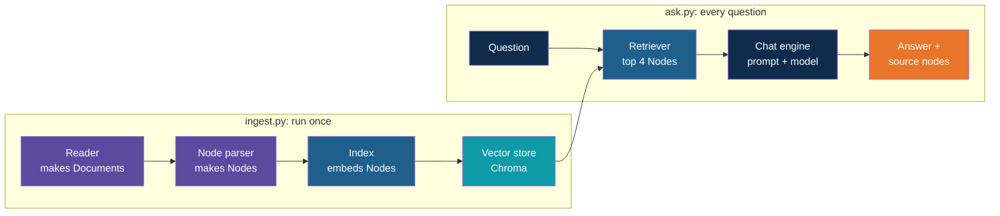

# Step 1 — Concepts Overview

> Back to index · Next: Start From the Hand-Built App

## Goal

Learn what each part of the hand-built app is called in LlamaIndex, and what you are about
to gain and give up by switching.

## Why this matters

You already know the six steps of RAG, because you wrote each one yourself. LlamaIndex does
not change any of them. It supplies a ready-made part for each, so that the loading loop,
the split, the embedding call, the `upsert`, the query and the prompt shrink into a few
configured objects.

That is useful and also a risk. A one-line call that "does the embedding and storing" hides
two steps. When an answer is wrong, you still have to know which step to open up. This
walkthrough is built to keep that knowledge: every LlamaIndex object is introduced next to
the hand-written code it replaces, so you can see exactly what it took over.

## The Vocabulary

| Hand-built | LlamaIndex | Where you will see it |
|---|---|---|
| The loop over `Path("docs").glob("*.md")` | **Reader**, producing **Documents** | `SimpleDirectoryReader` in `ingest.py` |
| A chunk, kept as two parallel lists | **Node**, one object holding text and metadata | `nodes` in `ingest.py` |
| The hand-written `split("\n## ")` | **Node parser** | `MarkdownNodeParser` in `ingest.py` |
| `client = OpenAI()` for embeddings and chat | **Settings** | `Settings.embed_model` and `Settings.llm` |
| A Chroma collection, called directly | **Vector store**, wrapped by an **Index** | `ChromaVectorStore` and `VectorStoreIndex` |
| `collection.query(...)` | **Retriever** | `index.as_retriever(...)`, then inside the chat engine |
| The prompt string and the chat call | **Chat engine** | `index.as_chat_engine(...)` in `ask.py` |
| `n_results=4` | `similarity_top_k=4` | `ask.py` |
| The `"Retrieved from"` metadata loop | **Source nodes**, each with a score | `response.source_nodes` |

## The Two Phases, With the New Names

The shape is the one you built before. Only the boxes have new names.

## What Stays and What Changes

| Stays the same | Changes |
|---|---|
| The six documents and the `docs/` folder | `pyproject.toml`: new packages |
| Chroma as the store, in `.chroma/` | `ingest.py`: reader, parser and index replace the loop, the embedding call and `upsert` |
| `text-embedding-3-small` and `gpt-4o-mini` | `ask.py`: a chat engine replaces the embedding call, the query and the prompt |
| The system message, word for word | The Chroma collection name, so the two apps do not share a store |
| `.env`, `.env.example` and `.gitignore` | |

## What You Gain and What You Give Up

| You gain | You give up |
|---|---|
| Memory: "And does it carry forward?" is understood as a follow-up | Some visibility: the prompt is built for you unless you ask to see it |
| A similarity cut-off that drops weak matches | Chunk ids you chose yourself: nodes get generated ids, so the store is rebuilt on every ingest |
| A score beside every source, for judging retrieval | A smaller install: LlamaIndex brings many packages |
| The same code shape for other stores and models | Stability: names and imports change between versions |

## Check Yourself

Before moving on, you should be able to say what a node is (a chunk, as an object that
carries its own text and metadata), and which of the six RAG steps the index covers (both
embedding and storing).

Next: **Step 2 — Start From the Hand-Built App**.
