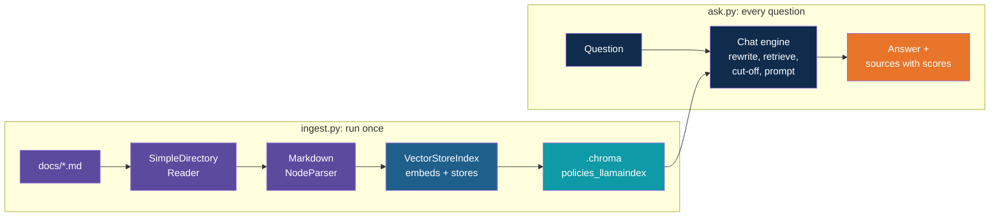

# Step 9 — Recap and Exercises

> Back to index · Previous: Add the Similarity Cut-off

## Goal

Review what changed, weigh what the framework bought against what it cost, and practise by
changing the app.

## What You Built



## Hand-Built Versus LlamaIndex, Step by Step

| RAG step | Hand-built | LlamaIndex | Walkthrough step |
|---|---|---|---|
| Load | `Path("docs").glob("*.md")` and `read_text()` | `SimpleDirectoryReader(...).load_data()` | 3 |
| Chunk | `split("\n## ")` and string building into two lists | `MarkdownNodeParser().get_nodes_from_documents(...)` | 4 |
| Embed | `client.embeddings.create(...)` | `Settings.embed_model`, used by the index | 5 |
| Store | `collection.upsert(...)` with ids you chose | `VectorStoreIndex(nodes, storage_context=...)`, random ids, rebuilt each run | 5 |
| Retrieve | Embed the question, then `collection.query(...)` | `index.as_retriever(similarity_top_k=4)`, or inside the chat engine | 6, 7 |
| Prompt and answer | Build the messages and call `client.chat.completions.create(...)` | `chat_engine.chat(question)` | 7 |
| Memory | None | Built into the chat engine, with `reset()` | 7 |
| Weak matches | Always four chunks | `SimilarityPostprocessor(similarity_cutoff=...)` | 8 |
| Sources | Chunk metadata | `response.source_nodes`, with scores | 7 |

## Code Removed Versus Behaviour Added

| | Hand-built | LlamaIndex |
|---|---|---|
| `ingest.py` code lines | 27 | 25 |
| `ask.py` code lines | 32 | 41 |
| Follow-up questions understood | No | Yes |
| Weak matches filtered | No | Yes |
| Scores shown | No | Yes |
| PDF and Word loading | Needs new code | Add one package |

Blank lines and comments are not counted in the line figures. The framework did not make
the app shorter overall. It made the same number of lines do
more. The ingest script got smaller, and the ask script got bigger because it gained the
chat engine, the cut-off and the reset command. Judge the switch by what you can do now,
not by line count.

## What You Gave Up

| Gave up | What it costs you | How to limit it |
|---|---|---|
| Visibility | The prompt is partly LlamaIndex's, and the embedding step is inside one call | Print the pieces when an answer is wrong. Exercise 4 shows the prompt |
| Chosen ids | Nodes get random ids, so the store is rebuilt on every ingest and re-embeds everything | Fine at 46 nodes. For large collections, look at ingestion pipelines, which track what changed |
| A small dependency list | A much larger install | Accept it, or pin the versions in `uv.lock` |
| Stability | Class names and import paths change between releases | Pin the version, and read the current documentation when an import fails |

## Quick Reference

| Concept | Where it lives |
|---|---|
| Loading | `SimpleDirectoryReader("docs", file_metadata=...)` in `ingest.py` |
| Which metadata is kept | The `file_metadata` lambda: file name only, not the file path |
| Chunking | `MarkdownNodeParser().get_nodes_from_documents(documents)` |
| What gets embedded | `header_path` plus the node text, as `MetadataMode.EMBED` shows |
| Embedding model | `Settings.embed_model` in both files |
| Chat model | `Settings.llm` in `ask.py` |
| Fresh collection each run | `delete_collection` in a `try`, then `create_collection` |
| Embed and store in one call | `VectorStoreIndex(nodes, storage_context=storage_context)` |
| Open an existing store | `VectorStoreIndex.from_vector_store(...)` in `ask.py` |
| Top-k | `similarity_top_k=4` |
| Memory and follow-ups | `chat_mode="condense_plus_context"` and `chat_engine.reset()` |
| Weak-match filter | `node_postprocessors=[SimilarityPostprocessor(similarity_cutoff=0.3)]` |
| Where an answer came from | The loop over `response.source_nodes` |

## Gotchas

| Gotcha | Why it happens | What to do |
|---|---|---|
| The store holds every node twice | Node ids are random, so a second ingest cannot replace the first | Keep the `delete_collection` lines in `ingest.py` |
| 46 nodes, not 40 | Each file's title and labelled lines become a node of their own | Expected. See Exercise 6 |
| Embedding model changed in one file only | Vectors from different models cannot be compared | Delete `.chroma`, set the same model in both files and re-ingest |
| Good questions say "could not find" | The cut-off is above their scores | Lower it, using the scores printed under "Retrieved from" |
| Off-topic questions still show sources | The cut-off is below some of their scores | Raise it, but check that good questions still pass |
| The model is wordier than the hand-built app | LlamaIndex's own preamble calls the assistant "talkative" | Read the prompt (Exercise 4) and replace the preamble if needed |
| A follow-up costs more than a first question | The engine makes an extra model call to rewrite it | Expected. It is the price of understanding follow-ups |
| Memory vanishes when the program exits | It lives only in the running program | Save the conversation yourself if you need it |
| A PDF does not load | PDF support is not in the core package | Add `llama-index-readers-file` |
| An import fails after an upgrade | LlamaIndex moves classes between versions | Pin the versions and check the current documentation |

## Discussion Questions

1. In the hand-built app the chunk text began with `Leave Policy > Carry Forward of Leave`.
   Here the title sits in `header_path` metadata. What did the embedding model receive in
   each case, and why is it nearly the same?
2. The reader's default metadata includes the full file path. What could go wrong if that
   path were embedded and shown to the model?
3. The hand-built app chose chunk ids so that a second ingest replaced the old chunks.
   This app deletes the collection instead. What does each approach cost?
4. A follow-up question costs an extra model call. When is that worth paying, and when would
   you rather use a mode that does not rewrite?
5. A cut-off of 0.3 worked for your colleague and not for you. What differs, and how would
   you choose a value you could defend to someone else?
6. Your answers are wrong. Using what is printed on screen, how do you tell a retrieval
   problem from a model problem?

## Exercises

Ordered from easiest to hardest.

1. **Ask your own questions.** Write six questions in everyday words, two each for three
   documents. For each, check that "Retrieved from" lists the right section and note the
   top score. Which question scored lowest, and why?
2. **Change k and the cut-off together.** Set `similarity_top_k` to 1, then to 8, with the
   cut-off at 0.0. Ask the work-from-home and laptop-theft questions. Then put your cut-off
   back and see how many of the eight survive. Which setting would you ship?
3. **Add a document.** Write `docs/07_travel_policy.md` in the same layout, with a title,
   three labelled lines and a few `##` sections. Run `ingest.py`. The count should rise by
   one plus the number of sections you wrote. Ask about it.
4. **Read the prompt.** Run this once and read what LlamaIndex puts above your `SYSTEM`
   text:

   ```bash
   uv run python -c "from llama_index.core.chat_engine.condense_plus_context import DEFAULT_CONTEXT_PROMPT_TEMPLATE as T; print(T)"
   ```

   Then replace it. In `ask.py`, pass your own `context_prompt` to `as_chat_engine`. It
   must contain `{context_str}` where the nodes go, for example a plain "Context:" line, the
   nodes, then a one-line instruction. Does the tone of the answers change?
5. **Compare chat modes.** Change `chat_mode` to `"context"`, which keeps memory but does
   not rewrite follow-ups. Ask the sick leave pair again and compare "Retrieved from" with
   `condense_plus_context`. What does the rewriting step buy you?
6. **Use the title nodes.** Ask "Who owns the laptop policy?" and "Which department handles
   expenses?". The `Department` lines in each document's title node are now searchable.
   Do they help, or do those nodes crowd out better ones for other questions? Decide
   whether you would keep them.
7. **Rebuild `ask.py` from memory.** Close this guide, delete `ask.py`, and rewrite it from
   the six steps of the RAG workflow. Then compare it with the reference and note every
   difference.

## What's Next

Day 4 continues with citations and evaluation. LlamaIndex has ready-made evaluators for the
two questions you keep asking by hand: was the right node retrieved, and did the answer
stay inside it. The same app also runs on a different store. The `hr-policy-qa-pgvector`
project is this app with Chroma replaced by Postgres and pgvector, and mainly the way the
store is opened changes. On Day 5, retrieval becomes one tool that an agent can choose to
use, and the engine you built here is the part you will reuse.
