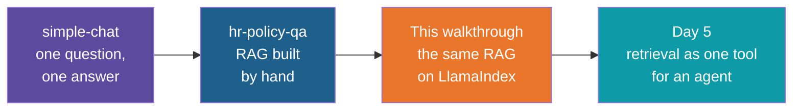

# HR Policy Q&A with LlamaIndex — Build Walkthrough

A step-by-step guide to turning the hand-built `hr-policy-qa` app into the
`hr-policy-qa-llamaindex` reference project. You start from a copy of the finished
hand-built app and replace its parts with LlamaIndex parts, one stage of the RAG workflow at
a time. Nothing the first walkthrough already taught is repeated: the documents, the
environment, the key handling and the six steps of RAG are all reused as they are.

## What You'll Build

The same assistant, with the glue code replaced by a framework and three things added that
the hand-built app does not have: memory for follow-up questions, a similarity cut-off, and
a score next to every source.

| File | What happens to it |
|---|---|
| `docs/`, `.gitignore`, `.env.example`, `.env` | Copied unchanged from the hand-built app |
| `pyproject.toml` | Changed: the `openai` package is replaced by four LlamaIndex packages |
| `ingest.py` | Rewritten: reader, node parser and index replace the hand-written loop, embedding call and `upsert` |
| `ask.py` | Rewritten: a chat engine replaces the embedding call, the query, the prompt and the model call |

## Who This Is For / Prerequisites

- You have finished the `hr-policy-qa` walkthrough, or you have the finished `hr-policy-qa`
  app to copy. This guide assumes you know what chunking, embedding, top-k and a system
  message are, and does not explain them again.
- `uv` installed and an OpenAI API key already in the hand-built app's `.env`. Step 2 copies
  that file, so you do not enter the key again.
- Read the Day 4 note on LlamaIndex first if you can. Step 1 gives the vocabulary you need.

Budget about 55 minutes. In a live session Steps 4, 7 and 8 are the core (about 30
minutes). Step 2 is mostly copying and can be shown rather than typed.

## Steps

| Step | File | What You'll Add | Est. Time |
|---|---|---|---|
| 1 | 01-concepts-overview.md | Vocabulary: what each hand-built part is called in LlamaIndex | 5 min |
| 2 | 02-start-from-the-hand-built-app.md | A copy of the app, new dependencies, a working import | 7 min |
| 3 | 03-load-the-documents.md | `ingest.py`, part 1: `SimpleDirectoryReader` replaces the file loop | 6 min |
| 4 | 04-chunk-into-nodes.md | `ingest.py`, part 2: `MarkdownNodeParser` replaces the hand-written split | 8 min |
| 5 | 05-embed-and-store-with-an-index.md | `ingest.py`, part 3: one index call embeds and stores | 8 min |
| 6 | 06-open-the-index-and-retrieve.md | `ask.py`, part 1: a retriever, with a score for every result | 7 min |
| 7 | 07-answer-with-a-chat-engine.md | `ask.py`, part 2: a chat engine writes the answer and remembers the conversation | 8 min |
| 8 | 08-add-the-similarity-cut-off.md | `ask.py`, part 3: drop weak matches | 6 min |
| 9 | 09-recap-and-exercises.md | Comparison, trade-offs, practice | 5 min |

## Relationship to the Reference Implementation

By the end your files should match the reference project's files exactly: `pyproject.toml`
(Step 2), `ingest.py` (Step 5) and `ask.py` (Step 8). The `.gitignore`, `.env.example` and
the six documents in `docs/` are the hand-built app's own files, unchanged. The reference
project also has a `README.md`, which this walkthrough does not rebuild.

Every full-file checkpoint was checked for valid Python syntax and compared against the
reference. The loading and chunking output in Steps 3 and 4 comes from a real run. Steps 5
to 8 were run end to end with stand-in models, to check that the code fits together, so the
scores and the wording of the answers in those steps are described rather than copied. Run
the finished app once with a real key before a session and confirm that your own numbers
fit what the steps say.

The comments in the code say "Step 1", "Steps 3 and 4" and so on. Those are the six steps
of the RAG workflow (load, chunk, embed, store, retrieve, ask), not the numbers of the
walkthrough steps in this guide.

## Suggested Demo Flow

1. Before Step 3, put the hand-built `ingest.py` and `ask.py` on screen next to each other
   and ask the room which lines are RAG ideas and which are plumbing. Each step then removes
   a block of plumbing, so the room can see what is being traded.
2. In Step 4, the node count is 46, not the 40 chunks of the hand-built app. Ask the room
   where the extra six came from before revealing that each file's title and labelled lines
   became a node of their own.
3. In Step 4, print what the embedding model will actually receive for one node. The title
   that the hand-built code wrote into each chunk is now supplied by `header_path`, which
   LlamaIndex adds for you.
4. In Step 6, ask "What is the capital of France?" and write the four scores on the board.
   Do not explain them yet. Step 8 turns those numbers into a decision.
5. In Step 7, ask "How many days of sick leave do I get?" and then "And does it carry
   forward?". Run the same two questions in the hand-built app in a second terminal. One
   remembers, the other searches for the words "and does it carry forward" alone.
6. In Step 8, set the cut-off just above the France scores to watch the source list go
   empty, then set it above a good question's scores to watch a correct answer disappear.
   The right value is between the two, and only your own numbers can tell you where.

## Series

Start with Step 1 — Concepts Overview.
