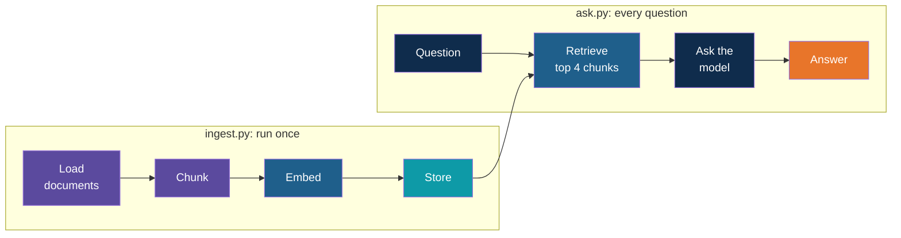

# Step 1 — Concepts Overview

> Back to index · Next: Project Setup

## Goal

Learn the words you need before writing any code, and see the shape of the app you are
about to build.

## Why this matters

A model on its own is like a student taking a closed-book exam. It knows a great deal in
general, but it has never seen your company's leave policy, so it either says it does not
know or, worse, answers confidently from nowhere. RAG turns the exam into an open-book one:
the app finds the right pages first and hands them to the model with the question.

The model does not change. All the work is in how you prepare the documents and how you
find the right pages. Almost every problem with a RAG answer comes down to one of those
two, and Steps 4 to 8 follow that split.

## The Vocabulary

| Word | Meaning | Where you will see it |
|---|---|---|
| Document | One source file, here a policy written in Markdown | The files in `docs/` |
| Chunk | A small piece of a document, here one section | `texts.append(...)` in `ingest.py` |
| Embedding (vector) | A list of numbers that captures the meaning of a text | `client.embeddings.create(...)` |
| Vector store | A database that finds the vectors closest to a given vector | Chroma, in the `.chroma/` folder |
| Metadata | A label stored with a chunk, such as its source and section | `{"source": ..., "section": ...}` |
| Top-k | The k closest chunks returned for a question; k is 4 here | `n_results=4` |
| Context | The retrieved chunks pasted into the prompt | `context = "\n\n".join(chunks)` |

## The Two Phases

The first phase is done ahead of time and only repeated when the documents change. The
second phase runs on every question. The only link between them is the vector store.

## Two Models, Two Jobs

| Model | Used for | Used where |
|---|---|---|
| `text-embedding-3-small` | Turning text into a vector | `ingest.py` for the chunks, `ask.py` for the question |
| `gpt-4o-mini` | Writing the answer | `ask.py` only |

The same embedding model must be used for the chunks and the question. Two different
models are like two maps with different scales, and a position on one means nothing on the
other.

## Check Yourself

Before moving on, you should be able to say which of the two programs makes a call to the
chat model (only `ask.py`), and why `ingest.py` does not need to run again when someone
asks a new question (the chunks and their vectors are already saved).

Next: **Step 2 — Project Setup**.
